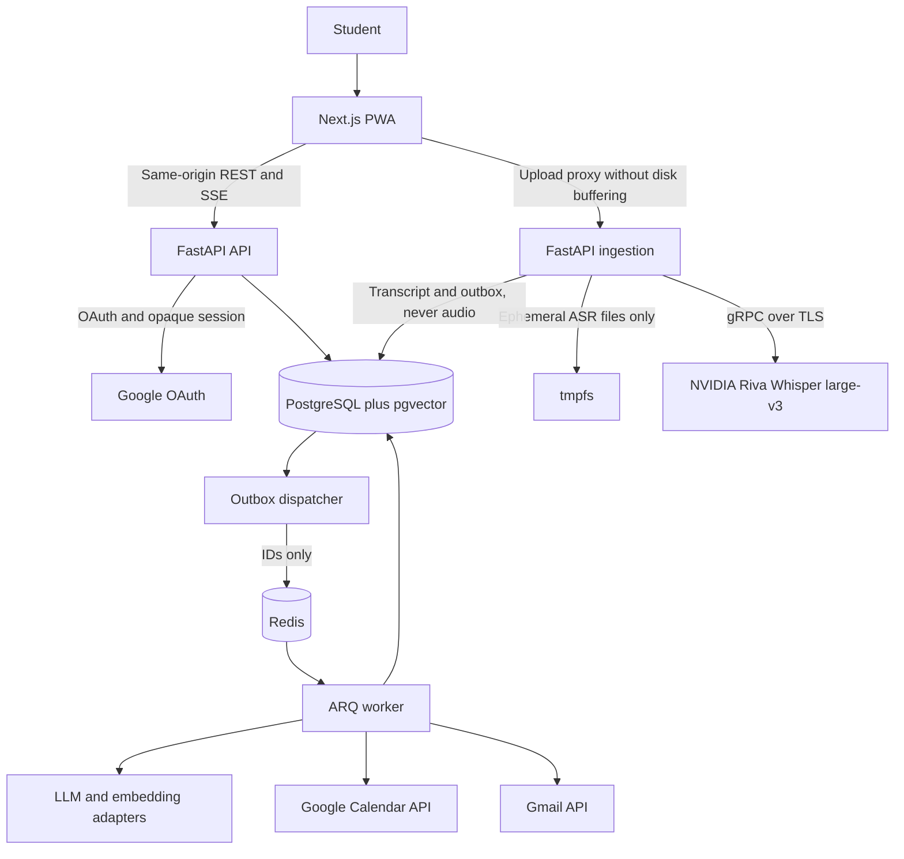

# Project Overview

Maulwurf is a documentation-first foundation for a planned study assistant that turns class
audio into searchable transcripts, cited RAG answers, reviewable task proposals, Google
Calendar entries, and optional Gmail reminders. The repository does not yet contain the
application scaffold, build system, or test suite; it currently records the product
contract, phased implementation plan, NVIDIA Riva dependency, and editor configuration.
Elevator pitch: upload a class recording, keep only its durable text, and turn what the
teacher said into evidence-backed study actions without silently writing to external
services.

## Repository Structure

- `.kiro/` — Editor and agent-tool configuration for this workspace.
  - `.kiro/agents/` — Empty; no nested agent instructions are currently defined.
  - `.kiro/settings/` — Workspace tool settings.
    - `.kiro/settings/cli.json` — Model defaults and tool-search settings.
- `.venv/` — Local, ignored Python virtual environment; generated and not source code.
- `docs/` — Spanish-language product, architecture, provider, and implementation documentation.
  - `docs/ESPECIFICACION.md` — Functional contract, proposed architecture, data model,
    security requirements, roadmap, and unresolved decisions.
  - `docs/NVIDIA_RIVA.md` — Audited NVIDIA Riva client parameters, installation notes,
    reference invocation, and validation limits.
  - `docs/PLAN_IMPLEMENTACION.md` — Phased delivery plan, acceptance gates, test strategy,
    and CI/CD expectations; its checklist is not evidence of implementation.
- `.gitignore` — Ignores the virtual environment and Python cache/compiled artifacts.
- `AGENTS.md` — This repository guidance for automated coding agents.
- `LICENSE` — GNU General Public License, version 3.
- `README.md` — Minimal NVIDIA Riva installation instructions.
- `requirements-riva.txt` — Direct Python dependency pin for `nvidia-riva-client`.

The proposed `apps/`, `infra/`, API, web, worker, and migration directories described in
the specification do not exist yet.

## Build & Development Commands

The repository has no application build or development entrypoint. Do not infer commands
from the proposed monorepo layout. The following setup command is copied verbatim from
`README.md` and is the supported local installation path today.

### Install

```bash
python3 -m venv .venv
.venv/bin/python -m pip install -r requirements-riva.txt
```

### Test

```bash
# TODO: define a test command after the application scaffold and test suites exist.
```

No tests are present today. The documented future layers are unit, local integration,
provider-contract, end-to-end, and load tests; see `docs/PLAN_IMPLEMENTACION.md`.

### Lint

```bash
# TODO: define lint scripts and configuration for the API and web applications.
```

The plan names Ruff and ESLint as future CI tools, but no configuration or executable
application exists yet.

### Type-check

```bash
# TODO: define type-check commands after the Python and TypeScript applications exist.
```

The plan names mypy and `tsc` as future CI tools; no type-check configuration is present.

### Run

```bash
# TODO: no application entrypoint exists yet.
```

### Debug

```bash
# TODO: no local debug entrypoint or debugger configuration exists yet.
```

The following is an external NVIDIA reference command preserved from `docs/NVIDIA_RIVA.md`.
It requires a separately cloned `python-clients` repository, an authorized API key in the
environment, and an authorized input file; it is not a command against a local Maulwurf
application and has not been run against NVIDIA from this repository.

```bash
.venv/bin/python python-clients/scripts/asr/transcribe_file_offline.py \
    --server grpc.nvcf.nvidia.com:443 \
    --use-ssl \
    --metadata function-id b702f636-f60c-4a3d-a6f4-f3568c13bd7d \
    --metadata authorization "Bearer $NVIDIA_API_KEY" \
    --max-message-length 1073741824 \
    --language-code en \
    --input-file /ruta/al/audio.wav
```

### Deploy

```bash
# TODO: add deployment manifests and an approved deployment command.
```

The plan proposes GitLab CI, container images, a controlled deployment approval, and a
single migration job, but no CI file, container definition, or deployment manifest exists.

## Code Style & Conventions

- The current repository contains Markdown, plain-text dependency metadata, and JSON only;
  there is no application source style to enforce yet.
- Documentation uses ATX headings, fenced code blocks, tables where useful, Mermaid diagrams,
  and relative links. Keep edits concise, preserve the existing Spanish technical vocabulary
  in the source documents, and do not present proposals as completed work.
- `docs/ESPECIFICACION.md` is the stated source of functional and technical contracts.
  Changes to phases, states, APIs, or guarantees should update the specification and plan in
  the same revision.
- The planned service names and domain identifiers use descriptive names such as
  `TranscriptionService`, `GoogleCalendarService`, `SearchService`, and `RAGService`; retain
  those documented concepts when the scaffold is implemented rather than inventing parallel
  names.
- No formatter, linter configuration, import-order rule, naming policy, or maximum source
  line length is configured. Keep new Markdown near 100 characters per line where practical.
  `> TODO:`: add authoritative Python, TypeScript, and Markdown tooling rules with the
  application scaffold.
- No commit-message template, commit hook, or commit-lint configuration is present.
  `> TODO:`: define the required commit format with the maintainers before enforcing it.

## Architecture Notes

The following is the proposed architecture from the specification, not an implementation
currently present in this repository.



The planned flow collects subject, class date, class timezone, and an explicitly selected
audio language before accepting bytes. The ingestion service validates and normalizes the
input, sends it to Riva in bounded temporary memory, persists a complete transcript and
segments, and verifies cleanup before enabling text-processing work. Original audio,
converted files, fragments, and audio payloads must not become durable files, object
storage, Redis values, logs, traces, caches, or backups.

After cleanup, durable outbox records dispatch indexing and, from the later phase, LLM
analysis. PostgreSQL stores tenant-owned metadata, transcripts, segments, chunks, and
versioned embeddings; pgvector and PostgreSQL full-text search support hybrid retrieval.
The chat service returns validated textual evidence. Task proposals remain reviewable, and
only an explicit user confirmation may enqueue a Calendar write. Gmail is opt-in and follows
the same worker/outbox model. Losing ephemeral audio requires a new upload; analysis and
indexing can retry from persisted text.

## Testing Strategy

There is no test suite, test directory, test runner configuration, or CI configuration in
the current tree. The implementation plan defines the following strategy for the future
scaffold:

1. **Unit tests:** cover dates and DST, Unicode character offsets, ASR overlap and boundary
   reconciliation, evidence spans, chunking, RRF retrieval, state transitions, idempotency,
   deduplication, and reminder scheduling.
2. **Local integration tests:** use real PostgreSQL/pgvector, Redis, ffmpeg/ffprobe, proxy,
   authentication, CSRF, outbox, tombstone/fencing, leases, cleanup, and restart paths.
   Provider doubles may control deterministic failures but do not validate provider contracts.
3. **Provider-contract tests:** use protected, authorized test accounts and budgets for NVIDIA
   Riva, the selected LLM/embedding providers, and Google. Record observed capabilities and
   limits; a mock is not evidence of cloud support or retention behavior.
4. **End-to-end and load tests:** exercise browser to proxy to services to database/provider,
   including upload, transcript cleanup, indexing, cited chat, human review, Calendar, and
   notification flows. Measure memory, tmpfs, latency, concurrency, and absence of audio
   persistence under failure and load.
5. **Build and delivery checks:** the plan calls for API, ingestion, and web builds,
   migrations, restore testing, lint, type checks, unit tests, integration tests, and E2E.

Locally, only the installation command in the previous section is currently runnable. `> TODO:`
add exact project scripts once the scaffold exists. The documented CI target is GitLab CI:
merge requests should run Ruff/ESLint, mypy/`tsc`, pytest/Vitest, local service integration,
E2E, and builds; cloud tests must be protected and manual or scheduled. No `.gitlab-ci.yml`
exists yet, so no CI command can honestly be claimed as configured or passing.

Synthetic audio for ASR tests must be generated in RAM at execution time and must not be
versioned or retained as a CI artifact. Persist only non-sensitive metrics and expected text.

## Security & Compliance

- **Secrets:** `NVIDIA_API_KEY` belongs only in a backend-controlled secret mechanism. Never
  commit it, send it from the browser, place it in prompts or logs, or include its Bearer
  value in traces. Google OAuth credentials and refresh tokens are planned to remain backend
  only, encrypted with AES-GCM and key-versioned; the exact secret-store integration is
  `> TODO:`.
- **Audio and private data:** the core contract is no persistent audio. Use bounded private
  `tmpfs` for ingestion, cleanup in `finally`, a read-only root filesystem where deployed,
  and no persistent swap, core dumps, snapshots, or memory hibernation for ingestion hosts.
  Do not place audio, full transcripts, prompts, credentials, or PII in logs, Sentry, traces,
  caches, Redis, or CI artifacts.
- **Application controls:** planned controls include opaque secure sessions, `HttpOnly` and
  `SameSite` cookies, CSRF and Origin checks, restrictive CORS, tenant filtering, encrypted
  database/backups, and validation of ownership in API, SSE, tools, and jobs. A user/session
  identity must come from authenticated backend state, not a user payload or LLM output.
- **External side effects:** Calendar writes require explicit human confirmation. Chat tools
  must not write Calendar or send mail directly. Provider calls, cloud tests, and real-class
  processing require authorized credentials, consent, approved test data, and a documented
  retention review.
- **Dependency scanning:** no scanner, lockfile for an application, or dependency policy is
  configured. `requirements-riva.txt` pins `nvidia-riva-client==2.27.0`. `> TODO:` add
  dependency vulnerability/license scanning and a reproducible lockfile policy before
  application dependencies are introduced.
- **Rate limits:** planned limits cover audio bytes/minutes, ingestion slots, LLM tokens,
  chat, and Google integrations. Use bounded retries, provider quotas, `Retry-After`, and
  jitter; do not invent numeric limits before the F0 capacity and contract tests establish
  them.
- **Compliance and licensing:** the repository is licensed under GPL-3.0 in `LICENSE`.
  Review every future dependency and provider term for GPL compatibility, attribution, data
  processing, retention, and consent requirements. NVIDIA/cloud retention conditions remain
  an explicit unresolved gate before real class recordings are accepted.

## Agent Guardrails

1. Treat the repository as documentation-only until implementation files actually exist.
   Never claim that a planned service, endpoint, CI job, migration, or acceptance gate is
   implemented merely because it appears in the specification or plan.
2. Never add durable audio storage, an audio playback/download path, hidden retranscription,
   upload spooling to persistent disk, or audio copies in object storage, Redis, logs,
   traces, caches, backups, or test artifacts. A lost ephemeral upload must require reupload.
3. Never commit API keys, OAuth tokens, private recordings, private transcripts, raw provider
   payloads, generated virtual environments, cache directories, or diagnostic dumps. Treat
   `.venv/` and generated Python artifacts as off-limits.
4. Do not call paid or external providers with real data without explicit authorization and a
   protected test setup. Do not create or modify Google Calendar events or send Gmail without
   the documented human-confirmation and opt-in flows.
5. Preserve tenant isolation and evidence validation in any future implementation. Do not
   trust IDs, timestamps, spans, dates, instructions, or tool requests emitted by an LLM or
   embedded in a transcript; validate them against authenticated database state.
6. Do not modify `LICENSE` or change the privacy, retention, confirmation, or provider
   guarantees without maintainer and, where applicable, legal/security review. Contract
   changes must update `docs/ESPECIFICACION.md` and `docs/PLAN_IMPLEMENTACION.md` together.
7. Preserve unrequested user changes and do not edit `.kiro/settings/cli.json` or generated
   environment files as a side effect of application work. No tracked file is currently
   declared immutable; `> TODO:` define ownership and review paths before production work.
8. Required reviews are security/privacy review before real ingestion, provider-contract
   review before enabling cloud integrations, and deployment approval before production.
   Owners and a formal review checklist are not defined: `> TODO:` assign them.
9. Respect provider and local capacity limits. Do not add concurrency, retry, or polling loops
   without bounded backoff, a budget, and an explicit rate-limit decision. Exact quotas and
   operational limits remain pending F0 validation.
10. No nested `AGENTS.md` exists today. If one is added, its instructions apply to its
    subtree and override this file where more specific, subject to user, security, and
    repository requirements.

## Extensibility Hooks

- **Provider adapters:** the planned transcription, LLM, and embedding interfaces isolate
  providers. A replacement provider requires capability/contract tests; changing embedding
  model, dimension, or version requires a new index generation and reindexing rather than
  mixing vectors.
- **Versioned prompts:** the planned API contains versioned `prompts/` directories with
  regression tests and stored prompt versions. That directory does not exist yet.
- **Durable work hooks:** the planned database outbox, ARQ workers, leases, and idempotent job
  keys are extension points for indexing, analysis, Calendar, and notifications. Outbox
  messages may contain IDs and non-sensitive configuration only, never audio or tokens.
- **Configuration:** `NVIDIA_API_KEY` is the only environment secret explicitly named by the
  current documentation. Riva host, function ID, model, language, limits, deadlines, and
  provider settings are described as configurable, but their environment variable names and
  schema are not defined: `> TODO:` document them without exposing secrets.
- **Feature progression:** the documented phases gate indexing/chat (F1), analysis and
  Calendar (F2), and opt-in Gmail/reminders (F3). There is no implemented feature-flag
  system; `> TODO:` define flags, defaults, and safe rollout behavior when code exists.
- **Future plugins:** no formal plugin registry exists. New integrations should use an
  explicit adapter plus contract tests, least-privilege scopes, tenant checks, bounded rate
  limits, and human confirmation for external writes.

## Further Reading

- [`README.md`](README.md) — Current local installation instructions.
- [`docs/ESPECIFICACION.md`](docs/ESPECIFICACION.md) — Functional and technical source of
  truth, including architecture, data model, security, phases, and unresolved decisions.
- [`docs/PLAN_IMPLEMENTACION.md`](docs/PLAN_IMPLEMENTACION.md) — Implementation gates,
  acceptance criteria, testing layers, and proposed GitLab CI/CD workflow.
- [`docs/NVIDIA_RIVA.md`](docs/NVIDIA_RIVA.md) — Riva client audit, connection parameters,
  reference command, and limits that still require real endpoint validation.
- [`LICENSE`](LICENSE) — GNU General Public License, version 3.
- `> TODO:` add `docs/ARCH.md`, ADRs, and operational runbooks when the application scaffold
  and deployment architecture are created; those documents do not exist today.
