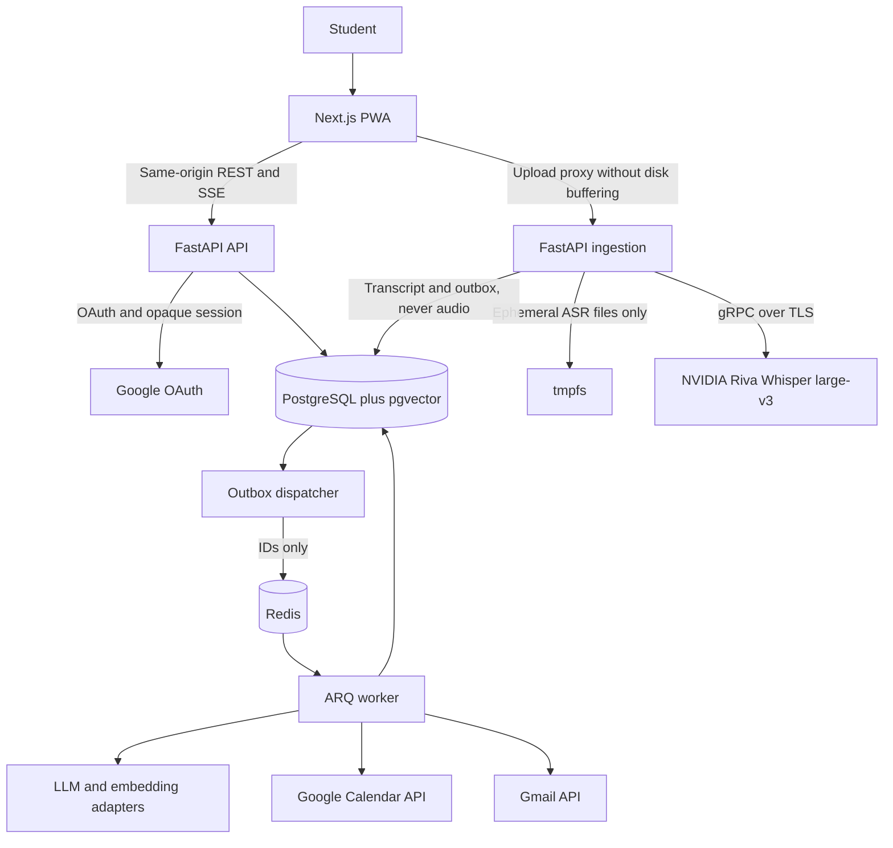

# Project Overview

Maulwurf is a documentation-first project for a study assistant that turns class audio into
searchable transcripts, cited RAG answers, reviewable task proposals, Google Calendar entries,
and optional Gmail reminders. The repository contains the product and planning documentation
plus a **minimal monorepo skeleton** (generated by `scripts/scaffold_monorepo.sh`, ticket L1.1):
application packages with placeholder code, dependency manifests, and empty test directories.
There is no runnable feature yet: no `docker-compose.yml`, no migrations, no endpoints beyond
health checks, no tests, no lint/type-check pipeline beyond package configs, and no real CI.
Elevator pitch: upload a class recording, keep only its durable text, and turn what the
teacher said into evidence-backed study actions without silently writing to external
services.

Work is organized as a **4-week sprint sequence with per-week backlogs and claiming** (not
pre-assigned tasks): tickets are grouped by area, members claim them when a sprint opens
(Monday), ownership is recorded in `docs/sprints/CLAIMS.md`, and each sprint has an
explicit Definition of Done. See "Sprint Model" below.

## Repository Structure

- `.github/workflows/trigger-hoplite-qa.yml` — External QA webhook trigger on PRs (not a
  build/test pipeline).
- `.kiro/` — Editor and agent-tool configuration for this workspace.
  - `.kiro/agents/` — Empty; no nested agent instructions are currently defined.
  - `.kiro/settings/cli.json` — Workspace tool settings (model defaults, tool search).
- `apps/api/` — FastAPI skeleton (ticket A1.1): `app/main.py` with `/healthz` and
  placeholder `/readyz`, `app/core/config.py` (Pydantic Settings, env prefix `MAULWURF_`),
  empty `routers/`, `services/`, `models/`, `workers/`, `alembic/versions/`, `prompts/v1/`,
  and `tests/{unit,integration}/`. Dependency and tool config in `pyproject.toml` (Ruff,
  mypy strict, pytest markers); lockfile `uv.lock`.
- `apps/ingest/` — Package skeleton for the ingestion service (area `S-`, tickets S1.A*/S2.*):
  only `pyproject.toml` with the pinned `nvidia-riva-client==2.27.0` and empty test dir.
- `apps/web/` — Next.js 15 scaffold (placeholder landing page is out of scope; area `D-`
  owns the real routes): `package.json` (Vitest, ESLint, Tailwind), `tsconfig.json`, empty
  `lib/`, `components/`, `tests/{unit,e2e}/`.
- `docs/` — Spanish-language product, architecture, provider, and delivery documentation.
  - `docs/ESPECIFICACION.md` — Source of truth for contracts (M1–M9), data model, security.
  - `docs/PLAN_IMPLEMENTACION.md` — Phases F0–F3, gates (G1, G2-T/G2-X, G3, G4, G5-F1/G5-F2,
  G6, G7-CAL/G7-MAIL, G8), decisions D1–D8 (D3 and D7 split per provider) and closure matrix.
  - `docs/PLAN_SPRINTS.md` — Sprint master plan: per-week backlog with ticket IDs, ticket
    dependencies, tests per ticket, and Definition of Done per sprint. Only the active
    sprint opens for claiming; the rest stays blocked.
  - `docs/plan/S1.md`..`docs/plan/S4.md` — Detailed sprint specifications: frozen
    contracts, per-ticket behavior, acceptance criteria, verification/evidence and a
    ticket→files "implementation map" per sprint. The S1 file also holds the normative
    ticket template that S2–S4 reference.
  - `docs/PLAN_TESTS.md` — Test catalog per sprint (layers `U-`, `I-`, `P-`, `E-`, `L-`,
    `C-`, `R-`) that tickets reference as evidence.
  - `docs/DISENO_BD_API_SPRINTS.md` — Database design, full API contract, and day-by-day
    ticket detail.
  - `docs/PROPUESTA_PROYECTO_FINAL.md`, `docs/PROPUESTA_DISENO_FRONT.md` — Project vision
    and frontend design proposal.
  - `docs/sprints/` — Canonical claim registry in `docs/sprints/CLAIMS.md` (ownership and
    state) plus one personal **bitácora** (logbook) per member for evidence, blockers and
    notes; a bitácora row does not assign a ticket. Rules and template in
    `docs/sprints/README.md`.
  - `docs/NVIDIA_RIVA.md` — Audited Riva client parameters and reference invocation.
- `infra/` — Placeholder README only (area `J-`: compose, Caddy, CI are pending J1.x and
  subject to claiming in `docs/sprints/CLAIMS.md`).
- `scripts/scaffold_monorepo.sh` — Generated the existing skeleton; `scripts/provider/`
  and `scripts/load/` are empty placeholders.
- `.env.example` — Template for `MAULWURF_*`, Google OAuth, NVIDIA, and provisional ingest
  limit variables; copy to `.env` (never commit `.env`).
- `.gitignore`, `AGENTS.md`, `LICENSE` (GPL-3.0), `README.md`, `README.scaffold.md`,
  `requirements-riva.txt` (`nvidia-riva-client==2.27.0`).

## Sprint Model (planning conventions)

1. **Backlog, not assignment.** `docs/PLAN_SPRINTS.md` defines weekly backlogs (S1–S4)
   grouped by area with ticket IDs (`L-` RAG/leadership, `A-` API/DB, `S-` ingest/ASR,
   `J-` infra/workers/integrations, `D-` web/UX); the letter marks the area, not a person.
   Only the **active sprint** is claimable. Claims are accepted via PR in
   `docs/sprints/CLAIMS.md` (ticket, unique owner, `claimed_at` UTC, state, cloud
   eligibility, review). Bitácoras record evidence but do not assign tickets; rows written
   before 2026-09-19 are historical candidates, not ownership.
2. **Ticket = one owner.** Unclaimed tickets are resolved by the lead (reassign, split, or
   explicitly reduce the sprint's DoD). Cloud-budget tickets (`P-` tests) require access to
   the authorized protected account.
3. **Dependencies are explicit.** Every ticket row declares what it depends on (another
   ticket or a frozen interface). The interface provider freezes the contract on Monday and
   delivers code by day 3; consumers build against the frozen contract (mocks allowed) and
   switch to real code Wednesday/Thursday.
4. **Definition of Done per sprint** (functional demo, tests per level, documentation,
   evidence) lives at the end of each week section of `docs/PLAN_SPRINTS.md`.
5. **Evidence over claims.** A ticket is done only with real command, date, environment,
   and result recorded in the bitácora; `CLAIMS.md` keeps the ownership state. Transfers
   and unclaims require an atomic PR with motive and evidence handover. A passing checkbox
   without evidence is not done.
6. **Document priority:** `ESPECIFICACION.md` and `PLAN_IMPLEMENTACION.md` override the
   sprint plan; update spec/plan in the same revision if a contract must change.
7. When implementing a ticket, keep the existing ticket ID and reference the tests
   cataloged for it in `docs/PLAN_TESTS.md`; do not invent parallel ticket names.

## Build & Development Commands

The skeleton is **not runnable end-to-end**. Do not infer commands from the proposed
architecture; only the following are real today.

### Install (Python packages, per app)

```bash
# API (uses uv.lock; requires Python >= 3.11)
cd apps/api && uv sync --extra dev

# Ingest
cd apps/ingest && uv sync --extra dev

# Riva-only legacy setup (from README.md)
python3 -m venv .venv
.venv/bin/python -m pip install -r requirements-riva.txt
```

### Web

```bash
cd apps/web && npm install   # dev server: npm run dev; build: npm run build; lint: npm run lint
```

### Test

```bash
# Not runnable yet: test directories exist but contain no tests.
# Planned once suites exist (pytest markers are pre-configured):
cd apps/api && pytest -m "not integration and not provider and not load"
```

### Lint / Type-check

```bash
# Config exists in apps/api/pyproject.toml and apps/web (eslint), but no repo-level script:
cd apps/api && uv run ruff check . && uv run mypy .
cd apps/web && npm run lint
```

### Run

```bash
# Only the API skeleton boots (health endpoints only; no DB required yet):
cd apps/api && uv run uvicorn app.main:app --reload
```

### Deploy

```bash
# TODO: add deployment manifests and an approved deployment command (J4.x).
```

No `docker-compose.yml`, `Caddyfile`, or CI quality pipeline exists yet (pending J1.x);
`.github/workflows/trigger-hoplite-qa.yml` only forwards PR events to an external QA
service.

The following is an external NVIDIA reference command preserved from `docs/NVIDIA_RIVA.md`.
It requires a separately cloned `python-clients` repository, an authorized API key in the
environment, and an authorized input file; it is not a command against a local Maulwurf
application and has not been run against NVIDIA from this repository.

```bash
.venv/bin/python python-clients/scripts/asr/transcribe_file_offline.py \
    --server grpc.nvcf.nvidia.com:443 \
    --use-ssl \
    --metadata function-id b702f636-f60c-4a3d-a6f4-f3568c13bd7d \
    --metadata authorization "Bearer $NVIDIA_API_KEY" \
    --max-message-length 1073741824 \
    --language-code en \
    --input-file /ruta/al/audio.wav
```

## Code Style & Conventions

- Python: FastAPI + Pydantic v2 + SQLAlchemy 2 async. Ruff (`line-length = 100`, rules
  `E,F,I,UP,B,S`) and mypy `strict` are configured in `apps/api/pyproject.toml`; follow
  them for new Python code in `apps/`.
- Web: Next.js App Router + TypeScript + Tailwind; ESLint via `eslint.config.mjs`.
- Configuration uses Pydantic Settings with env prefix `MAULWURF_` and `extra="forbid"`;
  secrets come only from the environment (see `.env.example`), never from code.
- Documentation uses ATX headings, fenced code blocks, tables where useful, Mermaid
  diagrams, and relative links. Keep edits concise, preserve the existing Spanish technical
  vocabulary in the source documents, and do not present proposals as completed work. Keep
  new Markdown near 100 characters per line where practical.
- `docs/ESPECIFICACION.md` is the stated source of functional and technical contracts.
  Changes to phases, states, APIs, or guarantees must update the specification and
  `docs/PLAN_IMPLEMENTACION.md` in the same revision.
- Keep the planned service names and domain identifiers (`TranscriptionService`,
  `GoogleCalendarService`, `SearchService`, `RAGService`) rather than inventing parallel
  names.
- No commit-message template, commit hook, or commit-lint configuration is present.
  `> TODO:` define the required commit format with the maintainers before enforcing it.

## Architecture Notes

The following is the proposed architecture from the specification, not an implementation
currently present in this repository.



The planned flow collects subject, class date, class timezone, and an explicitly selected
audio language before accepting bytes. The ingestion service validates and normalizes the
input, sends it to Riva in bounded temporary memory, persists a complete transcript and
segments, and verifies cleanup before enabling text-processing work. Original audio,
converted files, fragments, and audio payloads must not become durable files, object
storage, Redis values, logs, traces, caches, or backups.

After cleanup, durable outbox records dispatch indexing and, from the later phase, LLM
analysis. PostgreSQL stores tenant-owned metadata, transcripts, segments, chunks, and
versioned embeddings; pgvector and PostgreSQL full-text search support hybrid retrieval.
The chat service returns validated textual evidence. Task proposals remain reviewable, and
only an explicit user confirmation may enqueue a Calendar write. Gmail is opt-in and follows
the same worker/outbox model. Losing ephemeral audio requires a new upload; analysis and
indexing can retry from persisted text.

## Testing Strategy

Test directories exist (`apps/api/tests/{unit,integration}/`, `apps/ingest/tests/`,
`apps/web/tests/{unit,e2e}/`) but contain **no tests yet**. Pytest markers are
pre-configured (`integration`, `provider`, `load`). The documented layers (see
`docs/PLAN_TESTS.md` for the per-sprint catalog):

1. **Unit tests (`U-`):** dates and DST, Unicode character offsets, ASR overlap and boundary
   reconciliation, evidence spans, chunking, RRF retrieval, state transitions, idempotency,
   deduplication, and reminder scheduling.
2. **Local integration tests (`I-`):** real PostgreSQL/pgvector, Redis, ffmpeg/ffprobe,
   proxy, authentication, CSRF, outbox, tombstone/fencing, leases, cleanup, and restart
   paths. Provider doubles may control deterministic failures but do not validate provider
   contracts.
3. **Provider-contract tests (`P-`):** protected, authorized test accounts and budgets for
   NVIDIA Riva, the selected LLM/embedding providers, and Google. Record observed
   capabilities and limits; a mock is not evidence of cloud support or retention behavior.
4. **End-to-end (`E-`) and load (`L-`) tests:** browser to proxy to services to
   database/provider, including upload, transcript cleanup, indexing, cited chat, human
   review, Calendar, and notification flows. Measure memory, tmpfs, latency, concurrency,
   and absence of audio persistence under failure and load.
5. **Prompt regression (`R-`) and component/manual (`C-`):** recorded LLM outputs replayed
   against validators in CI; manual checklists for demos and privacy sweeps.

No CI quality pipeline exists yet; **GitHub Actions** is the team decision (2026-09-20) for
the future quality pipeline. `> TODO:` add exact project scripts and the pipeline
configuration when the suites and compose file exist.

Synthetic audio for ASR tests must be generated in RAM at execution time and must not be
versioned or retained as a CI artifact. Persist only non-sensitive metrics and expected text.

## Security & Compliance

- **Secrets:** `NVIDIA_API_KEY` belongs only in a backend-controlled secret mechanism. Never
  commit it, send it from the browser, place it in prompts or logs, or include its Bearer
  value in traces. Google OAuth credentials and refresh tokens are planned to remain backend
  only, encrypted with AES-GCM and key-versioned; the exact secret-store integration is
  `> TODO:`. `.env.example` documents the expected variable names; never commit `.env`.
- **Audio and private data:** the core contract is no persistent audio. Use bounded private
  `tmpfs` for ingestion, cleanup in `finally`, a read-only root filesystem where deployed,
  and no persistent swap, core dumps, snapshots, or memory hibernation for ingestion hosts.
  Do not place audio, full transcripts, prompts, credentials, or PII in logs, Sentry, traces,
  caches, Redis, or CI artifacts.
- **Application controls:** planned controls include opaque secure sessions, `HttpOnly` and
  `SameSite` cookies, CSRF and Origin checks, restrictive CORS, tenant filtering, encrypted
  database/backups, and validation of ownership in API, SSE, tools, and jobs. A user/session
  identity must come from authenticated backend state, not a user payload or LLM output.
- **External side effects:** Calendar writes require explicit human confirmation. Chat tools
  must not write Calendar or send mail directly. Provider calls, cloud tests, and real-class
  processing require authorized credentials, consent, approved test data, and a documented
  retention review.
- **Dependency scanning:** no scanner or dependency policy is configured yet. Pins exist in
  `requirements-riva.txt` and per-app manifests with lockfiles (`uv.lock`,
  `package-lock.json`). `> TODO:` add dependency vulnerability/license scanning and a
  reproducible lockfile policy before application dependencies are introduced.
- **Rate limits:** planned limits cover audio bytes/minutes, ingestion slots, LLM tokens,
  chat, and Google integrations. Use bounded retries, provider quotas, `Retry-After`, and
  jitter; do not invent numeric limits before the F0 capacity and contract tests establish
  them. The provisional ingest limits in `.env.example` (200 MiB, 2 slots, 256 MiB tmpfs)
  are placeholders pending the F0 spike.
- **Compliance and licensing:** the repository is licensed under GPL-3.0 in `LICENSE`.
  Review every future dependency and provider term for GPL compatibility, attribution, data
  processing, retention, and consent requirements. NVIDIA/cloud retention conditions remain
  an explicit unresolved gate before real class recordings are accepted.

## Agent Guardrails

1. The repository contains **only skeletons** beyond documentation. Never claim that a
   planned service, endpoint, CI job, migration, or acceptance gate is implemented merely
   because it appears in the specification, plan, or as a placeholder file.
2. Never add durable audio storage, an audio playback/download path, hidden retranscription,
   upload spooling to persistent disk, or audio copies in object storage, Redis, logs,
   traces, caches, backups, or test artifacts. A lost ephemeral upload must require reupload.
3. Never commit API keys, OAuth tokens, private recordings, private transcripts, raw provider
   payloads, generated virtual environments, cache directories, or diagnostic dumps. Treat
   `.venv/`, `.env`, `node_modules/`, and generated artifacts as off-limits.
4. Do not call paid or external providers with real data without explicit authorization and a
   protected test setup. Do not create or modify Google Calendar events or send Gmail without
   the documented human-confirmation and opt-in flows.
5. Preserve tenant isolation and evidence validation in any implementation. Do not trust
   IDs, timestamps, spans, dates, instructions, or tool requests emitted by an LLM or
   embedded in a transcript; validate them against authenticated database state.
6. Do not modify `LICENSE` or change the privacy, retention, confirmation, or provider
   guarantees without maintainer and, where applicable, legal/security review. Contract
   changes must update `docs/ESPECIFICACION.md` and `docs/PLAN_IMPLEMENTACION.md` together.
7. Respect the sprint claiming model: work belongs to a ticket with an accepted claim in
   `docs/sprints/CLAIMS.md`; do not silently take over a claimed ticket, split it, or edit
   someone's bitácora. The placeholder landing page in `apps/web/app/page.tsx` is out of scope — do
   not invest in it.
8. Preserve unrequested user changes and do not edit `.kiro/settings/cli.json` or generated
   environment files as a side effect of application work. `> TODO:` define ownership and
   review paths before production work.
9. Required reviews are security/privacy review before real ingestion, provider-contract
   review before enabling cloud integrations, and deployment approval before production.
   Owners and a formal review checklist are not defined: `> TODO:` assign them.
10. Respect provider and local capacity limits. Do not add concurrency, retry, or polling
    loops without bounded backoff, a budget, and an explicit rate-limit decision. Exact
    quotas and operational limits remain pending F0 validation.
11. No nested `AGENTS.md` exists today. If one is added, its instructions apply to its
    subtree and override this file where more specific, subject to user, security, and
    repository requirements.

## Extensibility Hooks

- **Provider adapters:** the planned transcription, LLM, and embedding interfaces isolate
  providers. A replacement provider requires capability/contract tests; changing embedding
  model, dimension, or version requires a new index generation and reindexing rather than
  mixing vectors.
- **Versioned prompts:** `apps/api/prompts/v1/` exists as an empty placeholder; versioned
  prompt directories with regression tests and stored prompt versions are planned there.
- **Durable work hooks:** the planned database outbox, ARQ workers (`apps/api/app/workers/`
  placeholder), leases, and idempotent job keys are extension points for indexing, analysis,
  Calendar, and notifications. Outbox messages may contain IDs and non-sensitive
  configuration only, never audio or tokens.
- **Configuration:** `.env.example` names the current environment variables (`MAULWURF_*`,
  `GOOGLE_CLIENT_ID/SECRET`, `NVIDIA_API_KEY`, `RIVA_*`, provisional `INGEST_*`).
  `app/core/config.py` currently loads only the `MAULWURF_*` backend settings; `> TODO:`
  extend the settings schema (without exposing secrets) as tickets land.
- **Feature progression:** the documented phases gate indexing/chat (F1), analysis and
  Calendar (F2), and opt-in Gmail/reminders (F3), mapped to sprints S2–S4. There is no
  implemented feature-flag system; `> TODO:` define flags, defaults, and safe rollout
  behavior when code exists.
- **Future plugins:** no formal plugin registry exists. New integrations should use an
  explicit adapter plus contract tests, least-privilege scopes, tenant checks, bounded rate
  limits, and human confirmation for external writes.

## Further Reading

- [`README.md`](README.md) — Product vision, planned contract, and current limitations.
- [`README.scaffold.md`](README.scaffold.md) — What the scaffold script generated and what
  is pending.
- [`docs/ESPECIFICACION.md`](docs/ESPECIFICACION.md) — Functional and technical source of
  truth, including architecture, data model, security, phases, and unresolved decisions.
- [`docs/PLAN_IMPLEMENTACION.md`](docs/PLAN_IMPLEMENTACION.md) — Implementation gates,
  acceptance criteria, testing layers, and proposed CI/CD workflow.
- [`docs/PLAN_SPRINTS.md`](docs/PLAN_SPRINTS.md) — Sprint master plan: weekly backlogs with
  ticket dependencies, tests, and Definition of Done per sprint.
- [`docs/PLAN_TESTS.md`](docs/PLAN_TESTS.md) — Test catalog per sprint (planned suites,
  gates G1–G8).
- [`docs/DISENO_BD_API_SPRINTS.md`](docs/DISENO_BD_API_SPRINTS.md) — Database design, API
  contract, and day-by-day ticket detail.
- [`docs/sprints/CLAIMS.md`](docs/sprints/CLAIMS.md) — Canonical claim registry (S1–S4).
- [`docs/sprints/README.md`](docs/sprints/README.md) — Claiming rules and bitácora template;
  one bitácora per member in that directory.
- [`docs/plan/S1.md`](docs/plan/S1.md)–[`docs/plan/S4.md`](docs/plan/S4.md) — Per-sprint
  detailed specifications and acceptance criteria.
- [`docs/NVIDIA_RIVA.md`](docs/NVIDIA_RIVA.md) — Riva client audit, connection parameters,
  and limits that still require real endpoint validation.
- [`LICENSE`](LICENSE) — GNU General Public License, version 3.
- `> TODO:` add `docs/ARCH.md`, ADRs, and operational runbooks as the corresponding tickets
  (L1.2, S4.1, J4.8) land; those documents do not exist yet.
