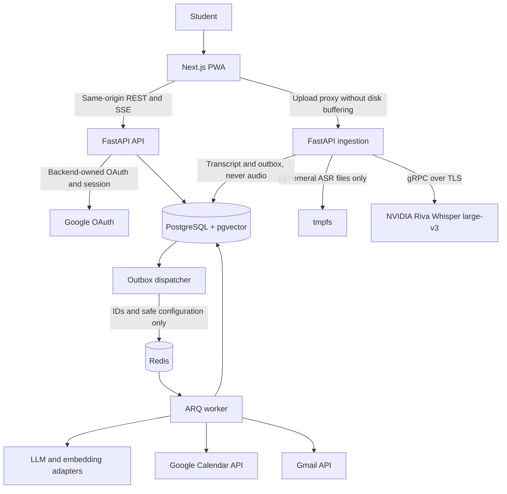

# Maulwurf

> A privacy-first study assistant that turns class recordings into searchable knowledge and
> reviewable study actions.

*Maulwurf* means “mole” in German: the project is intended to dig through class recordings
and build connections between notes, a calendar, and reminders.

> **Project status — design stage.** This repository is currently documentation-first. It does
> not contain the application scaffold, build system, test suite, CI configuration, deployment
> manifests, or working services described below. The only supported local setup today installs
> the official NVIDIA Riva Python client. Planned services and roadmap gates must not be read as
> implemented features.

## Product vision

Students often record classes but rarely revisit hours of audio. Important information—exam
dates, assignments, readings, and recommendations—remains buried in those recordings. Maulwurf
is designed to turn that information into durable text, searchable evidence, and actions that a
student can review before anything is written to an external service.

The planned flow is:

```text
Class audio
    → ephemeral transcription
    → searchable transcript
    → hybrid search and cited RAG chat
    → structured activity proposals
    → human review
    → Google Calendar
    → optional Gmail reminders
```

### Design principles

- **Audio is input; text is the durable source.** The planned system does not provide audio
  playback, audio downloads, durable audio archives, or retranscription without a new upload.
  Citations open transcript segments; timestamps are shown only when the ASR provider supplies
  validated timing data.
- **From consultation to action.** In addition to chat and search, the system proposes exams,
  assignments, readings, and follow-up activities.
- **Human confirmation is mandatory.** No task—whether extracted from a transcript or proposed
  in chat—may write to Google Calendar without explicit user confirmation. Chat tools cannot
  write Calendar or send mail directly.
- **Providers are behind adapters.** Transcription, language models, and embeddings are
  isolated behind interfaces. Replacing a provider requires capability and contract tests;
  changing an embedding model or dimension requires a new index generation and reindexing.
- **Privacy is designed in.** Maulwurf is not currently a 100% local product. Audio is sent to
  the selected cloud ASR provider, so provider retention and data-processing terms must be
  reviewed before real recordings are used.
- **Language is explicit.** The user must select and consent to the audio language before
  uploading bytes. Automatic language detection, silent fallback to `multi`, and ASR
  translation are not part of the MVP/v1 contract.

## Planned capabilities

The functional specification currently includes the following planned capabilities:

- Upload a class recording together with its subject, class date, class timezone, and selected
  audio language.
- Validate and normalize supported audio formats, transcribe them with NVIDIA Riva, and retain
  the transcript and its segments rather than the source audio.
- Search across subjects with PostgreSQL full-text search and pgvector, using hybrid retrieval.
- Chat with citations that link to validated transcript evidence.
- Extract assignments, exams, deliveries, readings, reminders, projects, and recommendations
  into reviewable structured proposals.
- Read authorized Google Calendar events as context and create a secondary Maulwurf calendar
  only after explicit confirmation.
- Optionally send Gmail reminders and daily or weekly digests after the integration is enabled.
- Show processing progress and separate the status of transcription, indexing, and analysis.

### Out of scope for now

The following are explicitly outside the current MVP/v1 scope:

- Speaker diarization, video ingestion, link or bot ingestion, and collaboration.
- Audio playback, audio download, durable audio storage, and retranscription after ephemeral
  audio has been lost.
- Automatic language detection, ASR translation, and a fully local deployment.
- Native mobile applications. An installable PWA may be considered later, without caching
  private audio or private application data.

## Proposed architecture

The following architecture is proposed by the specification; these services do not exist in the
current repository.



### Proposed technology stack

| Layer | Planned choice | Purpose |
| --- | --- | --- |
| Frontend | Next.js App Router, TypeScript, Tailwind, shadcn/ui | Web UI and installable PWA path |
| Backend | FastAPI, Pydantic v2, SQLAlchemy 2 async | API, authentication, and orchestration |
| Database | PostgreSQL 16 | Tenant data, transcripts, outbox, and metadata |
| Vector search | pgvector with cosine HNSW indexes | Versioned semantic retrieval |
| Full-text search | PostgreSQL full-text search | Lexical retrieval by language |
| Jobs | ARQ with Redis | Durable text-processing and integration jobs |
| Transcription | NVIDIA Riva, Whisper large-v3, `nvidia-riva-client` | Explicit-language ASR over gRPC/TLS |
| Conversion | `ffmpeg` and `ffprobe` in the ingestion service | Validation and ephemeral normalization |
| LLM | `gpt-4o-mini` through LiteLLM, provisional | Structured extraction and chat |
| Embeddings | `text-embedding-3-small`, 1536 dimensions, provisional | Semantic search |
| Authentication | Google OAuth managed by FastAPI and an opaque cookie session | Backend-owned identity and tokens |
| Durable audio storage | None | Source audio must remain ephemeral |
| Mail | Gmail API, opt-in | Reminders and digests |

## Planned processing contract

The intended end-to-end behavior is:

1. The user selects a subject, class date, class timezone, and audio language, and accepts the
   applicable cloud-processing and privacy notice before uploading data.
2. The API creates an ingestion attempt and reserves bounded capacity. The binary upload is
   authenticated and proxied without persistent-disk buffering.
3. The ingestion service validates the stream, computes a SHA-256 hash, checks limits, and uses
   `ffprobe`/`ffmpeg` to normalize audio inside private `tmpfs` storage. The actual Riva payload
   format and limits must be established by provider testing; the system must not assume a
   fixed ten-minute fragment size.
4. Audio is sent to Riva in bounded, sequential fragments with backpressure. The application
   must not retain the original, converted files, fragments, or audio payloads in object
   storage, Redis, logs, traces, caches, or backups.
5. The complete transcript and segments are committed atomically. All temporary audio is
   closed and removed in a `finally` path, and cleanup is independently verified before text
   processing is dispatched.
6. Indexing and LLM analysis run as independent stages over persisted text. A valid index may
   support chat even if analysis fails, and valid extracted tasks may remain reviewable even if
   indexing fails.
7. The user reviews textual evidence, dates, timezone, and proposed Calendar details. Only an
   explicit confirmation creates a durable Calendar write through an idempotent worker.
8. Optional Gmail notifications use the same outbox and worker model. Ambiguous delivery is
   surfaced as `delivery_unknown` rather than retried blindly.

If ephemeral audio is lost before a complete transcript is committed, the user must upload it
again. Indexing, analysis, and external-integration jobs may be retried from persisted text and
IDs; ASR may not be retried from a vanished temporary path.

Timestamps are never invented from an LLM response or distributed proportionally across text.
SRT export is available only when the stored timing information is valid. If Riva returns text
without usable offsets, citations remain textual and timestamp precision is recorded as `none`.

## Privacy and security requirements

These requirements are part of the documented product contract, not evidence that the controls
are already implemented:

- **No durable audio in Maulwurf infrastructure.** Ingestion is intended to use bounded private
  `tmpfs`, a read-only root filesystem, no persistent swap, and no persistent core dumps or
  memory snapshots. Cleanup must cover original files, converted files, fragments, and buffers.
- **Cloud processing is explicit.** Local deletion does not guarantee deletion by NVIDIA, an LLM
  provider, Google, or the user's device. Provider retention, regional processing,
  subprocessors, and consent for third-party voices must be reviewed before real classes are
  accepted.
- **Secrets stay server-side.** `NVIDIA_API_KEY`, Google OAuth credentials, and refresh tokens
  must never be committed, sent by the browser, placed in prompts, or written to logs. Google
  refresh tokens are planned to be encrypted with AES-GCM and key-versioned.
- **Tenant isolation is mandatory.** Authenticated backend state, not a user payload or LLM
  output, determines the user identity for API requests, SSE streams, tools, and jobs.
- **Private content is not observability data.** Audio, complete transcripts, prompts,
  credentials, and personally identifiable information must not be written to logs, traces,
  Sentry, caches, Redis values, or CI artifacts.
- **External side effects are controlled.** Calendar writes require human confirmation. Gmail is
  opt-in. Provider tests and real-class processing require authorized credentials, consent, and
  approved test data.

## Roadmap

No phase below is implemented in the current tree. The detailed plan defines the evidence and
acceptance gates for each phase.

| Phase | Planned scope | Exit condition |
| --- | --- | --- |
| **F0 — Feasibility and foundation** | Validate Riva languages, formats, limits, timestamps, privacy, ephemeral ingestion, auth, schema, and CI foundations | Provider contract and capacity are documented; cleanup and recovery are demonstrated; real ingestion remains blocked until this gate passes |
| **F1 — Knowledge** | Ephemeral ingestion, transcript library, hybrid index, transcript reader, and cited chat | End-to-end processing works for the tested class duration and published limits without retaining audio |
| **F2 — Action** | Versioned extraction, review inbox, Google Calendar synchronization, agenda context, and read-only chat tools | A reviewed task creates one idempotent event only after confirmation, including date, timezone, DST, and retry cases |
| **F3 — Reminders** | Opt-in Gmail, reminders, digests, complete dashboard, and global search | Dedupe, local-time/DST behavior, and uncertain delivery are tested with an authorized real message |
| **F4 — Exploratory backlog** | Quizzes, study plans, exports, briefings, and other future ideas | Independent prioritization; not part of the MVP or v1 commitment |

The project does not maintain schedule estimates until the capacity spike and team decisions are
complete.

## Repository status and layout

### Current repository

```text
.
├── .kiro/                         # Workspace/editor configuration
├── docs/
│   ├── ESPECIFICACION.md          # Functional and technical source of truth
│   ├── NVIDIA_RIVA.md             # Riva client audit and reference invocation
│   └── PLAN_IMPLEMENTACION.md     # Phases, gates, tests, and delivery plan
├── AGENTS.md                      # Repository guidance for coding agents
├── LICENSE                        # GNU GPL v3
├── README.md
└── requirements-riva.txt         # Pinned Riva client dependency
```

### Proposed application layout

This layout is described by the specification but has not been created:

```text
maulwurf/
├── apps/
│   ├── api/                       # FastAPI, services, workers, models, migrations
│   └── web/                       # Next.js application
├── infra/                         # Compose, reverse proxy, and deployment configuration
└── docs/
```

## Local setup

The repository currently has no application entrypoint. The only supported local operation is
installing the pinned Riva client dependency:

```bash
python3 -m venv .venv
.venv/bin/python -m pip install -r requirements-riva.txt
```

The direct dependency is `nvidia-riva-client==2.27.0`. The documented validation environment
also resolved `grpcio==1.84.0`, `grpcio-tools==1.81.1`, `protobuf==6.33.5`, and
`websockets==15.0.1`. The client was imported successfully with Python 3.14.7 during the
local audit. A supported application-wide Python version has not yet been fixed.

### Current development commands

There is no application build, run, test, lint, type-check, or deployment command yet:

| Activity | Current status |
| --- | --- |
| Install dependencies | Use the command above |
| Run the application | Not available; no application entrypoint exists |
| Tests | No test suite or test runner exists |
| Lint and formatting | Not configured; Ruff and ESLint are future targets |
| Type checking | Not configured; mypy and `tsc` are future targets |
| Deployment | No container or deployment manifests exist |

The future CI target is GitHub Actions with linting, type checks, unit tests, local service
integration, E2E tests, migrations, and application builds. Cloud-provider tests must be
protected and manual or scheduled; mocks do not establish provider support or retention
behavior.

## NVIDIA Riva integration reference

The planned ASR integration uses the official NVIDIA Riva Python client over gRPC/TLS. The
application contract currently documents these target parameters:

| Parameter | Planned value or rule |
| --- | --- |
| Server | `grpc.nvcf.nvidia.com:443` |
| Transport | TLS (`--use-ssl`) |
| NVIDIA function | `b702f636-f60c-4a3d-a6f4-f3568c13bd7d` |
| Client package | `nvidia-riva-client` |
| Model | Whisper large-v3, subject to endpoint validation |
| Authorization | Backend-only `Bearer $NVIDIA_API_KEY` metadata |
| Operation | Transcription, not `task:translate` |
| Language | Explicit user-selected code from a tested allowlist |
| Initial normalization target | Mono, signed 16-bit PCM WAV; sample rate remains subject to testing |

The following is an **external NVIDIA reference command**, not a Maulwurf application command. It
requires a separately cloned `python-clients` repository, an authorized API key, and an
authorized input file:

```bash
.venv/bin/python python-clients/scripts/asr/transcribe_file_offline.py \
    --server grpc.nvcf.nvidia.com:443 \
    --use-ssl \
    --metadata function-id b702f636-f60c-4a3d-a6f4-f3568c13bd7d \
    --metadata authorization "Bearer $NVIDIA_API_KEY" \
    --max-message-length 1073741824 \
    --language-code en \
    --input-file /path/to/audio.wav
```

Important limitations of this reference:

- The client-side `--max-message-length` maximum is 1 GiB; that does not prove the NVIDIA
  endpoint accepts a 1 GiB request. Server limits, protobuf overhead, quotas, deadlines,
  duration, format, sample rate, and memory may impose lower limits.
- The audited offline script reads the complete input file into memory and does not fragment a
  large recording. It is therefore not the planned bounded ingestion implementation.
- The example's `en` language, formats, timestamps, and limits do not prove support for every
  language or class recording. F0 must test the deployed endpoint before publishing capabilities.
- No transcription request against NVIDIA has been executed from this repository because no API
  key or authorized test audio is configured. Effective languages, quotas, deadlines, payload
  limits, and timestamp behavior remain unverified.

Never commit `NVIDIA_API_KEY`, send it from the browser, or use private class recordings in an
unapproved provider test.

## Testing strategy

Once the scaffold exists, the documented test layers are:

1. **Unit tests:** dates and DST, Unicode character offsets, ASR fragment reconciliation,
   evidence spans, chunking, RRF retrieval, state transitions, idempotency, deduplication, and
   reminder scheduling.
2. **Local integration tests:** real PostgreSQL/pgvector, Redis, `ffmpeg`/`ffprobe`, proxy,
   authentication, CSRF, outbox, leases, fencing, cleanup, and restart paths.
3. **Provider-contract tests:** protected authorized accounts for NVIDIA Riva, the selected
   LLM/embedding providers, and Google. These tests record observed capabilities and limits.
4. **End-to-end and load tests:** browser through proxy, services, database, and providers,
   including upload, cleanup, indexing, cited chat, human review, Calendar, and notifications.
5. **Build and delivery checks:** migrations, restore testing, lint, type checks, test suites,
   E2E, and builds for the planned API, ingestion, and web applications.

Synthetic audio for ASR tests must be generated in RAM at execution time and must never be
versioned or retained as a CI artifact. Persist only non-sensitive metrics and expected text.

## Capacity and cost notes

There is no validated monthly budget or production capacity yet. Costs depend on NVIDIA Riva
usage, LLM and embedding tokens, retries, `ffmpeg` CPU, RAM/tmpfs slots, PostgreSQL/pgvector,
Redis, backups, TLS, and network transfer. Avoid treating the provisional 200 MiB / 3 hour
input target as an approved production limit until F0 benchmarks it.

Not storing audio durably removes audio-storage cost, but it does not remove memory,
transcoding, provider, network, or cloud data-processing costs. Before real usage, the project
must establish quotas, rate limits, alerts, retention policies, and provider terms.

## Further documentation

- [Functional and technical specification](docs/ESPECIFICACION.md)
- [Implementation and validation plan](docs/PLAN_IMPLEMENTACION.md)
- [Team sprint plan (S1–S4)](docs/PLAN_SPRINTS.md) — open weekly backlogs with ticket
  dependencies and a Definition of Done per sprint; only the active sprint is claimable, and
  ownership lives in [docs/sprints/CLAIMS.md](docs/sprints/CLAIMS.md) (per-sprint specs in
  [docs/plan/S1.md](docs/plan/S1.md)–[docs/plan/S4.md](docs/plan/S4.md)).
- [Test catalog by sprint (planned suites, gates G1–G8)](docs/PLAN_TESTS.md)
- [NVIDIA Riva client audit](docs/NVIDIA_RIVA.md)
- [Pinned Riva dependency](requirements-riva.txt)
- [Repository agent guidance](AGENTS.md)
- [License](LICENSE)

## License

Maulwurf is distributed under the [GNU General Public License, version 3](LICENSE).
