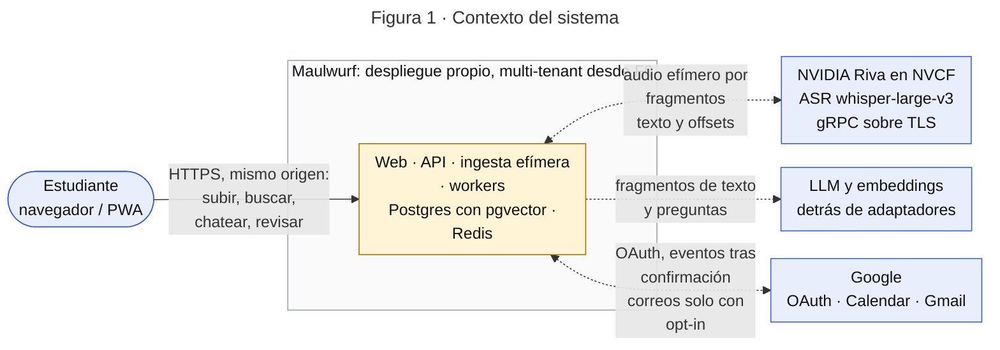
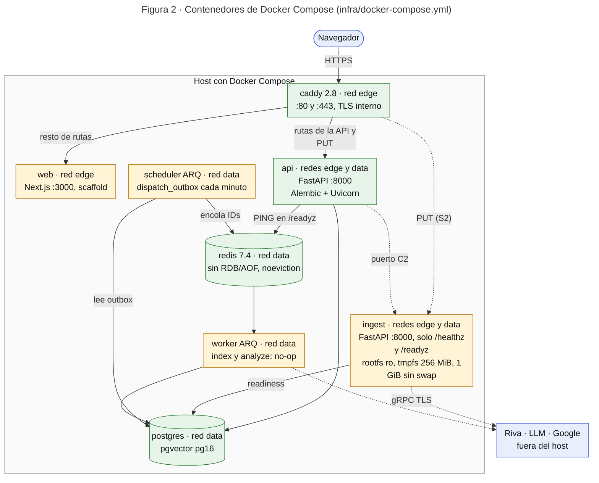
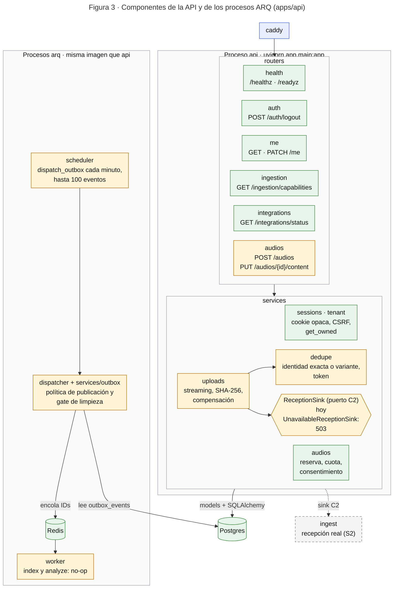
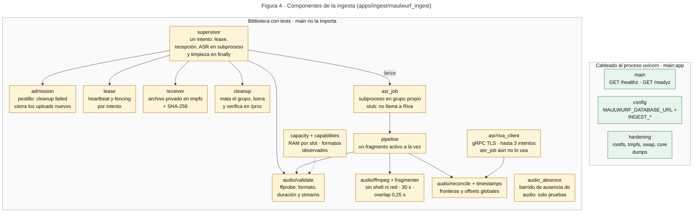
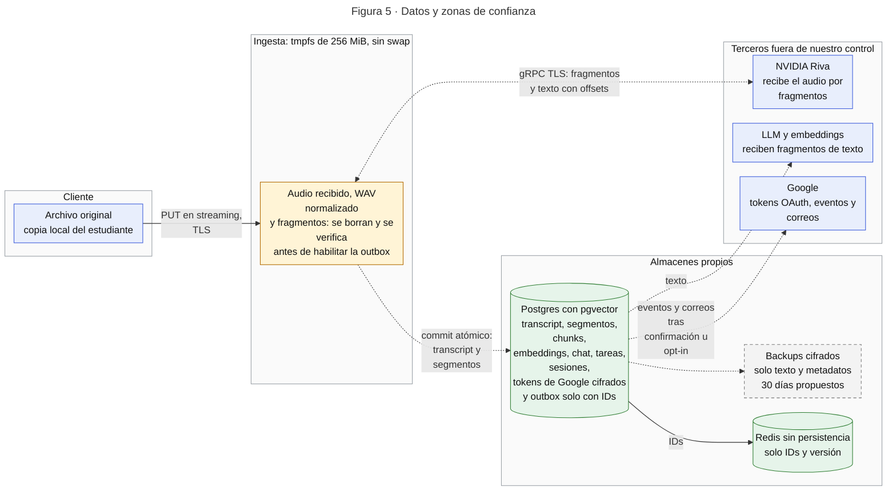

# Arquitectura del sistema — Maulwurf

> **Estado:** vista de arquitectura derivada de [ESPECIFICACION.md](ESPECIFICACION.md), que es la
> fuente normativa, y contrastada con el código de `develop` en `2298e1b` (2026-10-11). No crea
> contratos: ante cualquier diferencia mandan la especificación y el
> [plan de implementación](PLAN_IMPLEMENTACION.md). Los flujos paso a paso están en
> [PROCESOS.md](PROCESOS.md).

La arquitectura objetivo y la construida **todavía no coinciden**. S1 dejó una base sólida (stack
Compose, esquema, sesiones, ingesta endurecida como biblioteca) y S2 está en curso, pero no
existe ningún flujo de extremo a extremo. Cada diagrama marca qué está implementado, qué es
parcial y qué sigue planificado.

## 1. Cómo leer los diagramas

| Estilo | Significado |
|---|---|
| Relleno verde, borde sólido | Implementado y cableado en un proceso que se ejecuta |
| Relleno ámbar | Existe en el código (endpoint o biblioteca con tests) pero no funciona de extremo a extremo |
| Relleno gris, borde discontinuo | Solo especificado o planificado |
| Relleno azul | Actor o sistema fuera del repositorio |
| Línea discontinua | Flujo planificado o aún sin cablear |

Cada figura se exporta a SVG en [diagrams/](diagrams/) (ver §8).

| Fig. | Diagrama | SVG |
|---|---|---|
| 1 | Contexto del sistema | [arq-01-contexto.svg](diagrams/arq-01-contexto.svg) |
| 2 | Contenedores de Docker Compose | [arq-02-contenedores.svg](diagrams/arq-02-contenedores.svg) |
| 3 | Componentes de la API y de los procesos ARQ | [arq-03-componentes-api.svg](diagrams/arq-03-componentes-api.svg) |
| 4 | Componentes de la ingesta | [arq-04-componentes-ingesta.svg](diagrams/arq-04-componentes-ingesta.svg) |
| 5 | Datos y zonas de confianza | [arq-05-zonas-de-confianza.svg](diagrams/arq-05-zonas-de-confianza.svg) |

## 2. Contexto del sistema

<!-- svg: arq-01-contexto -->


Hoy **ninguna llamada a un tercero está cableada**: el cliente de Riva existe aislado y sin uso, y
Google solo aparece como configuración y estado leído de la base de datos.

| Sistema | Qué intercambia | Garantías y límites | Estado |
|---|---|---|---|
| Estudiante | Sube audio con idioma elegido y consentimiento; consulta, revisa y confirma | Cada escritura en Calendar exige confirmación explícita | API parcial; la web es un scaffold |
| NVIDIA Riva | Recibe audio por fragmentos y devuelve texto y offsets | `grpc.nvcf.nvidia.com:443`, `whisper-large-v3`, solo transcripción (nunca `task:translate`). Retención y región no verificadas: D3-Audio `blocked`; contrato D2 `pending` | Cliente aislado (S2.4 en curso), sin cablear |
| LLM y embeddings | Reciben fragmentos de texto y preguntas | Provisional: `gpt-4o-mini` vía LiteLLM y `text-embedding-3-small` (1536 dimensiones). D3-Texto se cierra por proveedor y modelo antes del primer transcript real | Planificado (S2–S3) |
| Google | Login OAuth, eventos de Calendar, correos por Gmail | Tokens solo en el backend, cifrados con AES-GCM. Gmail es opt-in y solo escribe al email verificado | Solo configuración y estado; sin login (A1.3) |

## 3. Contenedores

<!-- svg: arq-02-contenedores -->


| Servicio | Imagen o build | Redes | Expuesto | Límites y endurecimiento | Ejecuta |
|---|---|---|---|---|---|
| `caddy` | `caddy:2.8-alpine` (digest fijado) | edge | 80 y 443 en el host (configurables) | Caddyfile de solo lectura, admin API desactivada; sin healthcheck | Proxy inverso con TLS interno (`https://localhost`) |
| `web` | `apps/web` → `maulwurf-web:local` | edge | 3000, solo interno | `USER node` | `npm run start` (Next.js 15, scaffold) |
| `api` | `apps/api` → `maulwurf-api:local` | edge, data | 8000, solo interno | UID 10001 en el Dockerfile; el compose no añade `read_only` ni `cap_drop` | Migración Alembic y Uvicorn |
| `ingest` | `apps/ingest`, target `runtime` | edge, data | 8000, solo interno | UID 10001, rootfs `read_only`, tmpfs `/work/tmp` de 256 MiB (`noexec,nosuid,nodev`), `cap_drop: ALL`, `no-new-privileges`, 1 GiB de RAM sin swap, 2 CPU, 128 PIDs | Uvicorn `maulwurf_ingest.main:app` |
| `worker` | imagen de `api` | data | — | `cap_drop: ALL`, `no-new-privileges`, 128 PIDs | `arq app.workers.arq_app.WorkerSettings` |
| `scheduler` | imagen de `api` | data | — | Igual que `worker` | `arq app.workers.arq_app.SchedulerSettings` |
| `postgres` | `pgvector/pgvector:pg16` (digest fijado) | data | Ninguno en el host | Volumen `pgdata` | PostgreSQL 16 con pgvector |
| `redis` | `redis:7.4-alpine` (digest fijado) | data | `127.0.0.1:6379`, solo loopback | Sin RDB ni AOF, `maxmemory` 256 MB por defecto, `noeviction` (ADR-0005) | `redis-server` |

Todos los servicios tienen healthcheck salvo `caddy`, que espera a que `web`, `api` e `ingest`
estén sanos. El compose de los ocho servicios es el ticket [J1.1](plan/tickets/J1.1.md); la
imagen de ingesta endurecida es J1.2, Caddy J1.3, los procesos ARQ J1.5 y la política de
Redis J1.6.

**Enrutado de Caddy** (`infra/Caddyfile`, en este orden):

| Ruta | Destino | Notas |
|---|---|---|
| `PUT /audios/*/content` | `api:8000` | Streaming sin compresión ni buffering. El comentario del Caddyfile prevé moverlo a `ingest:8000` en S2 |
| `/audios/*/progress` | `api:8000` con `flush_interval -1` | SSE de progreso: la ruta existe en Caddy, pero no en los routers de la API |
| `/auth/*`, `/me`, `/me/*`, `/subjects`, `/subjects/*`, `/integrations/*`, `/audios`, `/audios/*`, `/ingestion/*`, `/readyz` | `api:8000` | `/subjects` aún no tiene router en `develop` (A1.6) |
| Cualquier otra | `web:3000` | Fallback |

**Qué no está conectado todavía**

- `ingest` no recibe tráfico de Caddy ni de `api`: su ASGI solo expone `GET /healthz` y
  `GET /readyz`, y `api` no tiene ningún cliente hacia él. El `PUT` termina en `api`, cuyo sink
  de recepción responde `503` (punto C2, ver §4.1).
- `worker` registra `index` y `analyze`, que solo escriben el ID en el log (`max_tries=1`).
- `scheduler` ejecuta `dispatch_outbox` al arrancar y cada minuto: toma hasta 100 eventos y encola
  IDs y versión en Redis, sin ACK ni reintentos (J2.1 pendiente).
- Ningún contenedor llama a Riva, a un LLM ni a Google.

## 4. Componentes

### 4.1 API y procesos ARQ

<!-- svg: arq-03-componentes-api -->


| Capa | Módulo | Propósito | Estado |
|---|---|---|---|
| routers | `health` | `/healthz` y `/readyz` (Postgres y Redis) | Implementado |
| | `auth` | `POST /auth/logout` | Implementado; el login con Google no existe (A1.3) |
| | `me` | `GET /me` (perfil y token CSRF) y `PATCH /me` | Implementado |
| | `ingestion` | `GET /ingestion/capabilities` (A2.2) | Implementado; publica límites `null` hasta cerrar D4 |
| | `integrations` | `GET /integrations/status`, solo lee la BD | Implementado |
| | `audios` | `POST /audios` (A2.3) y `PUT /audios/{id}/content` (A2.4) | Parcial: el `PUT` responde 503 con el sink por defecto |
| services | `sessions` | Sesión opaca (`mw_session`) y CSRF | Implementado |
| | `tenant` | `get_owned`: acceso filtrado por `user_id` (ADR-0006) | Implementado |
| | `audios` | Reserva de slot, cuota y consentimiento versionado | Implementado; cuota y slot son condicionales (D4) |
| | `uploads` | Recepción en streaming, SHA-256, compensación y puerto `ReceptionSink` | Parcial: no hay implementación real del sink |
| | `dedupe` | Identidad exacta o variante y token de un solo uso | Implementado; probado con un sink inyectado |
| | `outbox` | Política pura: qué eventos se publican y el gate de limpieza | Implementado |
| workers | `arq_app`, `dispatcher` | Procesos `worker` y `scheduler`; el dispatcher mueve IDs de `outbox_events` a Redis con `FOR UPDATE SKIP LOCKED` | Parcial: sin ACK ni reintentos; `index` y `analyze` no hacen nada |
| core | `config`, `deps`, `db`, `errors`, `validation` | Settings `MAULWURF_*` con validación fail-fast, sesión, CSRF y Origin, SQLAlchemy async, envelope de errores y validadores | Implementado |
| | `crypto` | AES-GCM con versión de clave | Existe, pero ningún proceso lo usa hoy |
| models | `core`, `ingestion`, `transcript`, `chunk`, `chat` | Tablas de S1 y S2 (migraciones `0001` y `0002`) | Esquema implementado; sin servicios que lo usen más allá de ingesta |
| schemas | `ingestion` | Contrato de capabilities | Implementado |
| | `analysis`, `chunk` | Contratos Pydantic de extracción y chunks | Borrador, sin uso en runtime |

### 4.2 Ingesta

<!-- svg: arq-04-componentes-ingesta -->


| Módulo | Propósito | Estado |
|---|---|---|
| `main` | App FastAPI con `/healthz` y `/readyz` (endurecimiento, tmpfs y Postgres); no sirve si falta una garantía de `hardening` | Implementado |
| `config`, `hardening` | Settings `MAULWURF_DATABASE_URL` e `INGEST_*`; autochequeo de rootfs, tmpfs, swap y core dumps leyendo `/proc` y el cgroup | Implementado |
| `supervisor` | Orquesta un intento: lease, recepción, ASR en subproceso y limpieza en `finally`; mata el grupo de procesos, borra el directorio y verifica en `/proc` | Biblioteca |
| `admission`, `lease` | Pestillo de admisión de la instancia; lease, heartbeat y fencing de `ingestion_attempts` | Biblioteca |
| `receiver` | Recepción en streaming a un fichero privado del intento; SHA-256 por chunk; corta y borra al pasar el tope | Biblioteca |
| `audio/validate` | ffprobe: decide aceptar, normalizar o rechazar por contenedor, duración y streams | Biblioteca; `m4a` figura como no verificado |
| `audio/ffmpeg`, `audio/fragmenter` | ffmpeg sin shell ni red y con límites de CPU, memoria y salida; fragmentos de hasta 30 s con overlap de 0,25 s | Biblioteca |
| `pipeline`, `asr_job` | Un fragmento activo a la vez; `asr_job` corre como subproceso y hoy es un stub sin llamada al proveedor | Biblioteca (stub) |
| `audio/reconcile`, `audio/timestamps` | Reconciliación de fronteras y overlap; offsets globales | Biblioteca |
| `asr/riva_client` | Cliente gRPC TLS aislado; hasta 3 intentos con backoff para errores transitorios | Biblioteca; no lo usa `asr_job` |
| `cleanup` | Directorio efímero por intento y verificación de limpieza en `/proc`: descriptores, procesos del grupo y mounts | Biblioteca; la usa el `supervisor` |
| `audio_absence` | Barrido de ausencia de audio en disco, Redis, logs, trazas y cachés; solo devuelve booleanos y conteos | Solo pruebas: la importa `test_no_audio_persistence.py` |
| `capacity`, `capabilities` | Presupuesto de RAM por slot; capabilities observadas en el spike | Biblioteca; D4 sigue bloqueado |
| `audio/synthetic` | Audio sintético generado en RAM para pruebas (necesita `espeak-ng`) | Solo pruebas |

## 5. Datos y zonas de confianza

<!-- svg: arq-05-zonas-de-confianza -->


| Dato | Dónde puede existir | Dónde nunca | Tercero que lo recibe |
|---|---|---|---|
| Audio: original, WAV normalizado y fragmentos | tmpfs de `ingest` (RAM, sin swap) mientras se recibe, valida, convierte y transcribe | Disco, S3 o MinIO, Postgres, Redis, logs, trazas, cachés, backups, artefactos de CI | NVIDIA Riva recibe los fragmentos; su retención no está verificada (D3-Audio `blocked`) |
| Transcript y segmentos | Postgres y backups cifrados | Logs, trazas, Redis, CI | LLM y embeddings, según el proceso (D3-Texto) |
| Chunks, embeddings, chat y tareas | Postgres (pgvector, versionados) | Redis, logs | LLM y embeddings; Google solo recibe el evento de una tarea confirmada |
| Tokens de Google | Postgres, cifrados con AES-GCM y `key_version` | Navegador, logs, Redis | Google |
| Sesión | Cookie opaca `mw_session` en el navegador; en Postgres solo su hash | Tokens emitidos por el cliente o el LLM | — |
| Mensajes de la cola | Redis, solo con IDs y versión | Texto, tokens, audio | — |

**Cómo se hacen cumplir las garantías**

| Garantía | Mecanismo | Estado |
|---|---|---|
| No persistir audio | tmpfs sin swap, rootfs de solo lectura, `hardening` que impide servir si falta una garantía, `cleanup` con verificación en `/proc` y, solo en las pruebas, el barrido `audio_absence` | Parcial: medidas implementadas en el contenedor y la biblioteca; el recorrido completo no está cableado |
| Sin limpieza verificada no hay índice ni análisis | Gate en `services/outbox` y dispatcher con `FOR UPDATE SKIP LOCKED` | Implementado (política y dispatcher) |
| Redis solo con IDs | El dispatcher encola únicamente IDs y versión; Redis sin RDB ni AOF y con `noeviction` (ADR-0005) | Implementado |
| Aislamiento por tenant | `get_owned` en cada lectura, claves foráneas con `user_id` y la suite A1.9 contra Postgres real (ADR-0006) | Implementado para las rutas existentes |
| Identidad solo desde el backend | `core/deps`: sesión, CSRF y Origin; nunca el cuerpo de la petición ni el LLM | Implementado |
| Calendar solo con confirmación humana | Transacción de confirmación, outbox y worker | Planificado (F2) |

## 6. Estado de implementación y brechas

| Capacidad | Estado | Evidencia |
|---|---|---|
| Stack Compose de 8 servicios con healthchecks y CI de calidad | Implementado | `infra/`, `.github/workflows/quality.yml`; CI verde en `2298e1b` |
| Sesión opaca, CSRF, `GET` y `PATCH /me`, `POST /auth/logout` | Implementado | `test_session_csrf.py`, `test_a18_endpoints.py` |
| Login con Google | No implementado | A1.3 sin claim; el PR #42 propone otro stack web |
| CRUD de materias | No está en `develop` | A1.6 `en curso`; PR #50 abierto |
| `POST /audios` y `PUT /audios/{id}/content` | Parcial | A2.3 (#51), A2.4 (#52); el sink por defecto responde 503 (C2) |
| Ingesta efímera: admisión, recepción, supervisor, lease, limpieza, ffprobe y ffmpeg, fragmentación, reconciliación y cliente Riva | Parcial: biblioteca sin cablear | S1.B*, S2.1–S2.2 (#54), S2.3–S2.4 (#55, `en curso`); `asr_job` es un stub |
| Commit del transcript y reconciliador post-commit | No implementado | S2.5 y A2.10, S2.7 |
| Dispatcher de la outbox | Parcial | J1.5; sin ACK ni reintentos (J2.1) |
| Indexación, búsqueda híbrida y chat | No implementado | L2.x, A2.11 y A2.12; hay modelos, pero no rutas ni jobs |
| Análisis, revisión, Calendar, Gmail y borrado de cuenta | No implementado | S3 y S4 siguen cerrados |
| Web | Scaffold | `apps/web/app/page.tsx` es un placeholder; el área `D-` no ha empezado |
| Límites de subida (objetivo de 200 MiB y 3 h) | Sin aprobar | `capabilities` publica `null`; el Caddyfile no fija límites de cuerpo ni timeouts |

## 7. Decisiones abiertas que condicionan la arquitectura

| Decisión | Estado | Efecto en la arquitectura | Fuente |
|---|---|---|---|
| D2 Contrato Riva | `pending` | Allowlist de idiomas, formatos y límites que publica `capabilities` | [Acta F0.1](spike/F0.1-acta-decisiones.md) |
| D3-Audio | `blocked` | Sin ella no se aceptan clases reales (retención y región de NVIDIA sin verificar) | Acta F0.1 |
| D3-Texto | Sin estado registrado | Proveedor de LLM y embeddings; cambiarlo reabre la decisión y los embeddings tienen dimensión fija en el esquema | ESPECIFICACION §12 |
| D4 Capacidad | `blocked` | Límites de subida, RAM por slot y deadlines | Acta F0.1 |
| D6 Temporalidad | `pending` (propuesta `none`) | Decide `timestamp_precision`, el formato de las citas y el SRT | Acta F0.1 |
| D8 Retención y backups | La spec la lista pendiente; `plan/S4.md` la da por aprobada | Retención de texto y chat, y política de backups | ESPECIFICACION §12, `plan/S4.md` |
| Ruta del `PUT` (C2) | Abierto | Hoy `api` recibe y el sink responde 503; la spec dibuja el `PUT` hacia `ingest`. Falta el contrato interno entre ambos | `infra/Caddyfile`, `services/uploads.py` |
| Framework web | Abierto | Next.js (especificación, ADR-0001 y scaffold) frente a Vite y Express (PR #42) | PR #42 |
| Límite de subida en el borde | Sin analizar | La propuesta usa Cloudflare Tunnel; Cloudflare documenta 100 MB (Free y Pro) y 200 MB (Business) por petición, frente al objetivo de 200 MiB. Falta confirmar si aplica a Tunnel | [Cloudflare, error 413](https://developers.cloudflare.com/support/troubleshooting/http-status-codes/4xx-client-error/error-413/) |

## 8. Mantenimiento

1. Los diagramas viven en este archivo y en [PROCESOS.md](PROCESOS.md) como bloques Mermaid, que
   GitHub renderiza. Cada bloque exportable va precedido de `<!-- svg: nombre -->`.
2. Tras editar un diagrama, regenera los SVG:

   ```bash
   python3 scripts/docs/export_diagrams.py
   ```

   Requiere Node 22 y Chrome o Chromium (variable `CHROME_PATH`). Fija
   `@mermaid-js/mermaid-cli` 12.0.0 (Mermaid 12.1.0) y escribe el texto como `<text>`, sin
   `foreignObject`, para que los SVG abran en Word, PowerPoint o Inkscape.
3. Cuando se fusione un ticket que cambie lo implementado, actualiza los colores, las tablas y el
   commit de la cabecera. Si un contrato cambia, actualiza antes ESPECIFICACION.md y
   PLAN_IMPLEMENTACION.md.
