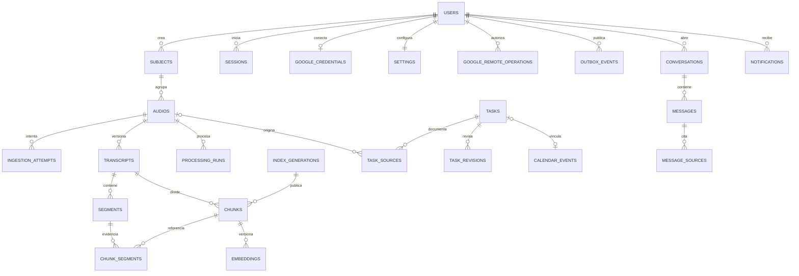
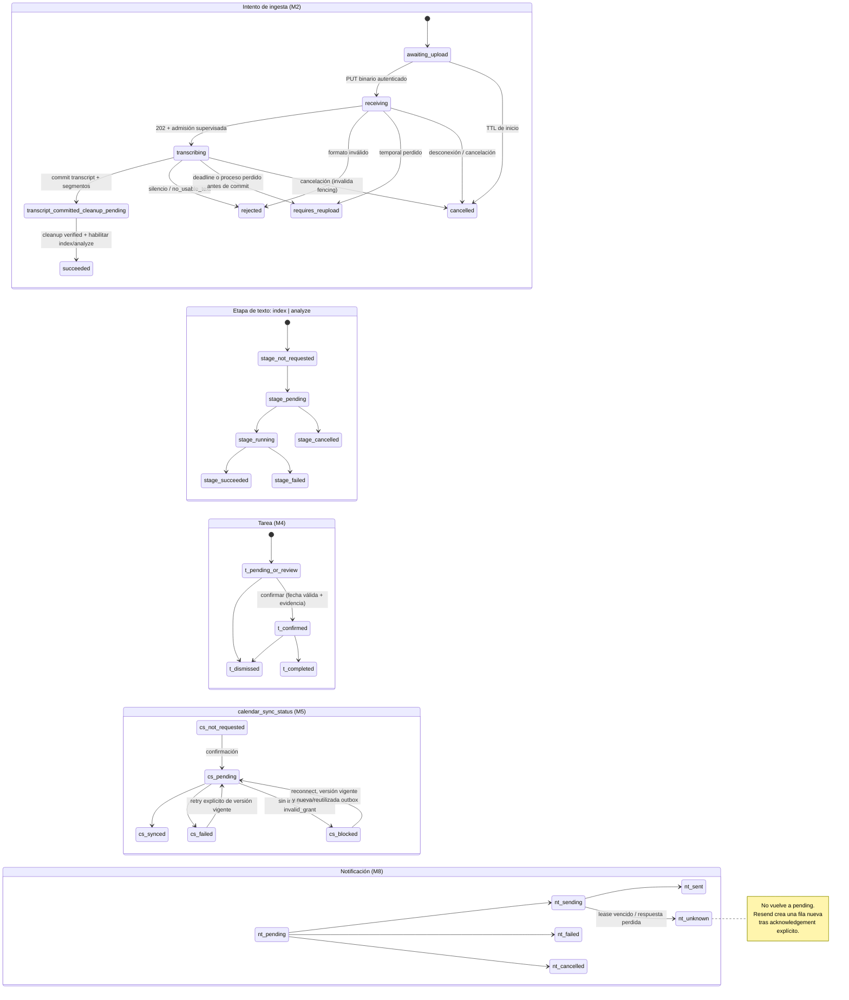

# Maulwurf — Diseño de base de datos, contrato de API y sprints detallados

> **Estado: documento de diseño.** Derivado de
> [ESPECIFICACION.md](ESPECIFICACION.md) (fuente de verdad de contratos),
> [PLAN_IMPLEMENTACION.md](PLAN_IMPLEMENTACION.md) (puertas G1–G8, decisiones D1–D8) y
> [PLAN_SPRINTS.md](PLAN_SPRINTS.md) (backlog por sprint con claiming). Nada de lo que sigue está
> implementado; este documento define **lo que se va a construir**, no evidencia de que
> exista. Si contradice la especificación, gana la especificación y este archivo se corrige
> en la misma revisión.

---

## 1. Estado actual del proyecto (revisión 2026-09-19)

| Área | Estado observado en el repositorio |
|---|---|
| Código de aplicación | Esqueleto mínimo: `apps/api` expone health checks y configuración; `apps/ingest` es un paquete vacío; `apps/web` es un scaffold Next.js. No hay funcionalidad, compose, migraciones, suites de tests ni pipeline CI de calidad. |
| Manifests y dependencias | Existen `apps/api/pyproject.toml` + `uv.lock`, `apps/ingest/pyproject.toml` + `uv.lock`, `apps/web/package.json` + `package-lock.json`, y `requirements-riva.txt`. El cliente Riva está fijado a `2.27.0`; los demás rangos pertenecen al scaffold y no demuestran instalación, build ni compatibilidad E2E. |
| Contratos funcionales | `docs/ESPECIFICACION.md` — módulos M1–M9, modelo de datos §6, NFRs §8 |
| Plan de entrega | `docs/PLAN_IMPLEMENTACION.md` — fases F0–F3, puertas G1–G8, decisiones D1–D8 |
| Plan de equipo | `docs/PLAN_SPRINTS.md` — S1–S4 backlog por sprint con claiming en `docs/sprints/` |
| Catálogo de pruebas | `docs/PLAN_TESTS.md` — capas de prueba, fixtures, cobertura por sprint |
| Proveedor ASR | `docs/NVIDIA_RIVA.md` — parámetros auditados; límites reales pendientes del spike S1 |

**Sprints propuestos actualmente** (PLAN_SPRINTS §0):

| Semana | Nombre | Objetivo en una frase | Puerta de salida |
|---|---|---|---|
| S1 | **Fundación + spike** | Monorepo, auth, esquema y contrato Riva probado | F0: G1 y exactamente G2-T o G2-X; D2/D3-Audio/D4/D6 |
| S2 | **Conocimiento (F1)** | Upload → transcript → índice híbrido → chat con citas | G1, G2-T o G2-X, G3, G4 y G5-F1 |
| S3 | **Acción (F2)** | Extracción, revisión, Calendar idempotente y tools de lectura | G5-F2, G6 y G7-CAL |
| S4 | **Recordatorios y cierre (F3)** | Gmail opt-in, recordatorios/digests, dashboard y hardening | G7-MAIL y G8 |

Regla dura vigente: **nada de ingesta real antes de que S1 cierre la puerta F0**
(retención D3, límites D2/D4, timestamps D6).

Este documento fija:

1. **§2** — diseño completo de la base de datos (tablas, constraints, índices, máquinas de
   estado) y a qué sprint pertenece cada pieza.
2. **§3** — contrato de todos los endpoints propuestos (M1–M9) con shapes de
   request/respuesta, errores y SSE.
3. **§4** — una secuencia diaria sugerida por área y ticket. No asigna personas: el owner
   real de cada ticket nace exclusivamente del claiming y se registra según
   [PLAN_SPRINTS.md](PLAN_SPRINTS.md) §0, conservando los identificadores del backlog
   (`A1.3`, `S1.A6`, `J2.4`, `D3.2`, `L3.4`, …).

---

## 2. Diseño de la base de datos

### 2.1 Convenciones generales

1. **Motor:** PostgreSQL 16 con `pgvector` (`pgvector/pgvector:pg16`, versión fijada). Una
   sola BD para datos, vectores y outbox.
2. **Multi-tenancy desde F0:** toda tabla de negocio lleva `user_id`; las referencias entre
   tablas de tenant usan **FKs compuestas `(user_id, recurso_id)`** para evitar referencias
   cruzadas; la autorización se valida además en servicios (API, SSE, tools y jobs). RLS es
   defensa adicional con `SET LOCAL app.user_id` transaccional y rol de aplicación sin
   `BYPASSRLS` (probar también el pool de conexiones y los workers).
3. **Claves y tiempo:** PK `uuid` con `gen_random_uuid()`; `created_at`/`updated_at`
   `timestamptz NOT NULL DEFAULT now()`; `updated_at` mantenido por la capa de persistencia.
4. **Borrado lógico:** `deleted_at timestamptz` (tombstone) en `users`, `subjects`, `audios`,
   `conversations`. Borrar una clase purga además los derivados (transcripts, segments,
   chunks, embeddings, tasks, resumen, citas/snippets de mensajes asociados o el mensaje
   completo si no puede purgarse con seguridad).
5. **Enums como `TEXT` + `CHECK`:** valores cerrados por contrato; facilitar ampliaciones
   controladas sin reescribir tipos.
6. **Sin audio durable:** `audios` no tiene `storage_key`, blob ni ruta; outbox contiene solo
   IDs y configuración no sensible; nada de audio en disco, S3/MinIO, Redis, logs, trazas,
   cachés ni backups.
7. **Versionado:** transcript por `(audio_id, version)`; chunks por `(transcript_id,
   index_version, ordinal)`; embeddings por `(chunk_id, index_version)` con modelo/dimensión
   registrados; análisis por `processing_runs` `(audio_id, stage, transcript_version,
   config_version)`. Las versiones activas se publican atómicamente (mismas transacción).
8. **Índices de soporte para FKs:** PostgreSQL no indexa el lado referenciante; toda FK
   compuesta o `ON DELETE` lleva índice en la tabla hija. Las purgas de clase y de cuenta
   recorren cascadas y no pueden degenerar en seq-scan.

RLS base (defensa adicional) en cada tabla tenant, con `USING` y `WITH CHECK` (en `users`,
sobre `id`). Sin `missing_ok`: si `app.user_id` no está fijado, la consulta falla
(fail-closed):

```sql
ALTER TABLE audios ENABLE ROW LEVEL SECURITY;
CREATE POLICY tenant_isolation ON audios
  USING (user_id = current_setting('app.user_id')::uuid)
  WITH CHECK (user_id = current_setting('app.user_id')::uuid);
```

Misma plantilla `FOR ALL` en `subjects`, `audios`, `transcripts`, `segments`, `chunks`,
`chunk_segments`, `embeddings`, `index_generations`, `processing_runs`, `outbox_events`,
`ingestion_attempts`, `variant_confirmation_tokens`, `conversations`, `messages`,
`message_sources`, `tasks`, `task_evidence`, `task_sources`, `task_revisions`,
`calendar_events`, `google_remote_operations`, `notifications`, `sessions` y
`google_credentials`. Cada transacción abre con `SET LOCAL app.user_id = '<uuid>'`
(transaccional, por tanto compatible con el pool); los workers lo fijan igual y lo cubren
I-S1-AN-05 y G3.

### 2.1.1 Extensiones

```sql
CREATE EXTENSION IF NOT EXISTS vector;
```

Los índices HNSW y GIN se crean en S2. **No se declara ningún índice sin probar planes y
recall con datos representativos** ([ESPECIFICACION.md](ESPECIFICACION.md) §6.2); los
candidatos se detallan en §2.5 y los índices de tareas en §2.8.

### 2.2 Diagrama ER completo



Todas las relaciones de tenant añaden la FK compuesta `(user_id, recurso_id)`; el diagrama
la omite por legibilidad.

### 2.3 S1 — Identidad, sesión y materias (steward técnico: API/BD)

```sql
CREATE TABLE users (
  id             uuid PRIMARY KEY DEFAULT gen_random_uuid(),
  google_sub     text NOT NULL UNIQUE,          -- identidad: sub de Google, no el email
  email          text NOT NULL,
  email_verified boolean NOT NULL DEFAULT false,
  timezone       text NOT NULL DEFAULT 'UTC',   -- IANA; afecta digests, no fechas de clase
  display_name   text,
  status         text NOT NULL DEFAULT 'active'
                   CHECK (status IN ('active','deleting','deleted')),
  created_at     timestamptz NOT NULL DEFAULT now(),
  updated_at     timestamptz NOT NULL DEFAULT now(),
  deleted_at     timestamptz                    -- tombstone de cuenta (S4)
);

CREATE TABLE sessions (
  id           uuid PRIMARY KEY DEFAULT gen_random_uuid(),
  user_id      uuid NOT NULL REFERENCES users(id) ON DELETE CASCADE,
  token_hash   text NOT NULL UNIQUE,            -- SHA-256 del identificador opaco
  csrf_hash    text NOT NULL,                   -- SHA-256 del token CSRF de la sesión
  created_at   timestamptz NOT NULL DEFAULT now(),
  expires_at   timestamptz NOT NULL,
  revoked_at   timestamptz,
  last_seen_at timestamptz
);
CREATE INDEX sessions_user ON sessions (user_id, expires_at);

CREATE TABLE google_credentials (
  user_id           uuid PRIMARY KEY REFERENCES users(id) ON DELETE CASCADE,
  access_token_enc  bytea NOT NULL,             -- AES-GCM con nonce único
  refresh_token_enc bytea,                      -- preservar el anterior si Google no devuelve otro
  nonce_enc         bytea NOT NULL,
  key_version       integer NOT NULL,           -- rotación de claves
  scopes            text[] NOT NULL DEFAULT '{}',
  token_expires_at  timestamptz,
  status            text NOT NULL DEFAULT 'connected'
                      CHECK (status IN ('connected','disconnected')),
  last_refresh_at   timestamptz,
  updated_at        timestamptz NOT NULL DEFAULT now()
);

CREATE TABLE subjects (
  id         uuid PRIMARY KEY DEFAULT gen_random_uuid(),
  user_id    uuid NOT NULL REFERENCES users(id) ON DELETE CASCADE,
  UNIQUE (user_id, id),
  name       text NOT NULL,
  color      text NOT NULL DEFAULT '#6366f1',
  teacher    text,
  created_at timestamptz NOT NULL DEFAULT now(),
  updated_at timestamptz NOT NULL DEFAULT now(),
  deleted_at timestamptz
);
CREATE UNIQUE INDEX subjects_active_name
  ON subjects (user_id, lower(name)) WHERE deleted_at IS NULL;
```

Notas:

- `sessions.token_hash` nunca guarda el valor plano de la cookie y `csrf_hash` nunca guarda
  el token CSRF plano. `GET /me` entrega el token CSRF plano únicamente al navegador de esa
  sesión con `Cache-Control: no-store`; no rota por cada lectura.
- El token CSRF rota al crear o rotar la sesión, se comparte entre las pestañas que usan la
  misma cookie y queda inválido al cerrar, revocar o reemplazar esa sesión. La rotación se
  confirma en una sola transacción que invalida el hash anterior antes de exponer el nuevo
  token; una pestaña con el valor anterior recibe `403 csrf_invalid` y debe repetir `GET /me`.
- Tokens de Google cifrados AES-GCM con nonce único y `key_version`; `invalid_grant` mueve el
  estado a `disconnected` sin cerrar necesariamente la sesión de la aplicación.
- La zona horaria de cada clase se captura como snapshot en `audios`; cambiar el perfil no
  altera fechas ya extraídas.

### 2.4 S1 esqueleto → S2 completo — Ingesta y audios (API/BD + Ingesta/ASR)

```sql
CREATE TABLE audios (
  id                        uuid PRIMARY KEY DEFAULT gen_random_uuid(),
  user_id                   uuid NOT NULL REFERENCES users(id) ON DELETE CASCADE,
  UNIQUE (user_id, id),
  subject_id                uuid NOT NULL,
  FOREIGN KEY (user_id, subject_id) REFERENCES subjects (user_id, id),
  title                     text,
  teacher                   text,
  sha256                    text,                -- desconocido al reservar; se decide en PUT
  class_date                date NOT NULL,
  class_timezone            text NOT NULL,       -- snapshot IANA de la clase
  language_code             text NOT NULL,       -- allowlist comprobada; sin 'multi'
  original_bytes            bigint,
  duration_seconds          double precision,    -- validada con ffprobe, no con Content-Length
  required_stages           text[] NOT NULL DEFAULT '{index}',
                            -- F1: '{index}'; desde F2: '{index,analyze}'; backfill explícito
  active_transcript_version integer,
  active_analysis_version   integer,
  active_index_version      text,
  created_at                timestamptz NOT NULL DEFAULT now(),
  updated_at                timestamptz NOT NULL DEFAULT now(),
  deleted_at                timestamptz          -- tombstone: cancela intentos/jobs tardíos
);

-- Identidad exacta: hash + idioma + materia + fecha + zona; se resuelve al finalizar el PUT.
CREATE UNIQUE INDEX audios_dedupe_identity
  ON audios (user_id, sha256, language_code, subject_id, class_date, class_timezone)
  WHERE deleted_at IS NULL AND sha256 IS NOT NULL;
CREATE INDEX audios_variant_lookup ON audios (user_id, sha256)
  WHERE deleted_at IS NULL AND sha256 IS NOT NULL;
CREATE INDEX audios_library ON audios (user_id, subject_id, class_date DESC)
  WHERE deleted_at IS NULL;

CREATE TABLE ingestion_attempts (
  id                                uuid PRIMARY KEY DEFAULT gen_random_uuid(),
  user_id                           uuid NOT NULL REFERENCES users(id) ON DELETE CASCADE,
  UNIQUE (user_id, id),
  audio_id                          uuid NOT NULL,
  FOREIGN KEY (user_id, audio_id) REFERENCES audios (user_id, id),
  privacy_notice_version            text NOT NULL,
  cloud_processing_accepted_at      timestamptz NOT NULL,
  third_party_voice_acknowledged_at timestamptz NOT NULL,
  declared_providers                jsonb NOT NULL, -- nombres/versiones mostrados, sin secretos
  status                            text NOT NULL
    CHECK (status IN ('awaiting_upload','receiving','transcribing',
                      'transcript_committed_cleanup_pending','succeeded',
                      'requires_reupload','rejected','cancelled')),
  owner_instance                    text NOT NULL,  -- instancia que posee reserva/temporal
  fencing_token                     bigint NOT NULL,
  lease_expires_at                  timestamptz,
  heartbeat_at                      timestamptz,
  upload_expires_at                 timestamptz,
  receive_deadline                  timestamptz,
  asr_deadline                      timestamptz,
  received_bytes                    bigint NOT NULL DEFAULT 0,
  expected_bytes                    bigint,
  fragments_done                    integer,
  fragments_total                   integer,
  cleanup_status                    text NOT NULL DEFAULT 'pending'
    CHECK (cleanup_status IN ('pending','verified','failed')),
  cleanup_verified_at               timestamptz,
  cleanup_evidence                  jsonb NOT NULL DEFAULT '{}',
  audio_deleted_at                  timestamptz,
  error_code                        text,
  created_at                        timestamptz NOT NULL DEFAULT now(),
  updated_at                        timestamptz NOT NULL DEFAULT now()
);

-- Solo se guarda el hash del token opaco. La fila caduca y se purga; no retiene audio.
CREATE TABLE variant_confirmation_tokens (
  id                    uuid PRIMARY KEY DEFAULT gen_random_uuid(),
  user_id               uuid NOT NULL REFERENCES users(id) ON DELETE CASCADE,
  token_hash            text NOT NULL UNIQUE,
  canonical_audio_id    uuid NOT NULL,
  FOREIGN KEY (user_id, canonical_audio_id)
    REFERENCES audios (user_id, id) ON DELETE CASCADE,
  content_sha256        text NOT NULL,
  subject_id            uuid NOT NULL,
  FOREIGN KEY (user_id, subject_id) REFERENCES subjects (user_id, id),
  class_date            date NOT NULL,
  class_timezone        text NOT NULL,
  language_code         text NOT NULL,
  metadata_digest       text NOT NULL, -- HMAC de metadatos normalizados mostrados al usuario
  expires_at            timestamptz NOT NULL,
  consumed_at           timestamptz,
  reserved_audio_id     uuid,
  FOREIGN KEY (user_id, reserved_audio_id) REFERENCES audios (user_id, id),
  created_at            timestamptz NOT NULL DEFAULT now(),
  CHECK (consumed_at IS NULL OR reserved_audio_id IS NOT NULL)
);
CREATE INDEX variant_tokens_expiry
  ON variant_confirmation_tokens (expires_at) WHERE consumed_at IS NULL;
CREATE INDEX variant_tokens_by_canonical
  ON variant_confirmation_tokens (user_id, canonical_audio_id);

-- Un único intento activo por clase; cleanup pendiente sigue siendo trabajo activo.
CREATE UNIQUE INDEX attempts_one_active
  ON ingestion_attempts (audio_id)
  WHERE status IN ('awaiting_upload','receiving','transcribing',
                   'transcript_committed_cleanup_pending');
CREATE INDEX attempts_by_audio ON ingestion_attempts (user_id, audio_id);
```

Notas de diseño ([ESPECIFICACION.md](ESPECIFICACION.md) §6.2):

- `POST /audios` crea una reserva con `sha256=NULL`: no puede prometer dedupe antes de recibir
  bytes. El primer `PUT` calcula el hash, limpia el temporal y decide de forma transaccional
  `duplicate_exact`, `duplicate_variant` o admisión a ASR. Una reserva provisional absorbida
  por dedupe se elimina después del cleanup; no queda como una clase duplicada.
- Para una variante, el primer `PUT` devuelve un token plano solo en esa respuesta; BD guarda
  `token_hash`. El segundo `POST` consume una única vez el token vigente, comprueba tenant y
  metadatos, liga la nueva reserva mediante `reserved_audio_id` y exige reupload. El segundo
  `PUT` vuelve a calcular el hash; una diferencia termina en `rejected` sin ASR. Ni el token
  ni la decisión humana prolongan la vida del audio del primer upload.
- Los consentimientos versionados son snapshot por intento. Una versión ausente u obsoleta o
  cualquiera de los dos reconocimientos en `false` se rechaza antes de reservar capacidad.
- `audios` **no** tiene `storage_key`, blob ni ruta durable. El hash se borra con la clase;
  reupload sin transcript reutiliza el registro canónico, salvo una variante confirmada que
  crea deliberadamente otra clase.
- Estado agregado (`processing|ready|partial|failed`) es derivado desde el intento y
  `processing_runs`; `not_requested` nunca equivale a éxito.
- Tras el commit, el estado interno es `transcript_committed_cleanup_pending`; no se expone
  como éxito. Lease vencido no prueba borrado: sin evidencia, `cleanup_status` sigue `pending`
  y solo la outbox de índice/análisis permanece bloqueada. `cleanup_status='failed'` detiene
  la admisión local y genera alerta.
- Los TTL candidatos se fijan únicamente después del benchmark F0; hasta entonces
  `GET /ingestion/capabilities` devuelve `null` y `limits_validated=false`.

### 2.5 S2 — Transcript, chunks, embeddings e índice (API/BD + RAG)

```sql
CREATE TABLE transcripts (
  id                  uuid PRIMARY KEY DEFAULT gen_random_uuid(),
  user_id             uuid NOT NULL REFERENCES users(id) ON DELETE CASCADE,
  UNIQUE (user_id, id),
  audio_id            uuid NOT NULL,
  FOREIGN KEY (user_id, audio_id) REFERENCES audios (user_id, id) ON DELETE CASCADE,
  version             integer NOT NULL,
  language_requested  text NOT NULL,
  provider            text NOT NULL DEFAULT 'nvidia-riva',
  model               text NOT NULL,             -- provisional: whisper-large-v3
  model_config        jsonb NOT NULL,            -- sample rate, fragmentación, overlap, ffprobe
  client_version      text,
  timestamp_precision text NOT NULL
                        CHECK (timestamp_precision IN ('word','segment','none')),
  text                text NOT NULL,             -- fuente durable completa del transcript
  char_count          integer NOT NULL DEFAULT 0
                        CHECK (char_count = char_length(text)),
  quality_flags       jsonb NOT NULL DEFAULT '[]',  -- repeticiones/silencios detectados
  warnings            jsonb NOT NULL DEFAULT '[]',
  fts_config          text NOT NULL,             -- 'spanish' | 'english' | 'simple'
  summary             text,                      -- F2: 3–5 frases, con analysis_version
  topics              text[],                    -- F2: versionados
  analysis_version    integer,
  created_at          timestamptz NOT NULL DEFAULT now(),
  UNIQUE (audio_id, version)
);

CREATE TABLE segments (
  id             uuid PRIMARY KEY DEFAULT gen_random_uuid(),
  user_id        uuid NOT NULL,
  UNIQUE (user_id, id),
  transcript_id  uuid NOT NULL,
  FOREIGN KEY (user_id, transcript_id)
    REFERENCES transcripts (user_id, id) ON DELETE CASCADE,
  ordinal        integer NOT NULL,               -- ID estable dentro de la versión
  text           text NOT NULL,
  char_start     integer NOT NULL,               -- puntos de código Unicode, no bytes/UTF-16
  char_end       integer NOT NULL,
  t_start        double precision,               -- nullable: la precisión real del ASR manda
  t_end          double precision,
  CHECK (char_start < char_end),
  CHECK ((t_start IS NULL AND t_end IS NULL)
         OR (t_start IS NOT NULL AND t_end IS NOT NULL
             AND 0 <= t_start AND t_start < t_end)),
  UNIQUE (transcript_id, ordinal)
);

CREATE TABLE chunks (
  id                 uuid PRIMARY KEY DEFAULT gen_random_uuid(),
  user_id            uuid NOT NULL,
  UNIQUE (user_id, id),
  audio_id           uuid NOT NULL,
  FOREIGN KEY (user_id, audio_id) REFERENCES audios (user_id, id) ON DELETE CASCADE,
  transcript_id      uuid NOT NULL,
  FOREIGN KEY (user_id, transcript_id)
    REFERENCES transcripts (user_id, id) ON DELETE CASCADE,
  transcript_version integer NOT NULL,
  index_version      text NOT NULL,              -- generación de índice
  ordinal            integer NOT NULL,
  content            text NOT NULL,
  char_start         integer NOT NULL,           -- offsets preservados sobre el texto íntegro
  char_end           integer NOT NULL,
  token_count        integer NOT NULL,           -- objetivo ~800, overlap ~100; contado con
                                                 -- el tokenizador del proveedor (D5)
  t_start            double precision,           -- derivados, nullable
  t_end              double precision,
  tsv                tsvector,                   -- construido con transcripts.fts_config
  UNIQUE (transcript_id, index_version, ordinal)
);
CREATE INDEX chunks_fts ON chunks USING GIN (tsv);
CREATE INDEX chunks_by_audio ON chunks (user_id, audio_id);

CREATE TABLE chunk_segments (
  user_id      uuid NOT NULL,
  chunk_id     uuid NOT NULL,
  FOREIGN KEY (user_id, chunk_id)
    REFERENCES chunks (user_id, id) ON DELETE CASCADE,
  segment_id   uuid NOT NULL,
  FOREIGN KEY (user_id, segment_id)
    REFERENCES segments (user_id, id) ON DELETE CASCADE,
  overlap_span jsonb,                           -- offsets del solapamiento, para la evidencia
  PRIMARY KEY (user_id, chunk_id, segment_id)
);
CREATE INDEX chunk_segments_by_segment ON chunk_segments (user_id, segment_id);

CREATE TABLE embeddings (
  user_id       uuid NOT NULL,
  chunk_id      uuid NOT NULL,
  FOREIGN KEY (user_id, chunk_id)
    REFERENCES chunks (user_id, id) ON DELETE CASCADE,
  index_version text NOT NULL,
  model         text NOT NULL,                   -- provisional: text-embedding-3-small
  dimension     integer NOT NULL,                -- provisional: 1536
  vector        vector(1536) NOT NULL,
  created_at    timestamptz NOT NULL DEFAULT now(),
  PRIMARY KEY (user_id, chunk_id, index_version)
);
-- HNSW global y coseno (coherente con el embedding); el recall con filtros de
-- tenant/versión se garantiza en la consulta (§3.9), no en el índice.
CREATE INDEX embeddings_hnsw ON embeddings USING hnsw (vector vector_cosine_ops);

CREATE TABLE index_generations (
  id           uuid PRIMARY KEY DEFAULT gen_random_uuid(),
  user_id      uuid NOT NULL REFERENCES users(id) ON DELETE CASCADE,
  version      text NOT NULL,
  model        text NOT NULL,
  dimension    integer NOT NULL,
  status       text NOT NULL CHECK (status IN ('building','active','retired')),
  chunk_count  integer NOT NULL DEFAULT 0,
  activated_at timestamptz,
  created_at   timestamptz NOT NULL DEFAULT now(),
  UNIQUE (user_id, version)
);
-- una sola generación activa por usuario; la activación es atómica (G5-F1)
CREATE UNIQUE INDEX index_generations_one_active
  ON index_generations (user_id) WHERE status = 'active';

CREATE TABLE processing_runs (
  id                 uuid PRIMARY KEY DEFAULT gen_random_uuid(),
  user_id            uuid NOT NULL REFERENCES users(id) ON DELETE CASCADE,
  UNIQUE (user_id, id),
  audio_id           uuid NOT NULL,
  FOREIGN KEY (user_id, audio_id) REFERENCES audios (user_id, id),
  stage              text NOT NULL CHECK (stage IN ('index','analyze')),
  transcript_version integer NOT NULL,
  config_version     text NOT NULL,
  prompt_version     text,                       -- analyze
  status             text NOT NULL DEFAULT 'pending'
                       CHECK (status IN ('pending','running','succeeded','failed','cancelled')),
  attempt_count      integer NOT NULL DEFAULT 0,
  error_code         text,
  started_at         timestamptz,
  finished_at        timestamptz,
  created_at         timestamptz NOT NULL DEFAULT now(),
  UNIQUE (audio_id, stage, transcript_version, config_version)
);
```

Notas:

- Un chunk **no** es la unidad mínima de evidencia: `chunk_segments` conserva los segmentos y
  sus spans aunque haya solapamiento entre chunks.
- Chunks y generaciones: reindexar con una `index_version` nueva re-chunkea — crea filas
  nuevas de `chunks`/`chunk_segments` para esa generación y purga los embeddings retirados.
  Un `chunk_id` pertenece a exactamente una generación; el `index_version` de `embeddings`
  es redundancia defensiva y debe coincidir con el del chunk.
- Recuperación vectorial con filtros (contrato §3.9): la consulta exige
  `hnsw.iterative_scan = strict_order` (pgvector ≥ 0.8; versión fijada) y over-fetch
  (los ~30 candidatos por rama) para que los filtros `user_id`/versión no dejen el top-k
  con menos de k candidatos; en corpus pequeños, escaneo exacto. G4 evalúa recall **con
  filtros activos**, no solo global.
- Cambiar el modelo/dimensión/versión de embeddings exige una **generación nueva de índice**
  y reindexación completa; nunca se mezclan versiones ni se expone un índice parcial.
- Borrar una clase purga chunks → embeddings y los caches/citas derivadas; los jobs
  re-verifican propiedad, tombstone y versión antes de publicar.

### 2.6 S1 (shape congelado) → S2 dispatcher — Outbox

```sql
CREATE TABLE outbox_events (
  id               uuid PRIMARY KEY DEFAULT gen_random_uuid(),
  user_id          uuid NOT NULL REFERENCES users(id) ON DELETE CASCADE,
  type             text NOT NULL,
  -- 'index_requested' | 'analyze_requested' | 'sync_task_event'
  -- | 'task_cancelled' | 'notify' | 'send_digest' | 'delete_event' | 'account_deleted'
  resource_type    text NOT NULL,               -- 'audio' | 'task' | 'user'
  resource_id      uuid NOT NULL,
  resource_version integer,                     -- versión del recurso al emitir
  payload          jsonb NOT NULL DEFAULT '{}', -- solo IDs/config NO sensible; jamás audio/tokens
  enabled          boolean NOT NULL,
  blocked_reason   text CHECK (blocked_reason IN ('cleanup_pending')),
  status           text NOT NULL DEFAULT 'pending'
                     CHECK (status IN ('pending','dispatched','completed','failed','skipped')),
  attempts         integer NOT NULL DEFAULT 0,
  max_attempts     integer NOT NULL DEFAULT 3,
  next_attempt_at  timestamptz,
  dedupe_key       text,                        -- idempotencia del consumidor
  published_at     timestamptz,
  completed_at     timestamptz,
  created_at       timestamptz NOT NULL DEFAULT now(),
  UNIQUE NULLS NOT DISTINCT (type, resource_id, resource_version, dedupe_key),
  CHECK (
    (type IN ('index_requested','analyze_requested')
      AND ((enabled AND blocked_reason IS NULL)
        OR (NOT enabled AND blocked_reason = 'cleanup_pending')))
    OR
    (type NOT IN ('index_requested','analyze_requested')
      AND enabled AND blocked_reason IS NULL)
  )
);
CREATE INDEX outbox_pending
  ON outbox_events (status, next_attempt_at) WHERE enabled AND status = 'pending';
CREATE INDEX outbox_by_user ON outbox_events (user_id) WHERE status <> 'completed';
```

- El **shape** se congela el lunes S1. El área API/BD mantiene tabla y emisores; el área
  Infra/Workers mantiene dispatcher y ejecución (regla anti-ciclo de `PLAN_SPRINTS.md` §6a).
- Solo `index_requested` y `analyze_requested` nacen deshabilitados con
  `blocked_reason='cleanup_pending'` en la transacción del transcript. Cleanup verificado los
  habilita y borra el motivo en una transacción; no se habilitan por expiración de lease.
- Calendar, notificaciones y borrados nacen `enabled=true`, `blocked_reason=NULL` en la misma
  transacción que autoriza su efecto. No dependen del cleanup de una ingesta anterior.
- Los consumidores son idempotentes y re-verifican tenant, autorización, tombstone y versión.

### 2.7 S2 — Chat (API/BD + RAG)

```sql
CREATE TABLE conversations (
  id         uuid PRIMARY KEY DEFAULT gen_random_uuid(),
  user_id    uuid NOT NULL REFERENCES users(id) ON DELETE CASCADE,
  UNIQUE (user_id, id),
  mode       text NOT NULL CHECK (mode IN ('all','subject','class')),
  subject_id uuid,
  FOREIGN KEY (user_id, subject_id) REFERENCES subjects (user_id, id),
  audio_id   uuid,
  FOREIGN KEY (user_id, audio_id) REFERENCES audios (user_id, id),
  title      text,
  created_at timestamptz NOT NULL DEFAULT now(),
  updated_at timestamptz NOT NULL DEFAULT now(),
  deleted_at timestamptz,
  CHECK (mode <> 'all'    OR (subject_id IS NULL AND audio_id IS NULL)),
  CHECK (mode <> 'subject' OR subject_id IS NOT NULL),
  CHECK (mode <> 'class'  OR audio_id IS NOT NULL)
);

CREATE TABLE messages (
  id                uuid PRIMARY KEY DEFAULT gen_random_uuid(),
  user_id           uuid NOT NULL,
  UNIQUE (user_id, id),
  conversation_id   uuid NOT NULL,
  FOREIGN KEY (user_id, conversation_id)
    REFERENCES conversations (user_id, id) ON DELETE CASCADE,
  role              text NOT NULL CHECK (role IN ('user','assistant','system')),
  content           text NOT NULL DEFAULT '',
  client_message_id text,                        -- idempotencia de envío
  status            text NOT NULL DEFAULT 'completed'
                      CHECK (status IN ('streaming','completed','failed','cancelled')),
  citas             jsonb NOT NULL DEFAULT '[]',
  -- [{audio_id, transcript_version, chunk_id, segment_id, t_start, t_end, quote}]
  -- únicamente referencias validadas en BD; nunca timestamps/IDs inventados por el LLM
  model             text,
  prompt_version    text,
  input_tokens      integer,
  output_tokens     integer,
  created_at        timestamptz NOT NULL DEFAULT now()
);
-- Idempotencia solo para peticiones del usuario: NULLS NOT DISTINCT colisionaría todos los
-- mensajes con client_message_id NULL y bloquearía el segundo turno del asistente.
CREATE UNIQUE INDEX messages_client_idem
  ON messages (conversation_id, client_message_id)
  WHERE client_message_id IS NOT NULL;

CREATE TABLE message_sources (
  id                 uuid PRIMARY KEY DEFAULT gen_random_uuid(),
  user_id            uuid NOT NULL,
  message_id         uuid NOT NULL,
  FOREIGN KEY (user_id, message_id)
    REFERENCES messages (user_id, id) ON DELETE CASCADE,
  kind               text NOT NULL
                       CHECK (kind IN ('transcript','calendar','task','general')),
  audio_id           uuid,
  FOREIGN KEY (user_id, audio_id) REFERENCES audios (user_id, id),
  transcript_id      uuid,
  FOREIGN KEY (user_id, transcript_id) REFERENCES transcripts (user_id, id),
  transcript_version integer,
  chunk_id           uuid,
  FOREIGN KEY (user_id, chunk_id) REFERENCES chunks (user_id, id),
  segment_id         uuid,
  FOREIGN KEY (user_id, segment_id) REFERENCES segments (user_id, id),
  delivered_at       timestamptz NOT NULL DEFAULT now(),
  CHECK (kind <> 'transcript' OR
    (audio_id IS NOT NULL AND transcript_id IS NOT NULL
     AND transcript_version IS NOT NULL AND chunk_id IS NOT NULL))
);
CREATE INDEX message_sources_by_audio ON message_sources (user_id, audio_id);
CREATE INDEX message_sources_by_message ON message_sources (user_id, message_id);
```

- `message_sources` registra **todas** las fuentes entregadas al modelo (también las de
  tools y las heredadas del historial) para purgar respuestas descendientes al borrar una
  fuente (G5-F1/G5-F2). El texto ya visto no puede retirarse; se informa ese límite.
- Historial con presupuesto de tokens y retención configurable por conversación. Presupuesto
  por turno: `ventana_del_modelo − reserva_de_salida − margen`; la evidencia (≤ ~8 chunks ×
  ~800 tokens) manda y el historial se recorta de forma determinista (turnos completos, del
  más antiguo; nunca a mitad). El presupuesto se verifica con el tokenizador real del
  proveedor antes de cada llamada; si ni con el historial mínimo cabe, `context_exceeded`.

### 2.8 S3 — Tareas, fuentes, revisiones, Calendar y settings (API/BD + Integraciones)

```sql
CREATE TABLE tasks (
  id          uuid PRIMARY KEY DEFAULT gen_random_uuid(),
  user_id     uuid NOT NULL REFERENCES users(id) ON DELETE CASCADE,
  UNIQUE (user_id, id),
  audio_id    uuid,                              -- nullable: tareas manuales/chat
  FOREIGN KEY (user_id, audio_id) REFERENCES audios (user_id, id),
  subject_id  uuid,                              -- denormalizado para filtros/bandeja
  FOREIGN KEY (user_id, subject_id) REFERENCES subjects (user_id, id),
  source      text NOT NULL DEFAULT 'extraction'
                CHECK (source IN ('extraction','chat','manual')),
  tipo        text NOT NULL
                CHECK (tipo IN ('examen','tarea','entrega','lectura',
                                'recordatorio','recomendacion','proyecto')),
  titulo      text NOT NULL,
  detalle     text,
  due_date    date,                              -- día completo
  due_at      timestamptz,                       -- instante; mutuamente excluyentes
  timezone    text NOT NULL,                     -- snapshot de la clase
  all_day     boolean NOT NULL,
  date_status text NOT NULL CHECK (date_status IN ('resolved','ambiguous','missing')),
  date_text   text,                              -- texto original ("el viernes que viene")
  date_reason text,                              -- motivo de needs_review (DST, ambiguo…)
  confidence_score double precision
    CHECK (confidence_score >= 0 AND confidence_score <= 1),
  -- señal NO calibrada; nunca permiso de auto-agendar
  status      text NOT NULL DEFAULT 'needs_review'
                CHECK (status IN ('pending','needs_review','confirmed','dismissed','completed')),
  calendar_sync_status text NOT NULL DEFAULT 'not_requested'
    CHECK (calendar_sync_status IN ('not_requested','pending','synced','failed','blocked')),
  version     integer NOT NULL DEFAULT 1,        -- locking optimista (PATCH/confirm)
  due_version integer NOT NULL DEFAULT 1,        -- versión de vencimiento (recordatorios)
  event_start_at             timestamptz,        -- bloque Calendar con hora
  event_end_at               timestamptz,
  event_start_date           date,               -- bloque Calendar all-day, fin exclusivo
  event_end_date_exclusive   date,
  calendar_id text,
  calendar_event_id text,
  confirmed_at timestamptz,
  completed_at timestamptz,
  dismissed_at timestamptz,
  created_at  timestamptz NOT NULL DEFAULT now(),
  updated_at  timestamptz NOT NULL DEFAULT now(),
  -- CHECK de fecha (spec §6.2):
  CHECK (
       (date_status = 'resolved' AND all_day
          AND due_date IS NOT NULL AND due_at IS NULL)
    OR (date_status = 'resolved' AND NOT all_day
          AND due_at IS NOT NULL AND due_date IS NULL)
    OR (date_status IN ('ambiguous','missing')
          AND due_date IS NULL AND due_at IS NULL)
  ),
  CHECK (
       (event_start_at IS NULL AND event_end_at IS NULL
          AND event_start_date IS NULL AND event_end_date_exclusive IS NULL)
    OR (event_start_at IS NOT NULL AND event_end_at IS NOT NULL
          AND event_start_date IS NULL AND event_end_date_exclusive IS NULL
          AND event_start_at < event_end_at)
    OR (event_start_at IS NULL AND event_end_at IS NULL
          AND event_start_date IS NOT NULL AND event_end_date_exclusive IS NOT NULL
          AND event_start_date < event_end_date_exclusive)
  )
);
-- `date` y `timestamptz` no se mezclan en una expresión de índice: la zona de sesión sería ambigua.
CREATE INDEX tasks_inbox_due_at ON tasks (user_id, status, due_at) WHERE due_at IS NOT NULL;
CREATE INDEX tasks_inbox_due_date ON tasks (user_id, status, due_date) WHERE due_date IS NOT NULL;

CREATE TABLE task_evidence (
  id             uuid PRIMARY KEY DEFAULT gen_random_uuid(),
  user_id        uuid NOT NULL,
  task_id        uuid NOT NULL,
  FOREIGN KEY (user_id, task_id) REFERENCES tasks (user_id, id) ON DELETE CASCADE,
  task_version   integer NOT NULL,
  transcript_id  uuid NOT NULL,
  FOREIGN KEY (user_id, transcript_id) REFERENCES transcripts (user_id, id),
  segment_id     uuid NOT NULL,
  FOREIGN KEY (user_id, segment_id) REFERENCES segments (user_id, id),
  char_start     integer NOT NULL,               -- offsets Unicode sobre el texto del segmento
  char_end       integer NOT NULL,
  quote          text NOT NULL,                  -- cita textual comprobada contra el segmento
  CHECK (char_start < char_end)
);
CREATE INDEX task_evidence_by_task ON task_evidence (user_id, task_id, task_version);

-- Una propuesta basada en transcript/chat puede referenciar varias clases; la tarea manual usa cero filas.
CREATE TABLE task_sources (
  user_id            uuid NOT NULL,
  task_id            uuid NOT NULL,
  FOREIGN KEY (user_id, task_id) REFERENCES tasks (user_id, id) ON DELETE CASCADE,
  audio_id           uuid NOT NULL,
  FOREIGN KEY (user_id, audio_id) REFERENCES audios (user_id, id) ON DELETE CASCADE,
  transcript_id      uuid NOT NULL,
  FOREIGN KEY (user_id, transcript_id) REFERENCES transcripts (user_id, id),
  transcript_version integer NOT NULL,
  segment_id         uuid NOT NULL,
  FOREIGN KEY (user_id, segment_id) REFERENCES segments (user_id, id),
  char_start         integer NOT NULL,
  char_end           integer NOT NULL,
  PRIMARY KEY (user_id, task_id, segment_id, char_start, char_end),
  CHECK (char_start < char_end)
);
CREATE INDEX task_sources_by_audio ON task_sources (user_id, audio_id);

CREATE TABLE task_revisions (
  id                 uuid PRIMARY KEY DEFAULT gen_random_uuid(),
  user_id            uuid NOT NULL,
  UNIQUE (user_id, id),
  task_id            uuid NOT NULL,
  FOREIGN KEY (user_id, task_id) REFERENCES tasks (user_id, id) ON DELETE CASCADE,
  run_id             uuid,
  FOREIGN KEY (user_id, run_id) REFERENCES processing_runs (user_id, id),
  base_task_version  integer NOT NULL,
  revision_type      text NOT NULL CHECK (revision_type IN ('reanalysis','edit_of_confirmed')),
  proposed_fields    jsonb NOT NULL,             -- nunca muta la tarea activa
  evidence_validated boolean NOT NULL DEFAULT false,
  status             text NOT NULL DEFAULT 'pending_confirmation'
                       CHECK (status IN ('pending_confirmation','activated','discarded')),
  activated_at       timestamptz,
  created_at         timestamptz NOT NULL DEFAULT now(),
  UNIQUE (task_id, base_task_version, revision_type, run_id)
);

CREATE TABLE calendar_events (
  id                 uuid PRIMARY KEY DEFAULT gen_random_uuid(),
  user_id            uuid NOT NULL REFERENCES users(id) ON DELETE CASCADE,
  calendar_id        text NOT NULL,
  event_id           text NOT NULL,              -- ID remoto de Google
  source             text NOT NULL CHECK (source IN ('google','maulwurf')),
  task_id            uuid,                       -- nullable: la mayoría de eventos no tienen tarea
  FOREIGN KEY (user_id, task_id) REFERENCES tasks (user_id, id),
  title              text NOT NULL,
  start_at           timestamptz,                -- par con end_at: eventos con hora
  end_at             timestamptz,
  start_date         date,                       -- par all-day (fin exclusivo)
  end_date_exclusive date,
  timezone           text,
  etag               text,
  remote_status      text NOT NULL DEFAULT 'confirmed',
  last_synced_at     timestamptz NOT NULL,
  created_at         timestamptz NOT NULL DEFAULT now(),
  updated_at         timestamptz NOT NULL DEFAULT now(),
  UNIQUE (user_id, calendar_id, event_id),
  CHECK ((start_at IS NOT NULL AND end_at IS NOT NULL
            AND start_date IS NULL AND end_date_exclusive IS NULL)
      OR (start_date IS NOT NULL AND end_date_exclusive IS NOT NULL
            AND start_at IS NULL AND end_at IS NULL)),
  CHECK (start_at IS NULL OR start_at < end_at),
  CHECK (start_date IS NULL OR start_date < end_date_exclusive)
);
-- una tarea tiene como máximo un evento vinculado
CREATE UNIQUE INDEX calendar_events_one_link
  ON calendar_events (task_id) WHERE task_id IS NOT NULL;

CREATE TABLE google_remote_operations (
  id          uuid PRIMARY KEY DEFAULT gen_random_uuid(),
  user_id     uuid NOT NULL REFERENCES users(id) ON DELETE CASCADE,
  kind        text NOT NULL CHECK (kind IN ('delete_event','delete_calendar','account_cleanup')),
  calendar_id text,
  event_id    text,
  authorized  boolean NOT NULL DEFAULT false,    -- opción explícita del usuario
  status      text NOT NULL CHECK (status IN ('pending','running','succeeded','failed')),
  attempts    integer NOT NULL DEFAULT 0,
  error_code  text,
  created_at  timestamptz NOT NULL DEFAULT now(),
  finished_at timestamptz
);

-- Registro residual sin FK: sobrevive a la purga para informar el resultado sin retener perfil/texto.
CREATE TABLE account_deletions (
  id            uuid PRIMARY KEY DEFAULT gen_random_uuid(),
  former_user_id uuid NOT NULL,
  status        text NOT NULL
    CHECK (status IN ('pending','completed','completed_with_remote_failures')),
  delete_events boolean NOT NULL DEFAULT false,
  error_summary text,
  expires_at    timestamptz NOT NULL,
  created_at    timestamptz NOT NULL DEFAULT now(),
  completed_at  timestamptz
);
CREATE INDEX account_deletions_expiry ON account_deletions (expires_at);
```

- El ciclo de vida de la tarea (`status`) está **separado** de `calendar_sync_status`;
  `scheduled` no es un estado de tarea. Una tarea manual tiene cero `task_sources`; una
  extracción/chat fundada en corpus debe tener al menos una fila validada antes de publicarse.
- Confirmar exige fecha válida + evidencia comprobada para tareas extraídas. Un `PATCH` de una
  tarea confirmada crea `task_revisions(status='pending_confirmation')` con
  `base_task_version`, sin mutar campos activos ni escribir Google. `confirm` recibe
  `revision_id` y `expected_version`, activa exactamente esa revisión, incrementa versión y
  crea/reutiliza la outbox de Calendar en una sola transacción.
- El borrado remoto de clase/tarea vive en `google_remote_operations` y **sobrevive** a su
  purga hasta resolverse. El borrado de cuenta crea `account_deletions`, que conserva solo ID
  previo, estado, error redactado y expiración; permite `GET /me/deletion/{id}` después de
  purgar perfil/tokens.
- Completar/descartar cancela recordatorios futuros pero conserva el evento con aviso, salvo
  petición explícita de eliminación remota.

### 2.9 S3 settings Calendar → S4 notificaciones (stewards: API/BD + Infra)

```sql
-- S3: persiste el calendario de escritura/lectura antes de conectar Google.
CREATE TABLE settings (
  user_id                    uuid PRIMARY KEY REFERENCES users(id) ON DELETE CASCADE,
  calendar_write_calendar_id text,
  calendar_read_calendar_ids text[] NOT NULL DEFAULT '{}',
  created_at                 timestamptz NOT NULL DEFAULT now(),
  updated_at                 timestamptz NOT NULL DEFAULT now()
);

-- S4: amplía la misma fila; no crea una segunda tabla de settings.
ALTER TABLE settings
  ADD COLUMN gmail_opt_in boolean NOT NULL DEFAULT false,
  ADD COLUMN digest_daily_enabled boolean NOT NULL DEFAULT false,
  ADD COLUMN digest_daily_time time NOT NULL DEFAULT '07:00',
  ADD COLUMN digest_weekly_enabled boolean NOT NULL DEFAULT false,
  ADD COLUMN digest_weekday integer NOT NULL DEFAULT 0 CHECK (digest_weekday BETWEEN 0 AND 6),
  ADD COLUMN reminder_offsets_hours jsonb NOT NULL DEFAULT '[48,24,2]',
  ADD COLUMN reminder_allday_offsets_days jsonb NOT NULL DEFAULT '[3,1]';

CREATE TABLE notifications (
  id                  uuid PRIMARY KEY DEFAULT gen_random_uuid(),
  user_id             uuid NOT NULL REFERENCES users(id) ON DELETE CASCADE,
  task_id             uuid,                       -- nullable: digests y prueba no dependen de tarea
  FOREIGN KEY (user_id, task_id) REFERENCES tasks (user_id, id) ON DELETE SET NULL,
  type                text NOT NULL CHECK (type IN
    ('reminder_t48','reminder_t24','reminder_t2',
     'reminder_t3d','reminder_t1d','digest_daily','digest_weekly','test')),
  occurrence          date,                       -- fecha local objetivo
  due_version         integer,
  scheduled_at        timestamptz NOT NULL,
  dedupe_key          text NOT NULL,              -- (user_id, type, task_id, due_version, occurrence)
  status              text NOT NULL DEFAULT 'pending'
    CHECK (status IN ('pending','sending','sent','failed','delivery_unknown','cancelled')),
  lease_expires_at    timestamptz,                -- 'sending' vencido = entrega incierta
  attempts            integer NOT NULL DEFAULT 0,
  sent_at             timestamptz,
  provider_message_id text,
  last_error_code     text,                       -- redactado, sin PII
  created_at          timestamptz NOT NULL DEFAULT now(),
  updated_at          timestamptz NOT NULL DEFAULT now(),
  UNIQUE NULLS NOT DISTINCT (user_id, type, task_id, due_version, occurrence)
);
CREATE INDEX notifications_due ON notifications (status, scheduled_at) WHERE status = 'pending';
```

- Dedupe persistente `(user_id, tipo, task_id, due_version, occurrence)`; cambiar vencimiento
  o preferencias cancela las ocurrencias futuras obsoletas; **nunca** ráfaga retrospectiva al
  confirmar tarde.
- DST: hora inexistente → siguiente instante válido; hora repetida → una sola ocurrencia
  local. Tareas sin fecha no tienen recordatorios escalados.
- Gmail no garantiza exactamente una entrega: respuesta perdida o lease `sending` vencido →
  `delivery_unknown`, **sin reintento automático**; visible en panel; reexpedición manual
  advierte del riesgo.

### 2.10 Máquinas de estado (contratos congelados)



(Las etiquetas abrevian los estados reales definidos en los CHECK; el contrato normativo
son los valores de las columnas, no el diagrama.)

### 2.11 Matriz tabla → sprint → stewardship técnico

`Steward técnico` indica el área que congela el contrato de datos; **no** asigna persona ni
propiedad de ticket. El owner efectivo se consulta en `sprints/CLAIMS.md`.

| Tabla | Sprint | Steward técnico | Áreas consumidoras |
|---|---|---|---|
| `users`, `sessions`, `google_credentials`, `subjects` | S1 | API/BD | Todas |
| `audios`, `ingestion_attempts`, `variant_confirmation_tokens` | S1 shape → S2 completo | API/BD + Ingesta | Ingesta, Web, Infra/Workers |
| `outbox_events` | S1 shape → S2 dispatcher | API/BD | Infra/Workers |
| `transcripts`, `segments` | S2 | API/BD + Ingesta | RAG, Web |
| `chunks`, `chunk_segments`, `embeddings`, `index_generations` | S2 | API/BD + RAG | RAG, Web |
| `processing_runs` | S2 | API/BD | RAG, Infra/Workers, Ingesta |
| `conversations`, `messages`, `message_sources` | S2 | API/BD + RAG | RAG, Web |
| `tasks`, `task_evidence`, `task_sources`, `task_revisions`, `calendar_events`, `google_remote_operations`, `settings` | S3 | API/BD + Integraciones | Web, Infra/Workers, RAG |
| `notifications` y extensión Gmail/digests de `settings` | S4 | API/BD + Infra/Workers | Infra/Workers, Web |

---

## 3. Contrato de la API

### 3.1 Convenciones comunes

| Aspecto | Contrato |
|---|---|
| Origen | Same-origin detrás de Caddy; rutas absolutas como en la especificación (sin prefijo `/api`) |
| Sesión | Cookie opaca `mw_session` (`Secure`, `HttpOnly`, `SameSite=Lax`); el servidor solo guarda el hash |
| CSRF | `GET /me` entrega el token plano bajo `Cache-Control: no-store`; el servidor conserva solo `csrf_hash`. Toda mutación (`POST`/`PUT`/`PATCH`/`DELETE`, incluido el binario) exige `X-CSRF-Token` válido y `Origin` coincidente. Rota con la sesión, no por lectura. |
| Privacidad HTTP | `Cache-Control: no-store` en contenido privado; el service worker (si existe, S4) excluye upload/API/transcripts/chat/SSE |
| Identidad | `user_id` siempre desde la sesión del backend; nunca de un payload ni de salida del LLM |
| Trazas | Logs JSON con `request_id`, `audio_id`, `attempt_id`, `run_id`; sin payloads sensibles |
| Paginación | `limit` (1–200, default 50) + `cursor` opaco |
| Cuotas | `429` con `Retry-After` para cuota por usuario; `503` con `Retry-After` para capacidad de ingesta. Valores efectivos TBD tras F0 |
| Idioma | Sin preselección ni autodetección; `multi` y traducción fuera de MVP/v1 |

### 3.2 Envelope de error y códigos

Éxitos con semántica especial (no son errores; se documentan aparte para que el manejo de
excepciones no los trate como fallos):

| Código | HTTP | Uso |
|---|---|---|
| `duplicate_exact` | 200 | Dedupe exacto: devuelve la clase canónica |
| `calendar_blocked` | 202 | Confirmada sin integración: sync queda `blocked` |

```json
{
  "error": {
    "code": "duplicate_variant",
    "message": "Existe una clase con el mismo hash y otro idioma. Requiere confirmación.",
    "details": { "existing_audio_id": "8f0c…" }
  }
}
```

Códigos tipados (sin PII ni contenido sensible):

| Código | HTTP | Uso |
|---|---|---|
| `auth_required` | 401 | Sin sesión o expirada |
| `csrf_invalid` | 403 | Falta/invalida `X-CSRF-Token` u Origin |
| `forbidden` | 403 | Recurso de otro tenant |
| `not_found` | 404 | Inexistente o tombstoned |
| `validation_failed` | 422 | Campos inválidos (detalle por campo) |
| `language_not_allowed` | 422 | Código fuera de la allowlist probada |
| `consent_required` | 422 | Falta aceptación de tratamiento cloud |
| `upload_expired` | 410 | TTL de la sesión de ingesta vencido |
| `attempt_not_active` | 409 | Intento no está en `awaiting_upload` |
| `payload_too_large` | 413 | Límite de bytes/duración superado |
| `unsupported_format` | 415 | Contenedor/codec no probado o malformado |
| `duplicate_variant` | 409 | Mismo hash, contexto distinto: exige confirmación |
| `capacity_unavailable` | 503 | Sin slot de RAM/concurrencia |
| `rate_limited` | 429 | Cuota por usuario |
| `tombstoned` | 409 | Operación sobre clase eliminada |
| `version_conflict` | 409 | Locking optimista (tasks) |
| `invalid_transition` | 409 | Estado destino no permitido |
| `transcript_unavailable` | 409 | Sin transcript utilizable (reupload); 404 si el recurso no existe para el tenant |
| `srt_unavailable` | 409 | Timestamps inválidos para SRT |
| `evidence_invalid` | 422 | Span/cita no reconstruible desde BD |
| `context_exceeded` | 422 | Historial + evidencia no caben tras recorte determinista |
| `date_unresolved` | 422 | Confirmar exige fecha válida |
| `provider_unavailable` | 503 | LLM/embeddings/Google caídos |
| `internal_error` | 500 | Sin detalles sensibles |

### 3.3 M1 — Autenticación, perfil e integraciones (S1; connect/reconnect en S3)

| Método | Ruta | Sprint | Descripción | Respuesta |
|---|---|---|---|---|
| `GET` | `/auth/google/start` | S1 | OAuth Authorization Code con `state`, PKCE y `nonce`; scopes `openid email profile` | `302` a Google |
| `GET` | `/auth/google/callback` | S1 | Valida `nonce`/issuer/audience; crea usuario por `sub`; emite sesión opaca | `302` a `/` con cookie |
| `POST` | `/auth/logout` | S1 | Revoca la sesión | `204` |
| `GET` | `/me` | S1 | Perfil + integraciones + bootstrap CSRF no-cacheable | `200` (shape abajo) |
| `PATCH` | `/me` | S1 | Actualiza `timezone` (IANA), `display_name` | `200` |
| `GET` | `/integrations/status` | S1 | Estado de login/Calendar/Gmail, scopes, frescura | `200` |
| `POST` | `/integrations/google/connect` | S3 | OAuth incremental con scopes de Calendar (verificación real D7) | `302` a Google |
| `POST` | `/integrations/google/reconnect` | S3 | Re-autorización tras `invalid_grant` (Testing caduca a 7 días) | `302` a Google |
| `PATCH` | `/me/notifications` | S4 | Preferencias M8 (opt-in Gmail, digests, umbrales) | `200` |
| `POST` | `/notifications/test` | S4 | Envío de prueba al email verificado | `202` |
| `DELETE` | `/me` | S4 | Borrado de cuenta; admite `delete_maulwurf_events` explícito, crea operación y pide borrados remotos antes de revocar tokens | `202 {deletion_operation_id}` |
| `GET` | `/me/deletion/{id}` | S4 | Estado no sensible del borrado; acepta la sesión restringida iniciadora | `pending\|completed\|completed_with_remote_failures` |

Tras `DELETE /me`, la sesión que inició la operación queda en **modo restringido**: solo
`GET /me/deletion/{id}` y `POST /auth/logout`; cualquier otra sesión se revoca. Así el
cliente puede mostrar el estado del borrado sin conservar acceso al resto de la cuenta.

Ejemplo `GET /me`:

```json
{
  "id": "b2a1…",
  "email": "estudiante@uni.edu",
  "timezone": "America/Bogota",
  "csrf_token": "token-plano-solo-en-respuesta-no-cacheable",
  "integrations": {
    "google_login": "connected",
    "calendar": {
      "status": "connected",
      "calendar_id": "abc@group.calendar.google.com",
      "scopes": ["calendar.app.created", "calendar.events.readonly",
                 "calendar.calendarlist.readonly"]
    },
    "gmail": { "status": "disconnected" }
  }
}
```

Rechazar permisos de Calendar/Gmail **no** impide transcribir ni chatear.

### 3.4 M2a — Materias (S1)

| Método | Ruta | Descripción | Respuestas |
|---|---|---|---|
| `GET` | `/subjects` | Lista del tenant | `200` `{items:[{id,name,color,teacher,class_count}]}` |
| `POST` | `/subjects` | Crea (`name`, `color`, `teacher` opcional) | `201` · `422` · `409` duplicado |
| `PATCH` | `/subjects/{id}` | Edita | `200` · `404` · `403` |
| `DELETE` | `/subjects/{id}` | Elimina; `409 subject_has_active_audios` si hay clases activas; `{"force": true}` exige confirmación explícita y tombstone de sus clases | `204` · `409` |

### 3.5 M2b — Ingesta y audios (esqueleto S1; completo S2)

`GET /ingestion/capabilities` publica solo valores observados por el spike. Antes de F0 el
shape no pretende probar límites ni idiomas:

```json
{
  "max_upload_bytes": null,
  "max_duration_seconds": null,
  "accepted_input_formats": [],
  "languages": [],
  "language_policy": "explicit_select_required_no_multi",
  "ttl": {"upload_start_minutes": null, "receive_minutes": null, "asr_minutes": null},
  "asr": {"provider": "nvidia-riva", "model": "whisper-large-v3",
           "timestamp_precision": null},
  "active_slots": null,
  "required_stages": ["index"],
  "limits_validated": false
}
```

Después de F0, los campos no nulos deben enlazar al informe versionado que los midió.

`POST /audios` reserva una sesión; no puede deduplicar antes de conocer el hash.

```json
{
  "subject_id": "5d6e…",
  "class_date": "2026-09-21",
  "class_timezone": "America/Bogota",
  "language_code": "es",
  "title": "Clase 03 — integrales",
  "teacher": "…",
  "privacy_notice_version": "2026-09-19",
  "cloud_processing_accepted": true,
  "third_party_voice_acknowledged": true,
  "variant_confirmation_token": null
}
```

`privacy_notice_version` y los dos acknowledgements se validan antes de reservar. El token
opcional solo puede venir de un `409 duplicate_variant` previo, pertenece al mismo tenant,
vence pronto y se consume una vez.

- `201 Created`: `{"audio_id","attempt_id","upload_url","upload_expires_at","outcome":"new"}`.
- `422 consent_required|language_not_allowed|validation_failed`; `429` cuota; `503` sin slot.
- No existe respuesta `duplicate_exact` ni `duplicate_variant` en este POST.

`PUT /audios/{id}/content?attempt_id=…`:

- Binario autenticado: sesión + CSRF + `attempt_id`; la URL es relativa al mismo origen, no
  es token bearer público ni permite elegir hosts internos.
- Recepción streaming a `tmpfs` privado por intento, SHA-256 incremental, corte al superar
  límite; el hash y la duración reales los valida ffprobe, no `Content-Length`.
- Tras recepción completa calcula SHA-256 y limpia primero el temporal que no seguirá a ASR.
  `202 Accepted` solo para contenido nuevo admitido:
```json
{ "attempt_id": "c41b…", "status": "transcribing", "received_bytes": 184467440 }
```
- `200 duplicate_exact`: `{"audio_id":"canónico","outcome":"duplicate_exact"}` tras liberar
  la reserva. `409 duplicate_variant` incluye `existing_audio_id`,
  `variant_confirmation_token` opaco y su expiración; el cliente debe hacer segundo POST y
  volver a subir. El segundo PUT compara su hash con el token antes de ASR.
- Errores: `410 upload_expired` · `413 payload_too_large` · `415 unsupported_format` ·
  `409 attempt_not_active` · `422 variant_hash_mismatch` · `429`/`503`.
- Desconectar la subida antes de completarla cancela y limpia el intento; tras el `202`
  cerrar la pestaña/SSE **no** cancela el ASR (continúa bajo su lease).

`GET /audios/{id}` — ficha con estados independientes por etapa (spec M2):

```json
{
  "id": "8f0c…",
  "subject": { "id": "5d6e…", "name": "Cálculo II", "color": "#6366f1" },
  "title": "Clase 03",
  "class_date": "2026-09-21",
  "class_timezone": "America/Bogota",
  "language_code": "es",
  "attempt": {
    "attempt_id": "c41b…",
    "status": "transcribing",
    "received_bytes": 104857600,
    "fragments_done": 4,
    "fragments_total": null,
    "cleanup_status": "pending"
  },
  "stages": { "index": "pending", "analyze": "not_requested" },
  "aggregate_status": "processing",
  "audio_retained": false
}
```

`aggregate_status`: `processing` mientras haya etapas requeridas pendientes/en ejecución;
`ready` si todas con éxito; `partial` si hay transcript utilizable pero alguna etapa
requerida falló/canceló; `failed` si no hay transcript utilizable.

`GET /audios/{id}/progress` (SSE, consumido con `EventSource` por ser `GET`):

```text
event: snapshot
id: 12
data: {"attempt":{"status":"transcribing","received_bytes":104857600,
        "fragments_done":4,"fragments_total":null},
       "stages":{"index":"pending","analyze":"not_requested"},
       "aggregate":"processing"}

event: progress
id: 13
data: {"received_bytes":110100480,"fragments_done":5,"fragments_total":null}

event: done
id: 20
data: {"aggregate":"ready","stages":{"index":"succeeded","analyze":"not_requested"}}

event: error
id: 21
data: {"code":"asr_deadline_exceeded","detail":"requires_reupload"}
```

Progreso real: bytes recibidos y fragmentos terminados/total si se conoce; **nunca
porcentajes inventados**. Latidos `: ping` cada ~15 s mantienen la conexión a través de
proxies. Al reconectar con `Last-Event-ID`, el servidor reenvía `snapshot` (los eventos son
estado, no incrementales); polling como fallback.

Otros endpoints M2:

| Método | Ruta | Sprint | Reglas | Respuestas |
|---|---|---|---|---|
| `POST` | `/audios/{id}/retry` | S2 · S3 | Cuerpo obligatorio `{stages:["index"\|"analyze"], transcript_version}`; solo texto, deduplicado por run/config | `202` · `409 transcript_unavailable\|invalid_transition` |
| `POST` | `/audios/{id}/reupload` | S2 | Solo sin transcript utilizable; nueva sesión efímera con la **misma identidad** de ingesta | `201` nueva URL · `409` si ya hay transcript |
| `POST` | `/audios/{id}/attempts/{attempt_id}/cancel` | S2 | Cancela intento autenticado; tras el commit devuelve conflicto con estado actual y **no** destruye el transcript | `202` · `409 invalid_transition` |
| `DELETE` | `/audios/{id}` | S2 | Tombstone: cancela intentos/jobs, borra transcript/chunks/embeddings/tareas derivadas/resumen/citas; eventos Google existentes se conservan por defecto (aviso); eliminarlos exige opción explícita vía `google_remote_operations` | `202` |
| `GET` | `/audios/{id}/transcript.txt` | S2 | Export TXT si hay transcript | `200` · `404` |
| `GET` | `/audios/{id}/transcript.srt` | S2 | Export SRT **solo** con tiempos válidos, ordenados y dentro de la duración | `200` · `409 srt_unavailable` |

### 3.6 M3 — Contrato interno de transcripción (no es API pública)

La ingesta es un servicio FastAPI aparte (`ingest`); su interfaz con la API/BD está congelada
desde S1:

| Interfaz | Contrato |
|---|---|
| Reserva | La API crea el intento con lease y fencing token; el servicio `ingest` es el único propietario durante recepción/ASR |
| Commit atómico | Transacción única: `transcripts` + `segments` + eventos `index/analyze` con `enabled=false, blocked_reason=cleanup_pending`; idioma/modelo/configuración/versión/precisión persistidos; vacío o silencio = `rejected/no_usable_text` |
| Cleanup | Tras commit el intento pasa a `transcript_committed_cleanup_pending`. `finally` cierra y elimina temporales; `succeeded` exige `cleanup_status=verified`. |
| Habilitación de outbox | Solo eventos de índice/análisis se habilitan tras cleanup verificado. El reconciliador post-commit puede verificar y habilitar sin retranscribir. Calendar, notificaciones y borrados no usan este gate. |
| Fencing | Token por intento; un propietario vencido no puede publicar; commits tardíos tras cancelación/tombstone se rechazan |
| Reintentos | gRPC transitorios acotados dentro del intento con deadline total; auth/idioma/formato inválido no se reintenta; agotar plazo → `requires_reupload` |
| Timestamps | `word\|segment\|none` según lo medido; nunca inventar ni repartir proporcionalmente; SRT solo con tiempos válidos |

### 3.7 M4 — Tareas (S3)

| Método | Ruta | Descripción | Respuestas |
|---|---|---|---|
| `GET` | `/tasks?status=&subject_id=&due_from=&due_to=` | Bandeja filtrada por estado (`pending\|needs_review\|confirmed\|dismissed\|completed`) | `200` |
| `GET` | `/tasks/{id}` | Detalle con evidencia, `calendar_sync_status` **aparte**, revisión pendiente si existe | `200` · `404` |
| `POST` | `/tasks` | Manual o propuesta chat. `manual` usa cero fuentes; una propuesta fundada en corpus requiere `task_sources` validadas | `201` · `422 evidence_invalid` |
| `PATCH` | `/tasks/{id}` | Cuerpo incluye `version`. Si está `confirmed`, crea revisión `pending_confirmation` y no cambia campos activos; desajuste → `409` con estado vigente | `200` · `409 version_conflict` |
| `POST` | `/tasks/{id}/confirm` | Cuerpo `{expected_version, revision_id?}`. Confirma tarea activa o promueve exactamente la revisión pendiente, y crea/reutiliza outbox Calendar atómica | `202` pending/blocked · `409 version_conflict` · `422 date_unresolved\|evidence_invalid` |
| `POST` | `/tasks/{id}/dismiss` | Descarta; cancela recordatorios futuros; conserva evento con aviso | `200` |
| `POST` | `/tasks/{id}/complete` | Completa; cancela recordatorios futuros; conserva evento con aviso | `200` |

Shape de tarea:

```json
{
  "id": "3f2a…", 
  "audio_id": "8f0c…",
  "sources": [{"audio_id":"8f0c…","transcript_version":1,"segment_id":"a1…",
               "char_start":0,"char_end":48}],
  "subject": {"id": "5d6e…", "name": "Cálculo II"},
  "source": "extraction",
  "tipo": "examen",
  "titulo": "Examen parcial — temas 1 a 4",
  "detalle": "Incluye sustitución trigonométrica",
  "due_date": "2026-09-21",
  "due_at": null,
  "timezone": "America/Bogota",
  "all_day": true,
  "date_status": "resolved",
  "date_text": "el lunes 21 de septiembre",
  "date_reason": null,
  "confidence_score": 0.92,
  "status": "needs_review",
  "calendar_sync_status": "not_requested",
  "version": 1,
  "due_version": 1,
  "event_block": {
    "start_at": null, "end_at": null,
    "start_date": "2026-09-21", "end_date_exclusive": "2026-09-22",
    "duration_default_editable": true
  },
  "evidence": [
    {"segment_id": "a1…", "char_start": 0, "char_end": 48,
     "quote": "el examen parcial será el lunes 21 de septiembre",
     "t_start": 1875.2, "t_end": 1888.9}
  ],
  "pending_revision": {"id":"r1…","base_task_version":1,"status":"pending_confirmation"}
}
```

Contrato del bloque de agenda (M5): vencimiento y bloque Calendar no son lo mismo; los pares
`event_start_at/event_end_at` (con hora) y `event_start_date/event_end_date_exclusive`
(all-day) son mutuamente excluyentes con fin posterior al inicio; la duración por defecto es
visible/editable antes de confirmar y el LLM nunca inventa una duración.

### 3.8 M5 — Google Calendar (S3)

| Método | Ruta | Descripción | Respuestas |
|---|---|---|---|
| `GET` | `/calendar/events?from=&to=` | Lee el espejo local (`calendar_events`), ventana propuesta -7/+60 días; informa frescura/cobertura | `200` con `last_synced_at` y aviso de cobertura |
| `POST` | `/calendar/sync` | Fuerza refresco completo de la ventana con publicación atómica (sin mezclar `syncToken` con filtros) | `202` · `409` |
| `GET` | `/calendar/conflicts` | Conflictos: solapamiento horario (eventos con hora) vs concentración de entregas/exámenes el mismo día | `200` shape abajo |

```json
{
  "time_conflicts": [
    {"a": {"event_id": "g1", "start_at": "…", "end_at": "…"},
     "b": {"event_id": "g2", "start_at": "…", "end_at": "…"}}
  ],
  "deadline_clashes": [
    {"date": "2026-09-21", "items": [{"task_id": "3f2a…", "tipo": "examen"}]}
  ],
  "last_synced_at": "2026-09-17T22:00:00Z",
  "coverage_ok": true
}
```

El mismo contrato alimenta dashboard y `get_calendar_events(rango)`. Al completar
`/integrations/google/reconnect`, el backend busca solo tareas `blocked` de la versión vigente,
las mueve atómicamente a `pending` y crea/reutiliza su outbox. No reactiva revisiones, tareas
tombstoned ni versiones obsoletas.

### 3.9 M6 — Búsqueda híbrida (S2; Ctrl+K en S4)

`GET /search?q=&subject_id=&from=&to=&limit=&cursor=`

```json
{
  "results": [
    {
      "chunk_id": "c9…",
      "audio_id": "8f0c…",
      "subject": {"id": "5d6e…", "name": "Cálculo II", "color": "#6366f1"},
      "class_date": "2026-09-03",
      "snippet": "…sustitución trigonométrica…",
      "segment_id": "a1…",
      "t_start": 1875.0,
      "t_end": 1890.0,
      "score_rrf": 0.031
    }
  ],
  "took_ms": 120
}
```

- Ambas ramas (pgvector + FTS con configuración por idioma) filtran **primero** `user_id`,
  recursos activos, versión activa y filtros; nunca top-k global y filtro después. La rama
  vectorial exige `hnsw.iterative_scan = strict_order` y over-fetch (§2.5) para sostener
  ese contrato; alternativa medida: escaneo exacto en corpus pequeños.
- La fusión RRF produce orden total determinista: `ORDER BY score_rrf DESC, chunk_id`; el
  `cursor` de paginación incluye el desempate para no omitir ni duplicar resultados.
- Sin offsets fiables, `t_start/t_end` van `null` y la UI muestra «segmento N».
- Objetivo p95 ≤ 500 ms medido, no garantizado (spec §8).

### 3.10 M7 — Chat RAG (S2; tools de lectura S3)

| Método | Ruta | Sprint | Descripción | Respuestas |
|---|---|---|---|---|
| `POST` | `/chat/conversations` | S2 | Crea conversación (`mode: all\|subject\|class` + `subject_id`/`audio_id` según modo) | `201` · `422 chat_mode_invalid` |
| `GET` | `/chat/conversations` | S2 | Lista del tenant | `200` |
| `GET` | `/chat/conversations/{id}/messages` | S2 | Historial paginado | `200` |
| `POST` | `/chat/conversations/{id}/messages` | S2 | Envía pregunta; **SSE consumido con `fetch`**; `client_message_id` idempotente devuelve el mensaje existente sin reejecutar | `200 text/event-stream` |
| `DELETE` | `/chat/conversations/{id}` | S2 | Tombstone y purga de contenido/fuentes | `204` |
| `POST` | `/chat/conversations/{id}/messages/{message_id}/cancel` | S2 | Cancela el streaming en curso; el parcial queda `cancelled` | `202` |

Eventos SSE del chat (congelados S2; todos con `id`): comienza con `snapshot`, sigue con
cero o más `delta`/`citation` y termina exactamente una vez en `done` o `error`. Latidos
`: ping` entre deltas mantienen la conexión a través de proxies; al reconectar, el
`Last-Event-ID` permite omitir lo ya enviado (el estado completo vive en el mensaje
persistido) y el cliente no reenvía el mismo `client_message_id` para pedir una nueva
generación.

```text
event: snapshot
id: 40
data: {"message_id":"m7…","status":"streaming"}

event: delta
id: 41
data: {"text": "Según tu clase de cálculo, "}

event: citation
id: 42
data: {"index": 1, "audio_id": "8f0c…", "transcript_version": 1,
       "chunk_id": "c9…", "segment_id": "a1…",
       "t_start": 1875.0, "t_end": 1888.9,
       "label": "[Cálculo II · Clase 03 · 31:15]",
       "url": "/biblioteca/8f0c…?segment=a1…"}

event: done
id: 43
data: {"message_id": "m7…", "conversation_id": "k2…",
       "status": "completed",
       "sources": [{"audio_id": "8f0c…", "kind": "transcript"}]}

event: error
id: 44
data: {"code": "insufficient_evidence", "message": "No hay evidencia suficiente; pide más contexto."}
```

Reglas del contrato:

- Las citas solo referencian IDs validados en BD; los marcadores van en buffer hasta validar
  su ID; ningún enlace arbitrario del modelo se renderiza como fuente.
- Sin offsets fiables la etiqueta es «segmento N», nunca un minuto inventado.
- Sin evidencia suficiente: abstención explícita, no fabricación.
- Tools F2 (allowlist): `get_calendar_events(rango)`, `get_pending_tasks()`,
  `propose_task()`; ninguna escribe Calendar ni envía correo; máximo de iteraciones/tiempo
  acotado; rangos y esquemas validados por el backend.
- Modos validados por CHECK de `conversations`; todo dentro del tenant.

### 3.11 M8/M9 — Notificaciones y dashboard (S4)

| Método | Ruta | Sprint | Descripción |
|---|---|---|---|
| `PATCH` | `/me/notifications` | S4 | Preferencias M8: opt-in Gmail, hora/activación de digests, umbrales visibles |
| `POST` | `/notifications/test` | S4 | Envío de prueba al email verificado (Gmail `gmail.send`); `202` con advertencia de entrega incierta |
| `GET` | `/notifications?status=&from=&to=&limit=&cursor=` | S4 | Panel paginado de entregas; no mezcla payload sensible |
| `POST` | `/notifications/{id}/resend` | S4 | Cuerpo obligatorio `{acknowledge_duplicate_risk:true}`; crea una nueva ocurrencia auditada y no muta `delivery_unknown` |

El dashboard (M9) es composición de los contratos anteriores: `GET /calendar/events`,
`GET /tasks?status=`, `GET /search` y las fichas `GET /audios/{id}`; no introduce endpoints
nuevos en MVP.

### 3.12 Salud y operación (S1)

| Método | Ruta | Descripción |
|---|---|---|
| `GET` | `/healthz` | Por proceso (web/api/ingest/worker/scheduler); liveness |
| `GET` | `/readyz` | API: Postgres/Redis. Ingesta: BD, temporales seguros, cleanup y capacidad operativa. **Nunca** invoca proveedores pagados |

### 3.13 Contratos internos congelados (resumen por sprint)

| Semana | Contrato congelado | Área proveedora | Áreas consumidoras |
|---|---|---|---|
| S1 | Sesión/cookie/CSRF (`mw_session`, hash, rotación y bootstrap `GET /me`) | API/BD | Todas |
| S1 | `POST /audios` + `PUT` (reserva, consentimiento, dedupe en PUT, URL relativa) | API/BD + Ingesta | Web |
| S1 | Shape de `outbox_events` y gate por tipo | API/BD | Infra/Workers |
| S1 | Estados de ingesta y SSE | Ingesta + API/BD | Web |
| S2 | Chunks/embeddings y eventos `index(audio_id)` | RAG + API/BD | Infra/Workers |
| S2 | SSE de chat (`snapshot\|delta\|citation\|done\|error`) y formato de citas | RAG | Web |
| S2 | `/search` con cursor y filtros | RAG + API/BD | Web |
| S3 | `tasks`, `task_sources`, revisiones, `calendar_events` y settings Calendar | API/BD | Web, Infra/Workers |
| S3 | Tools de lectura y límites de iteración | RAG | Infra/Workers, Web |
| S4 | Extensión de settings/notificaciones y dedupe | API/BD | Infra/Workers, Web |

### 3.14 Matriz endpoint → sprint

| Endpoint | S1 | S2 | S3 | S4 |
|---|---|---|---|---|
| `/auth/google/start`, `/callback`, `/auth/logout`, `/me`, `PATCH /me` | esqueleto→completo | — | — | — |
| `/integrations/status` | ✓ | — | — | — |
| `/subjects` CRUD | ✓ | — | — | — |
| `/ingestion/capabilities` | — | ✓ | — | — |
| `POST /audios` + `PUT` binario | esqueleto | ✓ | — | — |
| `GET /audios*`, SSE progreso, `retry`, `reupload`, `cancel`, `DELETE`, TXT/SRT | — | ✓ | — | — |
| `/search` | — | ✓ | — | Ctrl+K (UI) |
| `/chat/*` (conversaciones + SSE) | — | ✓ | tools de lectura | — |
| `/tasks*` (M4) | — | — | ✓ | — |
| `/calendar/*` (M5) | — | — | ✓ | — |
| `/integrations/google/connect\|reconnect` | — | — | ✓ | — |
| `PATCH /me/notifications`, `POST /notifications/test`, `GET /notifications`, `POST /notifications/{id}/resend` | — | — | — | ✓ |
| `DELETE /me`, `GET /me/deletion/{id}` | — | — | — | ✓ |

---

## 4. Secuencia sugerida por área y ticket (ownership por claiming)

La secuencia diaria siguiente es una **propuesta de orden**, no una asignación: cada persona
reclama tickets del backlog abierto y el owner se registra en `sprints/CLAIMS.md`. Los
identificadores y sus dependencias provienen del plan maestro; las pruebas en
`PLAN_TESTS.md` evidencian el ticket.

Secuencia sugerida, no asignación: el owner se obtiene solo del claiming canónico. Lunes =
verificar puerta/capacidad, abrir sprint, congelar contratos y claims; día 3 = primera
integración consumible; días 4–5 = E2E/cierre; viernes = demo y retro. Nada se mergea sin
review de un claim activo en la frontera afectada o del líder. Definición de hecho: alcance
cerrado, código/documento, prueba o evidencia prevista, demostración y registro verificable.

### 4.1 S1 — Fundación + spike de viabilidad (F0)

**Objetivo:** monorepo corriendo, auth básica, esquema inicial y contrato real de Riva
probado. **Criterios de salida:** monorepo §3.3 creado; `docker compose up` con los 8
servicios sin almacenamiento de audio; login Google funcional en local; migraciones desde
vacío; CI verde; informe del spike con evidencia (versiones, llamadas, idiomas, formatos,
límites, timestamps).

**Interfaces congeladas el lunes:** contrato de sesión/cookie y CSRF; esquema de `POST
/audios` + `PUT` binario (URL de upload relativa); shape de outbox; estados de ingesta;
shape de respuesta SSE de progreso (§2.9 y §3.5 de este documento).

#### Área RAG · calidad · coordinación (secuencia sugerida)

| Día | Ticket | Tarea | Entregable verificable |
|---|---|---|---|
| Lunes | L1.6 | Congelar interfaces S1 en el plan maestro | Tabla §6 del plan sin cambios toda la semana |
| 1 | L1.1 | Verificar/ajustar la estructura monorepo §3.3 existente; fijar versiones (Python, Node, Postgres 16, pgvector) y lockfiles | `apps/` + `infra/` + lockfiles verificados |
| 1–2 | L1.2 | ADRs cortos: estructura, versiones, política de lockfiles, formato de commit/PR | ADRs en `docs/` revisados el viernes |
| 2 | L1.3 | Protocolo del spike: qué medir, formato del informe, criterios D2/D4/D6 | Protocolo publicado antes del día 2 y usado como único formato |
| 3 | L1.4 | Esquema Pydantic preliminar de análisis (§M4) y de chunk (§M6) como borrador de congelación | Esquemas en `apps/api/prompts/` (borrador) |
| 3–4 | L1.5 | Esbozar dataset G4: ≥50 preguntas/idioma, 15 no respondibles, evidencia esperada | Dataset anotado en formato acordado |
| Continuo | L1.7 | Revisar todos los PRs; mantener tablero | PRs con review registrada |

Plan B: si el spike falla (p. ej. sin timestamps), reunión extraordinaria el **martes** para
decidir D6 antes de que S2 dependa de ello.

#### Área API · base de datos (secuencia sugerida)

| Día | Ticket | Tarea | Entregable verificable |
|---|---|---|---|
| 1 | A1.1 | Verificar scaffold `apps/api`: FastAPI + Pydantic v2 + SQLAlchemy 2 async (routers/services/models/core) y `/healthz` | API arranca en compose |
| 1 | A1.2 | Verificar/completar config Pydantic Settings; `NVIDIA_API_KEY` y secretos solo por entorno | Secretos fuera de código y logs |
| 2–3 | A1.3 | OAuth Google backend: Authorization Code + `state` + PKCE; valida `nonce`/issuer/audience; identidad por `sub` | Login real en compose |
| 2–3 | A1.4 | Sesión opaca: cookie `Secure/HttpOnly/SameSite=Lax`, solo hash en `sessions`, expiración/revocación; CSRF y Origin en mutaciones | Tests de revocación/CSRF en verde |
| 3–4 | A1.5 | Tablas núcleo `users/sessions/google_credentials/subjects` con FKs compuestas y RLS base | Migraciones desde vacío |
| 4 | A1.6 | CRUD materias con propiedad tenant; bloqueo de borrado con clases activas | CRUD demostrable |
| 4 | A1.7 | Alembic: desde vacío y actualización; probar con pool y workers | Comandos documentados en README |
| 5 | A1.8 | Esqueleto `POST /audios` + `PUT` binario (contrato congelado); `GET/PATCH /me`, logout, `/integrations/status` | Endpoints respondiendo |
| 5 | A1.9 | Tests de aislamiento básicos (B no ve recursos de A ni adivinando IDs) | Suite G3 parcial en verde |

Alcance: el `PUT` binario S1 es **solo esqueleto**; la recepción real llega en S2 sobre el
contrato congelado. Plan B si las credenciales OAuth no llegan el día 2: sesión
opaca + CSRF con login de desarrollo tras feature flag temporal, nunca mergeado a demo.

#### Área Ingesta · audio · ASR — semana crítica, spike bloqueante

**Parte A: spike de contrato (F0.1)**

| Día | Ticket | Tarea | Entregable verificable |
|---|---|---|---|
| 1 | S1.A1 | Generador de audio sintético en RAM con texto esperado conocido (voz inteligible, no solo tonos); nunca versionado ni artefacto CI | Script reproducible sin artefactos |
| 1 | S1.A2 | Primera llamada real `nvidia-riva-client==2.27.0`: TLS `grpc.nvcf.nvidia.com:443`, function-id, Bearer solo backend | Llamada observada y versiones registradas |
| 1–2 | S1.A3 | Idiomas candidatos uno por uno (español incluido); código inválido/ausente/incorrecto; sin `task:translate` ni fallback a `multi` | Allowlist propuesta |
| 2 | S1.A4 | Formato de entrada: WAV PCM signed 16-bit mono; sample rate efectivo (16 kHz candidato, no garantía); ffprobe/ffmpeg sobre mp3/m4a/wav/ogg/opus/flac/webm | Formatos probados documentados |
| 2–3 | S1.A5 | Límites: payload máximo, duración, cuotas, concurrencia, deadlines, cancelación, errores gRPC; sin saturar el proveedor | Números medidos con presupuesto |
| 2–3 | S1.A6 | Pedir offsets palabras/segmentos; unidades, orden, rango, precisión sobre frases conocidas/silencios/fronteras; decisión `word\|segment\|none` | Decisión D6 propuesta |
| 3–4 | S1.A7 | Latencia por duración/idioma, memoria del SDK, expansión PCM, costo | Tabla de medición |
| 4 | S1.A8 | Informe de contrato: versiones, llamadas redactadas, idiomas, formatos, límites, timestamps; sin claves ni audio privado | Informe publicado día 4 |
| Viernes | S1.A9 | Presentar informe; el equipo y el rol de decisión cierran D2/D3-Audio/D4/D6 | Decisiones cerradas o bloqueadas con propuesta |

**Parte B: prototipo de ingesta efímera (F0.2)**

| Día | Ticket | Tarea | Entregable verificable |
|---|---|---|---|
| 2–3 | S1.B1 | Proceso con root fs read-only, `tmpfs` acotado, usuario no root, sin swap/core dumps/snapshots; verificar el **host**, no solo compose | Configuración verificada |
| 3–4 | S1.B2 | Reserva de RAM por slot (original + fragmentos activos + buffers SDK/ffmpeg + margen); objetivo 200 MiB/3 h no aprobado hasta superar la prueba | Reserva dimensionada |
| 3–4 | S1.B3 | Supervisor + lease + fencing + limpieza independiente del proceso ASR; comprobar descriptores/procesos/mount, no solo nombres | Prototipo demostrado |
| 4–5 | S1.B4 | Matriz de fallos: éxito, upload incompleto, rechazo, timeout, cancelación, error ffmpeg/Riva/BD, SIGKILL, reinicio de contenedor y de host; fallo durante y tras el commit | Los 9 escenarios demostrados |
| 5 | S1.B5 | Verificar ausencia de original/convertidos/fragmentos en disco/Redis/logs/trazas/cachés; evidencia sin audio | Inspecciones guardadas sin audio |
| 5 | S1.B6 | Lease vencido no marca cleanup verificado; sin evidencia → outbox bloqueada; fallo de limpieza → detener admisión + alerta | Contrato probado |

#### Área Infra · integraciones · calidad (secuencia sugerida)

| Día | Ticket | Tarea | Entregable verificable |
|---|---|---|---|
| 1 | J1.1 | `infra/docker-compose.yml` con los 8 servicios (`web`, `api`, `ingest`, `worker`, `scheduler`, `postgres` pgvector, `redis`, `caddy`); sin MinIO/S3 ni volumen de audio | `compose up` levanta todo |
| 2 | J1.8 | Imagen base con ffmpeg para el spike de ASR S1.A (sin endurecer aún) | Spike desbloqueado día 2 |
| 1–2 | J1.2 | `ingest` endurecido: root fs read-only, tmpfs por instancia, no root, límites de recursos, sin swap/core dumps | Imagen endurecida |
| 2–3 | J1.3 | Caddy TLS local: sin buffering a disco, sin caché, sin captura de bodies en uploads | Prueba de no-buffering documentada |
| 2–4 | J1.4 | CI: ruff+ESLint, mypy+tsc, pytest+Vitest, integración con PG/pgvector/Redis reales, builds api/ingest/web; sin secretos de proveedores en MRs | Pipeline verde en MR |
| 3–4 | J1.5 | Esqueleto ARQ: `worker`+`scheduler` conectados a Redis, dispatcher básico de outbox, `/healthz` y `/readyz` (api: PG/Redis; ingest: BD, temporales seguros, cleanup y capacidad) | Healthchecks verdes |
| 4 | J1.6 | Redis solo con IDs/estado; persistencia solo para Postgres (y Redis si se decide) | Política aplicada |
| 5 | J1.7 | README con comandos reproducibles (levantar, testear, lint) | README revisado |

#### Área Web · UX (secuencia sugerida)

| Día | Ticket | Tarea | Entregable verificable |
|---|---|---|---|
| 1 | D1.1 | Scaffold `apps/web`: Next.js App Router + TS + Tailwind + shadcn/ui con lockfile | App corre contra API local |
| 1–2 | D1.2 | Rutas base `/`, `/biblioteca`, `/chat`, `/materias`, `/settings` con layout | Navegación visible |
| 2–3 | D1.3 | Login Google: redirección a `/auth/google/start`, callback, estados de carga/error; logout | Login demostrable |
| 3 | D1.4 | Cliente HTTP: cookies same-origin, CSRF en mutaciones, interceptores 401/403/429 | Cliente probado |
| 3–4 | D1.5 | Componentes base: fecha/zona/idioma, badges de estado, empty states, toasts | Design system mínimo |
| 4 | D1.6 | CRUD materias contra la API real de materias (A1.6) | Materias creables/editables |
| 5 | D1.7 | Borradores estáticos de upload y biblioteca (sin wiring) para validar UX temprano | Revisión del equipo el viernes |
| 5 | D1.8 | Landing pública de producto en `/` para visitantes (hero, flujo SUBE→ENCUENTRA→DECIDE, panel de privacidad, FAQ); con sesión activa `/` sigue siendo dashboard. Diseño mínimo pendiente de decisión del equipo | Landing visible sin datos privados |

Plan B: si los endpoints de A1.6/A1.8 se retrasan, mock server contra el contrato congelado y
conmutación el jueves; el contrato no se negocia en solitario.

**Criterios de salida S1 (puerta F0 + base):** builds/tests verdes; `compose up` con los 8
servicios; login/logout/`GET /me` vía Caddy; migraciones desde vacío; informe del spike con
idiomas/límites/timestamps; matriz de fallos S1.B4 completa; decisión `word|segment|none`
documentada; aislamiento básico probado. Sin esto, la ingesta real queda bloqueada.

### 4.2 S2 — Conocimiento: corte vertical F1

**Objetivo:** subir audio → transcript → índice híbrido → chat con citas en un corte vertical
completo. **Criterios de salida:** E2E real navegador → proxy → servicios con clase
sintética de 1 h y el límite efectivo publicado; audio ausente antes de indexar; chat con
citas válidas; G1, G2-T o G2-X, G3 y G4 pasan; G5-F1 con evidencia.

**Interfaces congeladas S2:** shape final de chunks/embeddings; eventos SSE del chat
(`delta|citation|done|error`); formato de citas `[Materia · Clase · mm:ss]`; contrato de
`/search`.

#### Área RAG (secuencia sugerida)

| Día | Ticket | Tarea | Entregable verificable |
|---|---|---|---|
| 1–2 | L2.1 | Chunking: ~800 tokens con overlap ~100, cortes en límites de frase/segmento, offsets Unicode preservados, `chunk_segments` para evidencia | Tests de offsets en verde |
| 2–3 | L2.2 | Embeddings batch versionados (`index_version`, modelo/dimensión/versión) con generación nueva y activación atómica; HNSW coseno | Índice activado sin versiones parciales |
| 3–4 | L2.3 | Búsqueda híbrida: `tsvector` por idioma (spanish/english/simple) + pgvector coseno, fusión RRF; filtros `user_id`/versión/tombstone **en ambas ramas antes de top-k** | Recall HNSW con filtros evaluado |
| 4 | L2.4 | `SearchService` reutilizable + `GET /search` (contrato RAG + API/BD) | Endpoint con snippet+audio+timestamp |
| 3–5 | L2.5 | Pipeline de chat SSE: embedding de pregunta → 30 candidatos/rama → RRF → dedupe/diversidad → ~8 chunks bajo presupuesto de tokens; `delta/citation/done/error` | Streaming demostrable |
| 5 | L2.6 | Citas solo hacia IDs validados en BD; «segmento N» sin offsets; `message_sources` con todas las fuentes entregadas | Cero IDs no autorizados |
| Viernes | L2.7 | Evaluación G4 sobre el dataset S1: Recall@8 ≥ 0.85 respondibles, precisión citas ≥ 0.95, abstención ≥ 0.90 | Números por idioma con numerador/denominador |
| Viernes | L2.8 | p95 de recuperación ≤ 500 ms en corpus de referencia | Medición publicada |

Plan B: si a jueves hay <3 clases reales, transcripciones sintéticas de clase (solo texto)
anotadas para el dataset; nunca maquillar métricas.

#### Área API · backend (secuencia sugerida)

| Día | Ticket | Tarea | Entregable verificable |
|---|---|---|---|
| 1–2 | A2.1 | Tablas `audios` (sin storage_key), `ingestion_attempts` (lease/heartbeat/fencing/cleanup_status), `transcripts`, `segments`, `processing_runs`, `outbox_events` | Esquema completo sin migración de emergencia |
| 1 | A2.2 | `GET /ingestion/capabilities` con datos del spike | Límites efectivos publicados |
| 2 | A2.3 | `POST /audios`: valida metadatos (materia, fecha, zona, idioma allowlist), crea intento `awaiting_upload`, devuelve URL relativa + expiración | Suite de contratos |
| 2–3 | A2.4 | `PUT` binario con sesión/CSRF/attempt_id; 202 solo tras recepción/admisión; compensar reserva si falla BD; cortar streaming al superar límite | Pruebas de corte |
| 3 | A2.5 | Dedupe por identidad exacta: unicidad transaccional; variante exige confirmación; nunca retener audio esperando decisión | Concurrencia verificada |
| 3 | A2.6 | Estados por etapa independientes + agregado derivado; `not_requested` ≠ éxito | Máquina de estados probada |
| 3–4 | A2.7 | Cancelación, tombstone y fencing: invalidar token de ejecución; commits tardíos rechazados; `DELETE` con purga de derivados | Test de commit tardío |
| 4 | A2.8 | `retry` (solo análisis/índice) y `reupload` (solo sin transcript utilizable); conflicto correcto en cada caso | Tests de transición |
| 4–5 | A2.9 | `GET /audios?subject_id=`, `GET /audios/{id}`, SSE progreso con snapshot desde BD, TXT y SRT condicionado | Endpoints probados |
| 5 | A2.10 | Recibir commit atómico de transcript/segmentos del servicio de ingesta; outbox deshabilitada hasta `cleanup_status='verified'` | Gate de cleanup probado |
| 5 | A2.11 | `GET /search` (contrato RAG + API/BD): filtros tenant/materia/fechas; snippet + audio + timestamp válido | Contrato Ctrl+K |
| 5 | A2.12 | Tablas `conversations`/`messages`/`message_sources` + endpoints M7: CRUD de conversaciones (modos all/subject/class), historial, `client_message_id` idempotente, cancelación de streaming | Chat persistido y aislado |

#### Área Ingesta · pipeline real (secuencia sugerida)

| Día | Ticket | Tarea | Entregable verificable |
|---|---|---|---|
| 1–2 | S2.1 | Servicio real: capabilities con límites del spike; recepción streaming a tmpfs privado por intento; SHA-256 incremental; ffprobe valida contenedor/codecs/duración/canales; rechazo de playlists/URLs/malformados | Recepción robusta |
| 2–3 | S2.2 | ffmpeg sin red, sin interpolación shell, límites CPU/memoria/salida/tiempo; normalización WAV PCM 16-bit mono al sample rate validado; fragmentación según límites reales (no asumir 10 min), cortes en silencios con solapamiento probado | Fragmentación medida |
| 3–4 | S2.3 | Procesamiento secuencial con backpressure (sin decodificar 3 h a RAM); reconciliación de fronteras: texto/palabras duplicadas, timestamps globales = offset + local, sin duplicar el overlap | Reconciliación probada |
| 3–4 | S2.4 | Cliente Riva bloqueante aislado del event loop, cancelación/deadlines probados; reintentos acotados transitorios; auth/idioma/formato inválido no se reintenta | Fallos gRPC deterministas |
| 4 | S2.5 | Commit atómico transcript+segmentos (contrato Ingesta + API/BD): idioma, modelo/config, versión, `timestamp_precision`; vacío/silencio = sin texto utilizable; calidad baja → advertencias | Transacción coherente |
| 4–5 | S2.6 | Cleanup en `finally` al terminar ASR (éxito o error); `cleanup_status` separado; intento `succeeded` solo tras commit **y** cleanup comprobado; habilitar outbox entonces | Test rojo si `succeeded` sin cleanup |
| 5 | S2.7 | Reconciliador post-commit: proceso caído tras commit → verificar cleanup y habilitar outbox sin retranscribir; fencing token | Recovery demostrado |
| 5 | S2.8 | Cancelación: desconexión en recepción cancela y limpia; tras 202 continúa bajo lease; cerrar pestaña no cancela; cancelar post-commit → conflicto | Casos probados |
| Viernes | S2.9 | E2E clase sintética de 1 h y límite efectivo publicado | Demo punta a punta |

#### Área Infra · workers · observabilidad (secuencia sugerida)

| Día | Ticket | Tarea | Entregable verificable |
|---|---|---|---|
| 1–2 | J2.1 | Dispatcher de outbox real: publica a Redis solo IDs/config no sensible cuando `cleanup_status='verified'`, nunca antes | Gate probado |
| 2–3 | J2.2 | Job `index(audio_id)` idempotente: consume el contrato de RAG; verifica propiedad/tombstone/versión antes de publicar; reintentos backoff+jitter (máx 3 transitorios) | Reintentos sin duplicados |
| 3 | J2.3 | Reconstrucción tras perder Redis: BD/outbox regeneran trabajos durables; probar el camino completo | `FLUSHALL` + regeneración |
| 3–4 | J2.4 | Reconciliador: intentos muertos marcados, outbox atascada re-publicada, ejecuciones duplicadas resueltas por unicidad/lease | Fault injection |
| 4–5 | J2.5 | Observabilidad mínima: logs JSON con `request_id/audio_id/attempt_id/run_id` sin payloads sensibles; métricas RAM/tmpfs/slots, lag outbox, retries, edad de temporales; alerta inmediata por cleanup fallido | Panel mínimo |
| 5 | J2.6 | Smoke E2E automatizado: upload → transcript → cleanup → índice → pregunta con cita, contra compose | Smoke en cada MR |
| 5 | J2.7 | Fault injection con áreas API/BD e Ingesta: crash antes/después del commit; lease vencido no marca cleanup verificado | Evidencia documentada |

#### Área Web · UI (secuencia sugerida)

| Día | Ticket | Tarea | Entregable verificable |
|---|---|---|---|
| 1–2 | D2.1 | Formulario upload según M2: materia, fecha de clase, zona horaria, **idioma sin preselección** (allowlist de capabilities), título/profesor opcionales; consentimiento visible (borrado, tratamiento cloud, sin reproducción/retranscripción) | Formulario completo |
| 2–3 | D2.2 | Upload binario: `PUT` a la URL relativa con `fetch` stream; progreso real de bytes; cancelar subida cancela el intento; sin Server Actions | Upload demostrable |
| 3–4 | D2.3 | Progreso: SSE con `EventSource` + polling como fallback; bytes recibidos y fragmentos completados/total; cero porcentajes inventados; snapshot al reconectar | Estados honestos |
| 3–4 | D2.4 | Biblioteca `/biblioteca`: por materia, estado agregado + estados por etapa; aviso permanente «audio no conservado»; «volver a subir» ≠ «reintentar análisis/índice» | Estados `not_requested/processing/ready/partial/failed` visibles |
| 4–5 | D2.5 | `TranscriptReader` en `/biblioteca/[audio_id]`: segmentos enlazables/resaltables (`?segment=`), timestamps solo si válidos; export TXT/SRT condicionado; resumen vacío si `not_requested` | Lector enlazable |
| 4–5 | D2.6 | UI chat `/chat`: composer con modo (todas/materia/clase), SSE con `fetch` (no `EventSource`), eventos `delta/citation/done/error`, cancelación, estados `streaming/completed/failed/cancelled` | Chat demostrable |
| 5 | D2.7 | Citas clicables `[Materia · Clase · mm:ss]` → `/biblioteca/{audio_id}?segment=…` resaltando texto; «segmento N» sin tiempos; Markdown sanitizado | Cero enlaces arbitrarios |
| Continuo | D2.8 | Privacidad navegador: `no-store` en privado, liberar `File`/object URLs al terminar/cancelar, sin IndexedDB/Cache Storage para datos privados | Verificación G1 en cliente |

**Criterios de salida S2:** E2E con 1 h y límite efectivo; audio ausente antes de indexar;
G1 y G5-F1 con evidencia (crash antes/después de commit resuelto; sin versiones parciales ni
duplicados tras retries); G4 con números por idioma; p95 recuperación medido.

### 4.3 S3 — Acción: extracción y Calendar (F2)

**Objetivo:** propuesta → revisión → confirmación → **un único evento**; lectura de agenda y
edición confirmada; ninguna escritura sin confirmación humana. **Criterios de salida:** E2E
con cuenta Google de prueba; G5-F2, G6 y G7-CAL aprobadas.

**Interfaces congeladas S3:** contrato de `tasks` + revisiones; shape de `calendar_events`;
tools de chat de lectura (`get_calendar_events`, `get_pending_tasks`, `propose_task`) y sus
límites de iteración; prompts v1.

#### Área RAG · prompts · validación · fechas (secuencia sugerida)

| Día | Ticket | Tarea | Entregable verificable |
|---|---|---|---|
| 1 | L3.2 | Esquema Pydantic final §M4: tipo/título/detalle, `due_date`/`due_at` excluyentes, `date_status`, `confidence_score`, spans Unicode `[inicio, fin)`, cita textual | Schema congelado día 1 |
| 1–2 | L3.1 | `apps/api/prompts/v1/` con system/user prompts de extracción y tests de regresión por versión; `prompt_version` registrado en resultados | Cambio de prompt sin tests no sube |
| 2–3 | L3.3 | Reglas deterministas post-LLM: enums, rangos, pertenencia de segmentos a clase/tenant/versión, reconstrucción de evidencia desde BD, comprobación literal de la cita | Cero propuestas con span inventado |
| 3–4 | L3.4 | Resolución de fechas contra fecha/zona **de la clase** (no upload, no «hoy»): DST, «el viernes que viene», horas inexistentes/duplicadas; ambiguo → `needs_review`; nunca medianoche inventada | Casos DST → `needs_review` |
| 4 | L3.5 | Análisis por ventanas con overlap y agregación/dedupe por evidencia; idempotencia con `processing_runs` | Reanálisis no duplica |
| 4–5 | L3.6 | Job `analyze(audio_id)` con adaptador de worker; reanálisis crea revisión nueva sin sobrescribir tareas editadas/confirmadas | Backfill explícito |
| Viernes | L3.7 | Evaluación G6: ≥50 actividades anotadas por idioma (ambigüedades/DST incluidos) | Precisión ≥ 0.95, recall ≥ 0.85, fecha exacta ≥ 0.95 en resolubles, evidencia 100% validada |
| 5 | L3.8 | Resumen (3–5 frases) y temas versionados | Shape versionado |

Plan B: sin acceso a LLM el día 1 → validadores y agregación en modo replay con outputs
grabados (sin claves ni PII); G6 real cuando haya clave autorizada.

#### Área API · tareas · evidencia · revisiones (secuencia sugerida)

| Día | Ticket | Tarea | Entregable verificable |
|---|---|---|---|
| 1–2 | A3.1 | Tabla `tasks` completa: tipo/título/detalle, `due_date`/`due_at` excluyentes con CHECKs, `date_status`, `confidence_score` [0,1] nullable, `status`, `calendar_sync_status` separado, `version`, pares de inicio/fin Calendar, revisión pendiente | Esquema sin migración de emergencia |
| 2 | A3.2 | Evidencia persistida: transcript/segmentos/spans + texto original de fecha + motivo de revisión + `due_version` + snapshot de zona | Evidencia 100% reconstruible |
| 2–3 | A3.3 | Endpoints M4: `GET /tasks?status=`, `PATCH` con versión (locking optimista), `confirm`, `dismiss`, `complete`, `POST /tasks` manual/chat | Suite de contratos |
| 3 | A3.4 | Confirmación atómica: guarda tarea + outbox de evento en una transacción; 202 con `calendar_sync_status=pending`; sin integración → confirmada + `blocked` | Transacción atómica probada |
| 3–4 | A3.5 | Reanálisis crea revisión nueva: no borrar/sobrescribir tareas editadas/confirmadas/programadas; activar revisión solo al completarse | Doble análisis no duplica |
| 3–4 | A3.6 | Reconstrucción de evidencia desde BD para validar spans del contrato RAG: offsets Unicode por segmento; rechazar pertenencia inválida | Ninguna propuesta con span inventado |
| 4 | A3.7 | Reglas de estado: resolver fecha/calidad antes de confirmar; confirmar exige fecha válida + evidencia; `scheduled` no es estado de tarea | Transiciones probadas |
| 4–5 | A3.8 | Tabla `calendar_events` espejo (clave `(user_id, calendar_id, event_id)`, all-day separado de instantes, ETag, `last_synced_at`) | Lista para el worker de Calendar (J3.7) |
| 5 | A3.9 | Tests: doble análisis no duplica; edición concurrente no pierde datos; doble confirmación no crea doble outbox | Suite en verde |

#### Área Ingesta · soporte de análisis (secuencia sugerida)

| Día | Ticket | Tarea | Entregable verificable |
|---|---|---|---|
| 1–2 | S3.1 | Backfill explícito de análisis para clases F1: solo desde texto persistido, nunca reupload | Backfill demostrado |
| 2–3 | S3.2 | Ventanas de análisis con overlap eficiente y dedupe por evidencia; coste de tokens/latencia con transcripciones reales | Números para el presupuesto G8 |
| 3 | S3.3 | Robustez cuando ASR no entregó offsets: análisis funciona igual (evidencia textual); sin minutos inventados | Clases sin offsets analizadas |
| 3–4 | S3.4 | `processing_runs` por versión de transcript/config: reanálisis solo reprocesa lo necesario | Versionado probado |
| 4 | S3.5 | Medición de costos ASR (minutos efectivos × tarifa) y RAM/tmpfs bajo carga | Tabla publicada |
| 5 | S3.6 | Hardening: reintentos backoff+jitter (máx 3 transitorios); advertencias de calidad ASR visibles para la bandeja | Señales en UI |

#### Área Infra · Google Calendar (secuencia sugerida)

| Día | Ticket | Tarea | Entregable verificable |
|---|---|---|---|
| 1 | J3.1 | Verificar scopes reales (D7): `calendar.app.created` + `calendar.events.readonly` + `calendar.calendarlist.readonly` con llamadas reales; registrar qué permite cada uno; no asumir | Hallazgos registrados |
| 1–2 | J3.2 | `GoogleCalendarService`: cliente bloqueante aislado del event loop; reintentos acotados 429/5xx respetando `Retry-After`; `invalid_grant` desconecta (no todo 403 es reintentable) | Comportamiento probado |
| 2 | J3.3 | Calendario secundario único «Maulwurf» al conectar; guardar ID; reconciliar creación ambigua antes de repetir | Un solo calendario |
| 2–4 | J3.4 | Job `sync_task_event(task_id, task_version)`: ID de evento determinista desde el UUID (hex/base32hex); timeout de insert → consultar ese ID; 409 → comprobar identidad y reconciliar; descartar jobs de versiones obsoletas | Doble clic no duplica |
| 3–4 | J3.5 | Evento con prefijo `[Maulwurf]`, detalle y **link autenticado al segmento textual** (sin audio ni tokens en URL); all-day con `start.date`/`end.date` fin exclusivo; con hora: inicio/fin válidos + zona IANA; duración por defecto visible/editable antes de confirmar | Evento correcto en ambos modos |
| 4 | J3.6 | Patch del evento al confirmar revisión con control de ETag; no sobrescribir cambios externos; completar/descartar cancela recordatorios pero conserva el evento | Cambio externo respetado |
| 4–5 | J3.7 | Lectura: ventana -7/+60 días con paginación completa, recurrencias expandidas, eliminaciones; publicación atómica en `calendar_events`; registrar cobertura y `last_synced_at` | Espejo poblado atómicamente |
| 5 | J3.8 | Conflicto horario (solape con hora) ≠ concentración de entregas por día; `GET /calendar/conflicts` y `POST /calendar/sync` | Endpoint de conflictos |
| Continuo | J3.9 | Cuenta Google de prueba protegida; pruebas remotas crean solo recursos de prueba y los limpian | Presupuesto de llamadas documentado |

#### Área Web · bandeja · dashboard (secuencia sugerida)

| Día | Ticket | Tarea | Entregable verificable |
|---|---|---|---|
| 1–2 | D3.1 | Bandeja «para confirmar»: tareas por estado, evidencia textual con cita, badge `date_status` (resuelta/ambigua/faltante), advertencia si la calidad ASR es baja | Bandeja completa |
| 2–3 | D3.2 | Edición de propuesta: título/detalle, fecha/hora/zona, all-day vs instante, y **bloque de agenda separado del vencimiento** (inicio/fin con duración por defecto visible y editable) | Edición fiel al contrato |
| 3 | D3.3 | Confirmar/descartar/completar con control de versión: detectar 409 de edición concurrente y refrescar; confirmación muestra qué se escribirá en Calendar | Humano en el loop visible |
| 3 | D3.4 | «Ver segmento de transcripción» desde la tarea → `TranscriptReader` con el segmento resaltado; timestamp solo si existe | Enlace honesto |
| 4 | D3.5 | Ficha de clase completa: resumen, temas, items detectados, estados de análisis/índice; backfill/reanálisis visibles cuando apliquen | Ficha completa |
| 4–5 | D3.6 | Dashboard con agenda: `CalendarView` (FullCalendar) con eventos Google + tareas Maulwurf coloreadas por materia, **sin dibujar dos veces la tarea y su evento vinculado**; frescura de sincronización visible | Dashboard sin duplicados |
| 5 | D3.7 | Estados de sync por tarea (`pending/synced/failed/blocked`) + UI de reconexión Google; sin auto-escritura en ningún flujo | Reconexión usable |
| 5 | D3.8 | Tools de chat solo lectura: respuestas que usan agenda/tasks distinguen la fuente; `propose_task` crea propuesta en bandeja, nunca agenda directo | Ningún atajo de escritura |

**Criterios de salida S3:** E2E con cuenta de prueba: propuesta → revisión → confirmación →
un único evento; lectura de agenda y edición confirmada; doble clic/respuesta perdida/retries
concurrentes no duplican; all-day vs instante correctos; rechazo de scopes no rompe
biblioteca/chat; G5-F2, G6 y G7-CAL con evidencia.

### 4.4 S4 — Recordatorios, cierre y demo (F3)

**Objetivo:** Gmail opt-in, recordatorios/digests, dashboard completo, Ctrl+K, hardening.
**Criterios de salida:** envío real de prueba observado con cuenta autorizada;
dedupe/DST/entrega incierta probados; runbooks y revisión de seguridad/costos; demo final.

**Interfaces congeladas S4:** preferencias/notificaciones; dedupe de recordatorios; rutas
finales de UI.

#### Área RAG · cierre de calidad (secuencia sugerida)

| Día | Ticket | Tarea | Entregable verificable |
|---|---|---|---|
| 1–2 | L4.1 | Cerrar G4/G6 con números finales y slices difíciles documentados | Informe por idioma |
| 2–3 | L4.2 | Revisión cruzada de seguridad: aislamiento tenant en SSE/tools/jobs, evidencia validada, ninguna escritura sin confirmación, secretos fuera de logs/trazas | Checklist firmada |
| 3 | L4.3 | Checklist de consistencia §9 del plan de implementación marcada con evidencia | Ítems con evidencia |
| 3–5 | L4.4 | Si cambió algún contrato: spec + plan + diseño actualizados en la misma revisión | Consistencia con evidencia/deuda |
| 4 | L4.5 | Go/no-go de demo y guion (upload → transcript → chat con cita → tarea → confirmación → evento → recordatorio) | Guion ensayado con el área Web el jueves |
| Viernes | L4.6 | Retro final y backlog F4 priorizado | Propuesta priorizada |

#### Área API · preferencias · borrado · cierre (secuencia sugerida)

| Día | Ticket | Tarea | Entregable verificable |
|---|---|---|---|
| 1 | A4.1 | Tabla `notifications` según M8: `scheduled_at`, `due_version`, `dedupe_key`, estados (`pending\|sending\|sent\|failed\|delivery_unknown\|cancelled`), `provider_message_id`, errores redactados | Esquema probado |
| 1–2 | A4.2 | `PATCH /me/notifications` y `POST /notifications/test` | Endpoints |
| 2 | A4.3 | Cambiar vencimiento/preferencias cancela ocurrencias futuras obsoletas; nunca ráfaga retrospectiva al confirmar tarde | Tests de cancelación |
| 2–3 | A4.4 | Borrado de cuenta observable: `DELETE /me` → 202 + `deletion_operation_id`; tombstone, bloqueo de sesiones/jobs, borrado remoto **antes** de revocar, purga idempotente y `GET /me/deletion/{id}` | E2E de borrado |
| 3 | A4.5 | D8 ya aprobada: validación de backups texto/metadatos cifrados, retención acordada y tombstones reaplicados al restaurar | Restore comprobado |
| 3–4 | A4.6 | Hardening final: ownership en API/SSE/tools/jobs; `no-store` en privado; rate limits básicos con `429/503` y cabeceras correctas | Límites activos |
| 4 | A4.7 | Tests de aislamiento finales (G3 completo) y soporte de restore | G3 cerrada |
| Viernes | A4.8 | Soporte en ensayo de demo | Demo sin puntos muertos |

#### Área Ingesta · hardening (secuencia sugerida)

| Día | Ticket | Tarea | Entregable verificable |
|---|---|---|---|
| 1–2 | S4.1 | Runbook de cleanup/recuperación: cleanup fallido bloquea admisión, sweeper cada 60 s, pérdida de host, restauración | Runbook ejecutado y revisado |
| 2–3 | S4.2 | Hardening del supervisor: leases/heartbeat, fencing, `audio_deleted_at` solo tras comprobar ausencia de temporales | Contrato probado |
| 3 | S4.3 | Re-verificar G1 bajo carga: cero persistencia con uploads concurrentes y fallos inyectados | Evidencia sin audio |
| 4 | S4.4 | TTLs efectivos (10/30/60 min de propuesta; ajustar con benchmark) publicados en capabilities | Límites con benchmark detrás |
| 4 | S4.5 | Tabla de costos reales por hora de clase (ASR, RAM, CPU ffmpeg) | Números para G8 |
| Viernes | S4.6 | Soporte en ensayo de demo | Ensayo |

#### Área Infra · Gmail · scheduler · despliegue (secuencia sugerida)

| Día | Ticket | Tarea | Entregable verificable |
|---|---|---|---|
| 1–2 | J4.1 | Gmail opt-in con `gmail.send` incremental; destinatario fijo al email verificado; templates HTML + texto plano escapados; ningún GET de correo muta estado; «Posponer» abre UI autenticada | Envío básico probado |
| 1–2 | J4.2 | Scheduler ARQ con rol único activo: cada minuto calcula vencimientos/horas locales y reclama filas atómicamente; workers múltiples protegidos por unicidad y leases; SLA objetivo 15 min | Reclamo atómico |
| 2 | J4.3 | Recordatorios escalados: T-48/T-24/T-2 h para instantes; T-3d/T-1d a hora local para all-day; sin fecha = sin recordatorios; sin ráfaga retrospectiva | Programación probada |
| 2–3 | J4.4 | Dedupe persistente `(user_id, tipo, task_id, due_version, occurrence)`; cambiar vencimiento/preferencias cancela ocurrencias obsoletas; DST: hora inexistente → siguiente válido; hora repetida → una sola vez | Casos DST probados |
| 3–4 | J4.5 | `delivery_unknown` cuando se pierde la respuesta tras enviar o el lease `sending` vence: **sin reintento automático**; visible en panel; reexpedición manual advierte | Entrega incierta gestionada |
| 4 | J4.6 | Digests diario (07:00 configurable) y semanal (domingo) por fecha local, con conflictos de la semana | Digests enviados |
| 3–5 | J4.7 | Despliegue de referencia (ARM + dominio + túnel según propuesta §5), imágenes versionadas, Alembic como job único, rollback probado | Deploy con rollback |
| 4–5 | J4.8 | Presupuesto/alertas activos (tokens, ASR, cuotas) y runbooks: cleanup, caída de proveedor, tokens revocados, restore, borrado de cuenta | Alertas activas |
| Viernes | J4.9 | G8: builds/tests de las 3 apps, restore comprobado, recordatorios dentro del objetivo con dependencias saludables | G8 cerrada |
| Viernes | J4.10 | Envío real de prueba observado con cuenta autorizada y limpieza posterior | Evidencia del envío |

#### Área Web · dashboard final · Ctrl+K · demo (secuencia sugerida)

| Día | Ticket | Tarea | Entregable verificable |
|---|---|---|---|
| 1 | D4.1 | Preferencias de notificaciones en `/settings`: opt-in Gmail, hora del digest diario/día semanal, umbrales visibles | Pantalla completa |
| 2 | D4.2 | Panel de entregas/sincronizaciones fallidas: `delivery_unknown` explicado, reexpedición manual con advertencia de duplicado | Panel honesto |
| 2–3 | D4.3 | Ctrl+K global con `GET /search`: snippet + materia + clase + timestamp válido; accesible en cualquier pantalla | Búsqueda global |
| 3 | D4.4 | Estadísticas por materia: clases transcritas, duración original, temas cubiertos — sin exponer audio | Stats por materia |
| 4 (opcional) | D4.5 | PWA instalable solo si sobra margen: manifest + service worker que **excluye** upload/API/transcripts/chat/SSE de cualquier caché | SW verificado |
| 3–4 | D4.6 | Pulido: empty states, errores accionables, loading, accesibilidad básica (labels, focus, contraste) | Pulido |
| 4 | D4.7 | Ensayo de demo contra el guion aprobado: flujo completo | Dos ejecuciones (jueves y viernes) |
| 5 | D4.8 | Revisión final de privacidad del navegador con checklist G1 en cliente | Checklist verificada |

**Criterios de salida S4:** envío real observado; `delivery_unknown` sin reintento
automático; restore no reintroduce borrados; dedupe/DST probados; demo completa en el
despliegue de referencia con alertas; checklist G1 en cliente verificada.

### 4.5 Cobertura de puertas G1–G8 por sprint

| Puerta | Qué exige (PLAN_TESTS §5) | S1 | S2 | S3 | S4 |
|---|---|---|---|---|---|
| G1 Privacidad | Cero persistencia de audio en todos los caminos F0.2; cleanup confirmado antes de jobs de texto | evidencia inicial | re-verificación con carga | — | re-verificación final |
| G2-T ASR temporal | Offsets ordenados/en rango con precisión aceptada; cero tiempos inventados | spike P-S1-SG-07 | E2E con `word\|segment` | — | — |
| G2-X ASR textual | D6 aprobado; `none`, tiempos null, SRT/enlaces temporales deshabilitados | spike + decisión D6 | UI/SRT sin tiempos | — | — |
| G3 Aislamiento | Cero accesos cruzados (IDs adivinados, búsqueda, SSE, tools, jobs, borrado) | tests básicos | completa en búsqueda/SSE/borrado | extends tools/jobs | cierre completo |
| G4 RAG | ≥50 preguntas/idioma (15 no respondibles); Recall@8 ≥ 0.85; citas ≥ 0.95; abstención ≥ 0.90 | formato dataset | primera medición | — | números finales |
| G5-F1 Recuperación de conocimiento | Sin versiones parciales ni duplicados; crash resuelto; borrar fuente bloquea respuestas/jobs tardíos | — | fault injection + reconciliador | — | — |
| G5-F2 Recuperación de acción | Análisis/revisiones/outbox Calendar sin parciales; versiones obsoletas no publican ni se reactivan | — | — | confirmación/ETag/reconnect | — |
| G6 Extracción | ≥50 actividades/idioma; precisión ≥ 0.95; recall ≥ 0.85; fecha exacta ≥ 0.95; evidencia 100% | — | — | medición | cierre |
| G7-CAL Calendar | Nada sin confirmación; evento único; all-day/instantes, scopes, ETag y reconnect | — | — | Calendar | — |
| G7-MAIL Gmail | Opt-in; entrega incierta sin reintento; reenvío manual advertido | — | — | — | Gmail |
| G8 Operación | Builds/tests 3 apps; restore; recordatorios ≤ 15 min; presupuesto/alertas | CI base | smoke E2E | — | cierre |

### 4.6 Resumen anti-ciclo (regla §6a del plan maestro)

Quien provee una interfaz la congela el lunes y entrega una primera integración consumible a
más tardar el día 3, pero el cierre y los E2E ocurren los días 4–5; quien consume construye
contra el contrato congelado (con doble/mock si hace falta) y conmuta cuando el código real
exista. Nadie espera bloqueado más de un día sin decisión visible.

| Área | No espera a | Consume desde el lunes | Primera integración real llega |
|---|---|---|---|
| API/BD | Infra (compose) ni RAG (versiones) — S1; Ingesta (Riva) — S2 | Decisiones de versiones (día 1); shape de commit congelado | Compose día 1–2; commit simulado con fixtures en S2 |
| Ingesta | Infra (imagen endurecida) ni API/BD (endpoints) | Contrato `POST /audios`+`PUT` congelado | Imagen base día 2; endpoints día 2–3 |
| RAG | Ingesta (spike/transcripts) ni API/BD (tablas) | Sus propios contratos (los publica) | Tablas día 2; transcripts reales solo para medir el viernes |
| Web | API/BD (endpoints) ni Infra (compose) | Contratos de sesión/materias/estados congelados | API real día 3–4; conmuta el jueves |
| Infra | API/BD (esqueleto) ni RAG (índice real) | ADR de versiones (día 1); contrato del job índice congelado | Índice stub → real día 4–5 |

---

## 5. Enlaces

- [ESPECIFICACION.md](ESPECIFICACION.md) — contratos M1–M9, modelo de datos, NFRs.
- [PLAN_IMPLEMENTACION.md](PLAN_IMPLEMENTACION.md) — fases F0–F3, puertas con variantes
  (G1, G2-T/G2-X, G3, G4, G5-F1/F2, G6, G7-CAL/MAIL, G8) y matriz D1–D8.
- [PLAN_SPRINTS.md](PLAN_SPRINTS.md) — secuencia S1–S4, backlog abierto y reglas de coordinación.
- [PLAN_TESTS.md](PLAN_TESTS.md) — catálogo por sprint y área (sufijos legados estables).
- [plan/](plan/S1.md) — especificaciones detalladas: [S1](plan/S1.md) · [S2](plan/S2.md) ·
  [S3](plan/S3.md) · [S4](plan/S4.md).
- [NVIDIA_RIVA.md](NVIDIA_RIVA.md) — parámetros auditados para el spike S1.
- Claiming: [sprints/CLAIMS.md](sprints/CLAIMS.md) — registro canónico; bitácoras en
  [sprints/](sprints/README.md) — evidencia y notas por persona.

---

*Documento vivo: actualizar por PR junto con `ESPECIFICACION.md` y
`PLAN_IMPLEMENTACION.md` cuando cambie un contrato. Nada de lo aquí descrito debe leerse
como implementado.*
