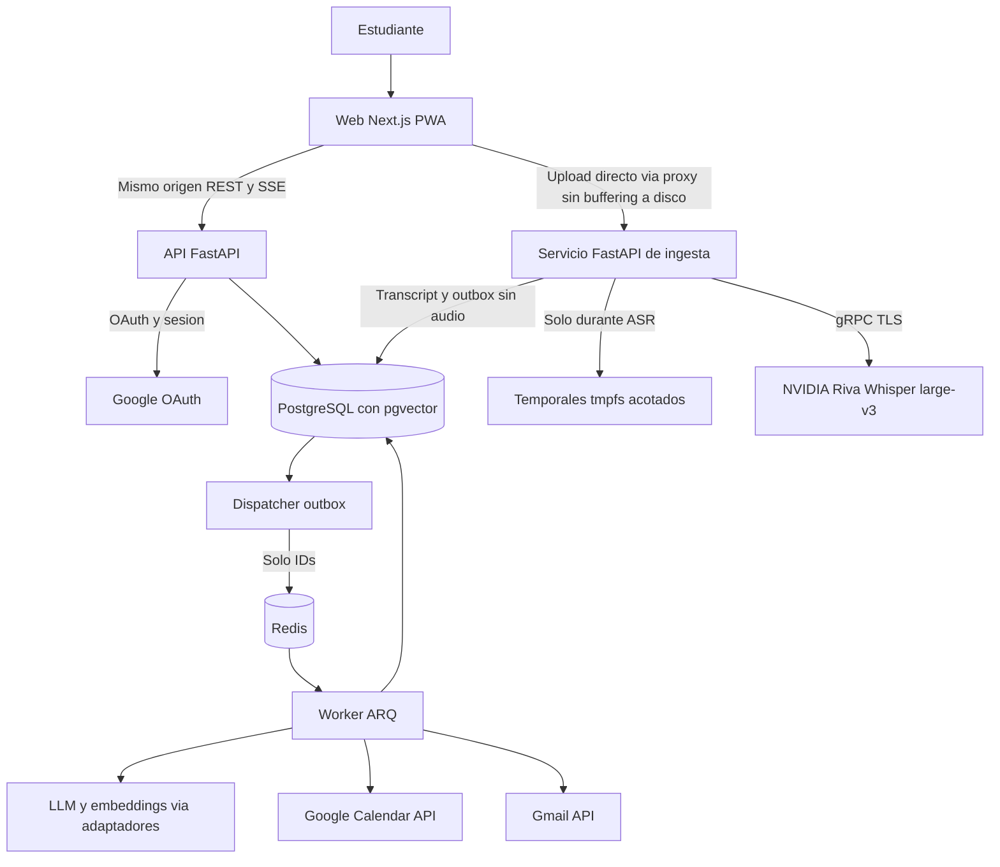
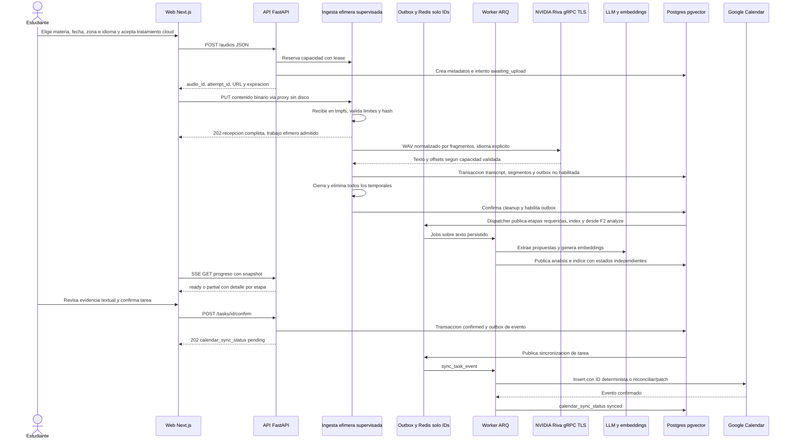
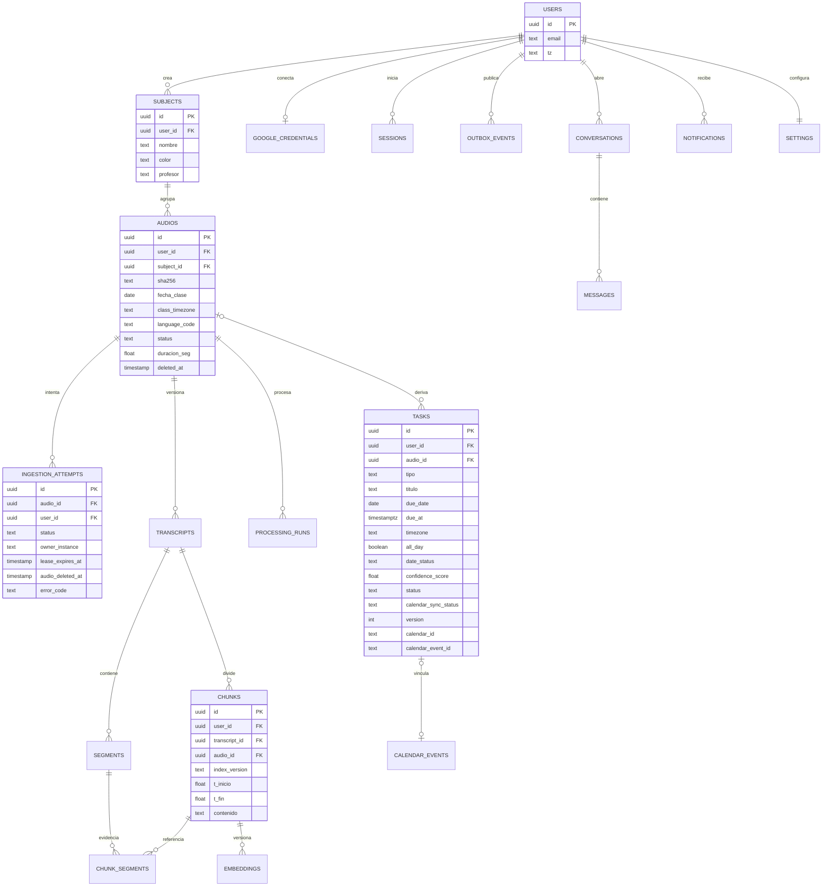

# Maulwurf — Especificación Funcional y Técnica

> *Maulwurf* ("topo" en alemán): excava en tus audios de clase y construye túneles entre tus apuntes, tu agenda y tu bandeja de entrada.
>
> **En una frase:** un NotebookLM **orientado a audios de clase** que, además de dejarte chatear con tus apuntes, **actúa**: detecta tareas, exámenes y pendientes que menciona el profesor, los programa en Google Calendar, te recuerda por correo y te ayuda a estudiar.

---

## Tabla de contenido

1. [Visión del producto](#1-visión-del-producto)
2. [Alcance](#2-alcance)
3. [Arquitectura y stack](#3-arquitectura-y-stack)
4. [Módulos funcionales (qué debe hacer y qué debe existir)](#4-módulos-funcionales)
5. [Pipeline end-to-end](#5-pipeline-end-to-end)
6. [Modelo de datos](#6-modelo-de-datos)
7. [Integraciones Google (detalles y gotchas)](#7-integraciones-google)
8. [Requisitos no funcionales](#8-requisitos-no-funcionales)
9. [DevOps y entrega](#9-devops-y-entrega)
10. [Costos estimados](#10-costos-estimados)
11. [Roadmap por fases](#11-roadmap-por-fases)
12. [Dudas y decisiones pendientes](#12-dudas-y-decisiones-pendientes)
13. [Diferenciadores vs NotebookLM y mejoras recomendadas](#13-diferenciadores-vs-notebooklm-y-mejoras)

---

## 1. Visión del producto

### Problema

Un estudiante graba clases, acumula horas de audio que **nunca vuelve a escuchar**, y la información crítica (fechas de examen, entregas, advertencias del profesor) queda enterrada en ese audio. Las herramientas existentes (NotebookLM incluido) son de **consulta**: te dejan chatear con el documento, pero no convierten ese conocimiento en **acción** ni avisan.

### Propuesta

Maulwurf es un asistente personal de estudio con pipeline automático:

```
Audio → Transcripción → Extracción de tareas (LLM) → Google Calendar
                    ↘
                      Indexación vectorial → Chat RAG multi-materia
                    ↘
                      Correos de recordatorio y digests
```

### Principios de diseño

- **Audio como entrada, texto como fuente durable:** las citas abren segmentos de la transcripción; no existe reproducción ni descarga del audio. Los timestamps son referencias al original y solo se muestran con la precisión realmente disponible.
- **De consulta a acción:** el sistema propone tareas, agenda lo confirmado y recuerda.
- **Humano en el loop:** confirmación explícita antes de cualquier escritura en Calendar, también para propuestas del chat. No hay auto-confirmación en MVP/v1.
- **Proveedores detrás de interfaces:** transcripción NVIDIA Riva/Whisper large-v3 por gRPC; LLM y embeddings con adaptadores independientes. Cambiar de proveedor exige pruebas de capacidades y, para embeddings, reindexación.
- **Privacidad por diseño:** sin persistencia de audio en nuestra infraestructura. Texto, embeddings y credenciales sí se conservan y requieren protección. El servicio cloud recibe el audio; no se promete modo 100% local.

### Decisiones vinculantes — revisión 2026-09-14

1. **No guardar audio de forma persistente:** solo buffers y archivos temporales en RAM (`tmpfs`) mientras se recibe, valida, convierte y transcribe. Esto incluye original, fragmentos y versiones convertidas. Nada de S3/MinIO, disco, backups, payloads Redis, logs, trazas ni cachés con audio. Es una interpretación operativa de «transcribir y borrar», no una promesa de ausencia de buffers de memoria.
2. **Eliminar inmediatamente al terminar la transcripción o al abortar**, antes de extracción/indexación; no esperar a que la clase esté `ready`. Un fallo de almacenamiento del transcript no autoriza a conservar el audio. Toda salida usa cleanup en `finally`; un supervisor independiente elimina temporales huérfanos por vencimiento.
3. **Idioma obligatorio seleccionado por el usuario**, sin valor inferido ni autodetección por defecto. Código validado contra una allowlist comprobada con el endpoint desplegado; `multi` queda fuera del MVP. No confundir idioma del audio, locale del perfil y zona horaria.
4. **NVIDIA Riva por gRPC TLS:** `grpc.nvcf.nvidia.com:443`, modelo `whisper-large-v3`, `function-id=b702f636-f60c-4a3d-a6f4-f3568c13bd7d`, cliente `nvidia-riva-client`. Autorización Bearer solo desde el servidor. Operación de transcripción, nunca `task:translate`.
5. **Sin audio durable no hay reintento durable de ASR:** si se pierde el proceso/temporal, el usuario debe volver a subir el archivo. Análisis e indexación sí se reintentan desde el texto persistido.
6. **Puertas de validación:** antes de construir la ingesta se debe probar el contrato real de NVIDIA (idiomas, formatos, sample rate, duración/payload, cuotas, deadlines y timestamps). El ejemplo aportado no demuestra esos límites ni garantiza alineación temporal. Ver [plan de implementación](PLAN_IMPLEMENTACION.md).
7. **Límite de la garantía:** confirmar las condiciones de tratamiento/retención de NVIDIA y de los proveedores de texto antes de usar clases reales. Si «en ningún lado» exige cero retención también por terceros y el proveedor no lo garantiza, ese despliegue cloud queda bloqueado; no se encubre con una promesa local de borrado.

---

## 2. Alcance

### Dentro del alcance (MVP + v1)

- Subida de archivos de audio y su transcripción automática.
- Extracción estructurada de: tareas, exámenes, entregas, lecturas, pendientes y recomendaciones del profesor.
- Creación de eventos en Google Calendar (previa confirmación).
- Almacenamiento de transcripción + embeddings y búsqueda vectorial.
- Chat RAG sobre todos los apuntes, filtrable por materia, con citas a timestamps.
- Consulta del calendario desde el chat ("¿qué tengo pendiente esta semana?").
- Correos: recordatorios escalados de tareas, digest diario y semanal.

### Fuera del alcance (por ahora)

- Diarización (quién habla), ingesta de video/links/bots y colaboración: backlog sin fase comprometida.
- Reproducción, descarga, archivo durable o retranscripción del audio sin nueva subida.
- Detección automática de idioma, traducción ASR y modo 100% local en MVP/v1.
- Apps móviles nativas (PWA instalable posterior al flujo web; sin caché de audio/datos privados).

---

## 3. Arquitectura y stack

### 3.1 Diagrama general



### 3.2 Stack recomendado

| Capa | Decisión | Alternativa | Justificación |
|---|---|---|---|
| Frontend | Next.js App Router en versión estable soportada + TypeScript + Tailwind + shadcn/ui | — | Fijar versiones y lockfile en F0; PWA sin cachear datos privados |
| Backend | FastAPI + Pydantic v2 + SQLAlchemy 2 async | — | API y servicio de ingesta aislado; llamadas bloqueantes fuera del event loop |
| BD relacional | PostgreSQL 16 | — | Datos + vectores + outbox en una sola BD |
| Vectores | **pgvector**, HNSW coseno | — | Búsqueda híbrida con filtros tenant antes de recuperar |
| Cola / jobs | **ARQ + Redis** | — | Solo trabajo durable sobre texto/IDs; cron nativo ARQ, no Celery beat |
| Transcripción | **NVIDIA Riva / whisper-large-v3**, `nvidia-riva-client`, gRPC TLS | — | Idioma explícito y contrato probado en F0; no es una API REST compatible con OpenAI |
| Conversión efímera | ffmpeg/ffprobe en ingesta + `tmpfs` acotado | — | Normalización por fragmentos, sin audio en disco |
| LLM | **gpt-4o-mini** vía **LiteLLM**, provisional | — | Fijar modelo/versiones y validar calidad en español y otros idiomas habilitados |
| LLM estructurado | JSON schema + Pydantic v2 | instructor si el adaptador lo requiere | Validación semántica adicional; JSON válido no implica contenido cierto |
| Embeddings | `text-embedding-3-small`, 1536 dimensiones | — | Registrar modelo/dimensión/versión; cambio requiere índice nuevo y reindexación |
| Auth | OAuth Google gestionado por FastAPI + sesión opaca en cookie | — | Una autoridad de sesión; Next no emite JWT ni custodia tokens Google |
| Audio durable | **Ninguno** | — | Sin bucket, volumen persistente ni endpoint de reproducción |
| Mail | **Gmail API**, conexión incremental | — | Opt-in; tokens cifrados en backend; limitaciones de entrega explícitas |

### 3.3 Estructura de monorepo propuesta

```
maulwurf/
├── apps/
│   ├── api/            # FastAPI
│   │   ├── app/
│   │   │   ├── routers/        # audios, chat, tasks, calendar, subjects...
│   │   │   ├── services/       # transcripcion, extraccion, rag, calendar, mail
│   │   │   ├── workers/        # jobs ARQ
│   │   │   ├── models/         # SQLAlchemy
│   │   │   └── core/           # config, security, logging
│   │   ├── prompts/            # prompts versionados (ver §4.4)
│   │   ├── alembic/
│   │   └── tests/
│   └── web/            # Next.js
│       ├── app/                # rutas App Router
│       ├── components/
│       └── lib/
├── infra/
│   ├── docker-compose.yml
│   └── Caddyfile               # reverse proxy + TLS
└── docs/
```

---

## 4. Módulos funcionales

Cada módulo define: **propósito**, **qué debe hacer** (requisitos funcionales), **qué debe existir** (componentes) y **endpoints** principales.

### M1 — Autenticación y perfil

**Propósito:** identificar al estudiante y conectar su cuenta de Google (necesaria para Calendar y Gmail).

**Qué debe hacer:**
- FastAPI inicia y resuelve OAuth Authorization Code con `state`, PKCE y validación de `nonce`/issuer/audience del ID token. La identidad usa el `sub` Google, no el email como identificador inmutable.
- Login con `openid email profile`; permisos Calendar/Gmail solo al conectar cada función. Rechazar esos permisos no impide transcribir ni chatear.
- Sesión opaca aleatoria en cookie `mw_session` (`Secure`, `HttpOnly`, `SameSite=Lax`); guardar solo hash del identificador en `sessions`, con expiración/revocación. Next y API bajo el mismo origen. Validar Origin y CSRF en operaciones mutantes, incluido upload.
- Guardar el `refresh_token` de Google **cifrado** (AES-GCM con nonce único y versión de clave); nunca enviarlo al navegador. Renovación coordinada para evitar carreras; preservar el refresh token anterior si Google no devuelve otro.
- Revocación/`invalid_grant` marca la integración `disconnected` y solicita reconexión, sin cerrar necesariamente la sesión de la aplicación.
- Perfil: zona horaria IANA, hora local del digest y preferencias opt-in. La zona horaria de cada clase se captura como snapshot para que cambios de perfil no alteren fechas ya extraídas.
- Todos los accesos, SSE, tools y jobs están aislados por `user_id`; el backend lo toma de la sesión, nunca del payload del usuario ni del LLM.

**Qué debe existir:**
- Tablas `sessions` y `google_credentials` (user_id, tokens cifrados, scopes concedidos, expiración, estado, versión de clave).
- Dependencia de FastAPI compartida por API e ingesta para validar sesión, CSRF y propiedad de recursos.
- Página de settings de usuario y consentimiento incremental.

**Endpoints:** `GET /auth/google/start`, `GET /auth/google/callback`, `POST /auth/logout`, `GET /me`, `PATCH /me`, `GET /integrations/status`, `POST /integrations/google/connect`, `POST /integrations/google/reconnect`.

---

### M2 — Subida y gestión de audios

**Propósito:** ingestar una clase; `audios` es el nombre técnico del registro de origen, no un archivo conservado.

**Qué debe hacer:**
- Formatos de entrada objetivo: `mp3, m4a, wav, ogg, opus, flac, webm`. Solo habilitar los probados con ffprobe/ffmpeg. Los formatos aceptados por la UI no son los formatos enviados a Riva.
- Objetivo máximo de entrada: **200 MiB / 3 h**, sujeto a prueba de capacidad F0. Publicar límites efectivos en `/ingestion/capabilities`; validar tamaño durante streaming y duración real con ffprobe, no solo `Content-Length` o extensión.
- Antes de transferir bytes, pedir **materia, fecha de clase, zona horaria e idioma del audio**; idioma sin preselección silenciosa. Opcionales: título y profesor. Explicar borrado, tratamiento cloud y ausencia de reproducción/retranscripción posterior.
- Crear sesión de ingesta con metadatos JSON y reservar capacidad RAM/concurrencia. Subida binaria mediante `PUT`, no Server Actions de Next ni `UploadFile` con spooling por defecto a disco. No soportar subida reanudable en MVP.
- Hash SHA-256 incremental y deduplicación **por usuario e identidad de ingesta**: hash, idioma, materia, fecha de clase y zona horaria (no título/profesor). Una coincidencia exacta devuelve la clase canónica sin nuevo ASR. Mismo hash con idioma/contexto diferente exige confirmación explícita antes del upload mediante referencia autorizada a la clase previa; si se descubre al terminar de recibir, limpiar el nuevo audio y devolver conflicto que requiere confirmar y volver a subir. No retener audio esperando decisiones humanas. Una variante confirmada crea otra clase, sin mutar evidencia ni tareas existentes. Intentos fallidos sin transcript reutilizan el registro canónico; concurrencia se resuelve con unicidad transaccional.
- ASR efímero: `awaiting_upload → receiving → transcribing → succeeded | requires_reupload | rejected | cancelled`. Un timeout antes del upload también termina la sesión. Ningún estado final permite conservar temporales.
- Análisis e índice tienen estados **independientes** `not_requested | pending | running | succeeded | failed | cancelled`. Etapas requeridas capturadas por clase: F1 solo índice; desde F2 análisis e índice para nuevas clases (backfill explícito de las anteriores). `not_requested` no equivale a éxito. Estado agregado: `processing` mientras haya etapas requeridas pendientes/en ejecución; `ready` si todas tienen éxito; `partial` si hay transcript utilizable pero alguna etapa requerida falla o se cancela; `failed` si no hay transcript utilizable. Durante ingesta se expone el estado del intento, sin declarar éxito por tener cero etapas de texto iniciadas. Un índice correcto permite chat aunque falle análisis; tareas correctas permiten revisión aunque falle índice. Resumen/temas quedan en F2 y no bloquean F1.
- Cancelación explícita del intento mediante endpoint autenticado; desconectar la subida antes de completarla cancela y limpia. Tras el 202, cerrar la pestaña/SSE no cancela ASR: continúa bajo su lease. Cancelar después del commit no destruye el transcript; devuelve conflicto con estado actual. Cancelar o eliminar invalida el token de ejecución para impedir commits tardíos; el supervisor cancela subprocess/gRPC y limpia.
- Progreso real: bytes recibidos, fragmentos terminados/total si se conoce; nunca porcentajes inventados. SSE con snapshot desde BD y polling como fallback.
- Eliminar una clase cancela intentos/jobs mediante tombstone y evita escrituras tardías. Borra transcript, chunks, embeddings, tareas derivadas, resumen y citas/snippets de mensajes asociados (o el mensaje completo si no puede purgarse con seguridad). Eventos Google existentes se conservan por defecto con aviso; eliminarlos exige opción explícita y trabajo remoto rastreable.

**Qué debe existir:**
- CRUD de materias con propiedad tenant (`GET/POST /subjects`, `PATCH/DELETE /subjects/{id}`); impedir borrar una materia con clases activas hasta moverlas o confirmar su borrado explícito.
- Tablas `audios` (solo metadatos), `ingestion_attempts` y `processing_runs`; propietario y lease del intento, estados por etapa, errores tipados sin contenido sensible.
- Servicio de ingesta con temporales `tmpfs` privados por intento, reserva de recursos, supervisor de tareas y limpieza independiente. No encolar ASR en ARQ ni pasar rutas temporales a workers remotos. F0/F1 despliega una sola instancia de ingesta; escalar requiere routing al propietario de la reserva, sin trasladar archivos. La URL de upload es relativa al mismo origen y se valida con sesión/CSRF/attempt_id; no es un token bearer público ni permite elegir hosts internos.
- Biblioteca de clases con lector de transcripción, idioma, estado y aviso permanente «audio no conservado».

**Endpoints:** `GET /ingestion/capabilities`, `POST /audios` (JSON → `audio_id`, `attempt_id`, URL y expiración de upload), `PUT /audios/{id}/content?attempt_id=…` (binario → 202 tras recepción y admisión al proceso supervisado), `GET /audios?subject_id=`, `GET /audios/{id}`, `GET /audios/{id}/progress` (SSE), `POST /audios/{id}/retry` (solo análisis/índice), `POST /audios/{id}/reupload` (solo sin transcript utilizable; nueva sesión efímera con la misma identidad), `POST /audios/{id}/attempts/{attempt_id}/cancel`, `DELETE /audios/{id}`, `GET /audios/{id}/transcript.txt`, `GET /audios/{id}/transcript.srt` (solo con timestamps válidos).

---

### M3 — Transcripción

**Propósito:** convertir audio a texto en su idioma original con trazabilidad temporal comprobable, sin retener audio.

**Qué debe hacer:**
- Usar `nvidia-riva-client` con TLS, host/function-id configurables y metadatos `authorization: Bearer …` en backend. No usar el SDK OpenAI para ASR. Pasar el código de idioma seleccionado; no enviar `task:translate` ni hacer fallback silencioso a `multi`.
- El ejemplo de NVIDIA exige mono de 16 bits en WAV/OPUS/FLAC. Normalizar inicialmente a **WAV PCM signed 16-bit mono**, sample rate fijado tras probar el endpoint (16 kHz como candidato, no garantía). Registrar configuración efectiva y versión del cliente/modelo.
- ffprobe valida contenedor, codecs, duración y canales; ffmpeg corre sin red, sin interpolación shell y con límites de CPU, memoria, salida y tiempo. Rechazar playlists/URLs y archivos malformados. Todo input/output temporal va a `tmpfs`.
- Fragmentar según el límite real de payload/duración de Riva, **no asumir 10 minutos**. Buscar cortes en silencios y usar pequeño solapamiento configurable probado; reconciliar texto y palabras duplicadas en las fronteras. Timestamps globales = offset del fragmento + tiempos locales; no sumar dos veces el solapamiento.
- Convertir/procesar fragmentos secuencialmente con backpressure, sin decodificar 3 h enteras a RAM. Conservar como máximo original temporal + fragmentos activos + buffers acotados. Dimensionar `tmpfs` y concurrencia con la expansión PCM y memoria del SDK medidas, no con los MB del upload solamente.
- Validar si Riva entrega offsets de palabras o segmentos al solicitar la capacidad correspondiente. Derivar segmentos de palabras solo cuando existan offsets válidos. Si solo hay texto, guardar `timestamp_precision=none` y tiempos null; nunca inventarlos con el LLM ni repartirlos proporcionalmente. Timestamps fiables son puerta de salida de F1; alternativa textual requiere aceptación explícita de producto.
- Persistir transcript y segmentos en **una transacción**, con idioma solicitado, modelo/configuración, versión de transcripción y precisión `word | segment | none`. No publicar un transcript incompleto como completo. Respuesta vacía/silencio es resultado sin texto utilizable, no alucinación a rellenar.
- Detectar repeticiones/silencios como señales de calidad; no borrar automáticamente frases legítimas del profesor. Guardar advertencias y texto normalizado trazable; baja calidad exige revisión antes de proponer fechas/tareas.
- Liberar buffers, cerrar archivos/cliente y eliminar original/convertidos/fragmentos en `finally` al terminar ASR (éxito o error). Sin core dumps ni swap persistente; root filesystem read-only y `TMPDIR` en `tmpfs`. Esto evita persistencia recuperable en disco, no promete borrado criptográfico de RAM.
- Reintentar errores transitorios de gRPC dentro del mismo intento efímero, con límite de intentos y deadline total. Auth/idioma/formato inválido no se reintentan. Al agotar plazo o perder el proceso: borrar, marcar `requires_reupload` y explicar que no puede retranscribirse desde el servidor.
- Exportar TXT siempre que haya transcript; SRT solo con tiempos válidos, ordenados y dentro de la duración. Las citas siguen siendo textuales aunque no haya SRT.

**Qué debe existir:**
- `TranscriptionService` y adaptador `NvidiaRivaTranscriptionService` con pruebas de contrato. La interfaz desacopla proveedor, pero no incluye backend local en MVP/v1.
- Procesamiento ASR bajo supervisor del servicio de ingesta; no `FastAPI BackgroundTasks` como garantía durable ni reintentos de ASR desde Redis. Cliente gRPC bloqueante aislado del event loop, con cancelación/deadlines comprobados.
- Heartbeat y lease por intento en BD. El supervisor local limpia carpetas vencidas incluso si falla BD; un reconciliador marca intentos muertos y publica trabajo sobre texto si la transacción ya se confirmó.
- Outbox de texto creada junto al transcript, habilitada tras cleanup; el reconciliador verifica liberación del intento antes de despachar las etapas requeridas (índice en F1, también análisis desde F2). El intento solo pasa a `succeeded` tras commit y cleanup comprobados. Cleanup fallido bloquea nuevas ingestas en esa instancia y genera alerta, nunca se declara borrado exitoso sin comprobarlo.
- Lease expirado no prueba borrado: registrar `cleanup_status=pending|verified|failed` separado del ASR. Supervisor en el mismo host/namespace debe comprobar ausencia de archivos y terminación de procesos que mantengan buffers/descriptores; caída de un contenedor no implica que su mount tmpfs haya desaparecido. Para pérdida de host, exigir evidencia del plano de infraestructura de destrucción de memoria/mount sin snapshots/swap. Mientras no exista comprobación, conservar estado de cleanup pendiente y bloquear outbox, sin pedir retranscribir si ya hay texto confirmado. La coordinación usa un token de fencing por intento; un propietario vencido no puede publicar.
- ffmpeg/ffprobe en la imagen de **ingesta**, sin volumen de audio compartido con ARQ.

---

### M4 — Análisis LLM y extracción de actividades

**Propósito:** el corazón diferencial. Del transcript, extraer **estructura** (tareas, fechas, recomendaciones) con trazabilidad a la fuente.

**Qué debe hacer:**
- Enviar el transcript (por chunks si es largo, con agregación final) junto con **contexto**: materia, profesor, fecha de la clase y snapshot de zona horaria de la clase.
- Producir **salida estructurada validada con Pydantic** (JSON mode / instructor), nunca texto libre. Schema:

```json
{
  "items": [
    {
      "tipo": "examen | tarea | entrega | lectura | recordatorio | recomendacion | proyecto",
      "titulo": "Examen parcial de Cálculo II — temas 1 a 4",
      "detalle": "Incluye sustitución trigonométrica",
      "due_date": "2026-09-21",
      "due_at": null,
      "timezone": "America/Mexico_City",
      "all_day": true,
      "date_status": "resolved",
      "confidence_score": 0.92,
      "fuente": { "spans": [{ "segment_id": "…", "inicio_char": 0, "fin_char": 48 }] },
      "cita_textual": "el examen parcial será el lunes 21 de septiembre"
    }
  ],
  "resumen_clase": "…3 a 5 frases…",
  "temas": ["integrales por partes", "sustitución trigonométrica"]
}
```

- **Fechas:** resolver contra fecha y zona horaria capturadas en la clase, no fecha de upload ni «hoy» del servidor. `due_date` (DATE) para día completo, `due_at` (TIMESTAMPTZ) para instante; mutuamente excluyentes. Sin fecha/ambigua: ambos null, `date_status=missing|ambiguous` y `needs_review`. Validar fechas imposibles, ambigüedad «el viernes que viene», hora local inexistente/duplicada por DST; no inventar medianoche como hora de entrega.
- `confidence_score` es señal no calibrada, **no probabilidad de certeza** ni permiso de auto-agendar. Validación Pydantic más reglas deterministas: fechas, enums, rangos y pertenencia de segmentos a clase/tenant/versión.
- El LLM devuelve IDs permitidos y spans/cita textual; offsets `[inicio_char, fin_char)` en puntos de código Unicode del texto inmutable de cada segmento (no bytes ni índices UTF-16 de JavaScript). El backend reconstruye la evidencia de los spans ordenados, comprueba la cita contra el texto y resuelve `audio_id` y tiempos desde BD. No confiar en timestamps o IDs inventados. Transcript e instrucciones del profesor son datos no confiables, no instrucciones para ejecutar tools.
- Las **recomendaciones** nunca van directo a Calendar: se convierten manualmente en tarea/bloque de estudio con fecha y confirmación explícita.
- Generar resumen (3–5 frases) y temas; conservar evidencia por item. Análisis por ventanas con overlap y agregación/dedupe por evidencia, sin enviar transcripts completos que excedan el contexto.
- **Idempotencia:** `processing_runs` únicos por clase, etapa, versión de transcript y configuración. Upsert de propuestas con clave de evidencia/tipo; reanálisis crea nueva revisión y no borra ni sobreescribe tareas editadas, confirmadas o programadas. Activar una revisión solo al completarse, no publicar resultados parciales.

**Qué debe existir:**
- Carpeta `prompts/` **versionada** (v1, v2, …) con tests de regresión por versión; el resultado guarda `prompt_version`.
- Job ARQ `analyze(audio_id)`.
- Bandeja de revisión con cita textual y botón «ver segmento de transcripción»; timestamp solo si existe. Edición de fecha/hora/zona antes de confirmar.
- Tabla `tasks` (ver modelo de datos).

**Endpoints:** `GET /tasks?status=pending|needs_review|confirmed|dismissed|completed`, `PATCH /tasks/{id}` (edición con versión para evitar actualizaciones perdidas), `POST /tasks/{id}/confirm`, `POST /tasks/{id}/dismiss`, `POST /tasks/{id}/complete`, `POST /tasks` (manual/propuesta de chat). `calendar_sync_status` se devuelve aparte.

---

### M5 — Integración Google Calendar

**Propósito:** escribir eventos (pendientes → agenda) y leerlos (conflictos, "¿qué tengo esta semana?").

**Qué debe hacer:**

*Escritura:*
- Confirmar guarda tarea y outbox atómicamente; devuelve 202 con `status=confirmed`, `calendar_sync_status=pending`. El worker crea el evento, no la request de confirmación. Sin integración conectada, la tarea sigue confirmada y la sincronización queda `blocked`.
- Evento con prefijo `[Maulwurf]`, detalle y **link autenticado al segmento textual** (sin audio ni tokens en URL). Evitar copiar transcript completo a Google. Día completo usa `start.date`/`end.date` con fin exclusivo; evento con hora requiere inicio/fin válidos y zona IANA. Para vencimientos sin duración, proponer duración por defecto visible y editable antes de confirmar.
- Calendario secundario único «Maulwurf» por usuario, creado al conectar Calendar. Guardar ID y reconciliar creación ambigua antes de repetir; no crear uno por materia en MVP.
- Idempotencia remota: ID de evento determinista a partir del UUID de tarea en formato permitido por Google (hex/base32hex), asociado al calendario destino. Ante timeout de insert, consultar ese ID; ante 409, comprobar identidad y reconciliar. Un índice local único **no evita** duplicados tras una respuesta perdida.
- Cambios de fecha/horario/título de una tarea ya confirmada quedan en una revisión pendiente hasta nueva confirmación explícita; un `PATCH` local no escribe Google. Al confirmar la revisión, disparar `patch` del evento vinculado con control de versión/ETag; no sobrescribir silenciosamente cambios hechos en Google. Completar/descartar una tarea cancela recordatorios futuros, pero conserva su evento con aviso salvo petición explícita de eliminación remota. Eliminar una clase tampoco elimina eventos por defecto.
- Contrato de agenda: vencimiento y bloque Calendar no son lo mismo. Guardar `event_start_at/event_end_at` para eventos con hora, o `event_start_date/event_end_date_exclusive` para día completo; pares mutuamente excluyentes y fin posterior al inicio. La UI muestra y confirma estos campos junto al vencimiento. El LLM no inventa una duración; un valor por defecto de producto es visible/editable. Recordatorios usan `due_at/due_date`, no el fin del bloque.

*Lectura:*
- Sincronizar eventos próximos (ventana: -7 a +60 días) en caché local (`calendar_events`) refrescada bajo demanda / cada hora, con paginación completa, recurrencias expandidas, eliminaciones y selección explícita de calendarios de lectura. MVP: refresco completo de la ventana con publicación atómica, sin mezclar `syncToken` con filtros incompatibles; registrar cobertura y última sincronización.
- Endpoint usado por el **chat como tool** y por el **dashboard**; informar caché desactualizada o cobertura insuficiente.
- **Detección de conflictos:** distinguir solapamiento horario de concentración de entregas/exámenes el mismo día. No llamar conflicto horario a eventos sin hora.

**Qué debe existir:**
- `GoogleCalendarService` con cliente bloqueante aislado del event loop; reintentos acotados para 429/5xx y errores de cuota transitorios, respetando `Retry-After`. `invalid_grant` desconecta; no tratar cualquier 403 como reintentable.
- Job `sync_task_event(task_id, task_version)` idempotente; `calendar_sync_status=not_requested|pending|synced|failed|blocked` separado del ciclo de vida de la tarea. Descartar jobs de versiones obsoletas.
- Tabla `calendar_events` espejo, clave única `(user_id, calendar_id, event_id)`, fechas all-day separadas de instantes, ETag, estado remoto y `last_synced_at`. El dashboard no dibuja dos veces la tarea y su evento vinculado.

**Endpoints:** `GET /calendar/events?from&to`, `POST /calendar/sync` (forzar), `GET /calendar/conflicts`.

---

### M6 — Base de datos, embeddings y búsqueda vectorial

**Propósito:** almacenar el conocimiento consultable y recuperarlo con precisión.

**Qué debe hacer:**
- **Chunking:** objetivo ~800 tokens con overlap ~100, preferir límites de frase/segmento. Si una frase supera el máximo, dividir con offsets de caracteres preservados. Guardar `segment_ids`, spans, versión de transcript y tiempos derivados nullable; un chunk no es la unidad mínima de evidencia.
- Embeddings batch en job `index(audio_id)`; clave única por chunk y versión de embedding. Crear una generación nueva de índice y activarla atómicamente cuando esté completa; no mezclar versiones/dimensiones ni exponer índice parcial.
- **Búsqueda híbrida desde F1:** pgvector coseno + full-text Postgres, fusión RRF. `tsvector` con configuración por idioma (`spanish`, `english`, etc.; `simple` para idiomas sin configuración adecuada). Query con configuración compatible por partición lingüística; la búsqueda semántica multilingüe puede recuperar otras lenguas sin traducir silenciosamente el transcript.
- En **ambas ramas** filtrar primero por `user_id`, recursos activos, versión activa y filtros de materia/fecha/clase; no hacer top-k global y filtrar tenant después. Evaluar recall de HNSW con filtros selectivos, usando búsqueda exacta para corpus pequeños o ajustes soportados por la versión fijada.
- Borrado clase → chunks → embeddings y purga de caches/citas derivadas; jobs vuelven a verificar propiedad, tombstone y versión antes de publicar.

**Qué debe existir:**
- Extensiones: `vector`, índice HNSW (`vector_cosine_ops`) y GIN sobre tsvector.
- Servicio `SearchService` con la fusión RRF (reutilizable por el chat).
- Endpoint rápido de búsqueda (usado por el Ctrl+K global del frontend).

**Endpoints:** `GET /search?q=&materia=&desde=&hasta=` → resultados con snippet + materia + audio + timestamp.

---

### M7 — Chat RAG multi-materia

**Propósito:** chatear con **todos** tus apuntes y con tu agenda en una sola conversación.

**Qué debe hacer:**
- **Streaming** de la respuesta (SSE), token a token.
- Pipeline F1: pregunta → embedding → candidatos vectoriales y léxicos (p. ej. 30 por rama) → RRF → dedupe/diversidad → ~8 chunks bajo presupuesto de tokens → respuesta fundamentada. Valores iniciales, no umbrales demostrados. Re-ranker opcional en F3 solo si mejora métricas con latencia/costo aceptables.
- Citas `[Cálculo II · Clase 03 · 31:15]` abren `/biblioteca/{audio_id}?segment={segment_id}` y resaltan el texto. Sin offsets fiables, mostrar «segmento N», no minuto inventado. El backend entrega un registro de citas con IDs permitidos; el modelo solo referencia esos IDs, validados antes de renderizar enlaces.
- En streaming, mantener marcadores de citas en buffer hasta validar su ID; nunca renderizar enlaces arbitrarios del modelo como fuentes. Registrar todas las fuentes entregadas al modelo (no solo las citadas), también las heredadas del historial/resúmenes, en `message_sources`. Al borrar una fuente, invalidar o purgar respuestas y descendientes dependientes; revalidar tombstone/versión antes de persistir y emitir `done`. No se puede retirar texto ya visto por el usuario ni enviado a un proveedor; informar ese límite.
- Sin evidencia suficiente: reconocerlo y pedir contexto; no fabricar fuentes/fechas. Distinguir evidencia del transcript, datos de Calendar y explicación general. El historial no sustituye la recuperación actual ni autoriza usar fuentes eliminadas.
- **Tool calling F2:** allowlist `get_calendar_events(rango)`, `get_pending_tasks()` y `propose_task()`. Usuario/permisos los inyecta backend; rangos/esquemas validados, máximo de iteraciones/tiempo. Ninguna tool del chat escribe Calendar o envía correo; confirmar siempre en UI.
- Transcript, resultados de tools y mensajes son datos no confiables: resistir instrucciones embebidas, no ejecutar comandos ni URLs extraídas. Render Markdown sanitizado, sin HTML inseguro, y redacción de trazas de proveedor.
- Historial persistente con presupuesto por tokens y retención configurable; conversaciones y mensajes aislados por tenant. `client_message_id` idempotente; estados `streaming|completed|failed|cancelled`, cancelación y manejo explícito de respuesta parcial.
- Modos: todas las materias, materia o clase, siempre dentro del tenant. System prompt de tutor con seguimiento sin afirmar más que las fuentes.

**Qué debe existir:**
- Tablas `conversations` y `messages` (rol, contenido, citas JSON).
- Servicio `RAGService` (reutiliza `SearchService`) + orquestador de tools.
- UI: composer con selector de modo, render de citas clicables, sugerencias de follow-up.

**Endpoints:** `POST /chat/conversations`, `GET /chat/conversations`, `GET /chat/conversations/{id}/messages`, `POST /chat/conversations/{id}/messages` (SSE consumido con `fetch`, no `EventSource` que solo permite GET), `DELETE /chat/conversations/{id}`. Eventos `delta`, `citation`, `done`, `error` con ID; citas comprobadas y resultado final persistido. El SSE de progreso de ingesta sí usa GET/EventSource y se recupera mediante snapshot.

---

### M8 — Correos y notificaciones

**Propósito:** que el estudiante no tenga que abrir la app para no perderse nada.

**Qué debe hacer:**
- **Recordatorio escalado** por tarea confirmada no completada/descartada: **T-48 h**, **T-24 h** y **T-2 h** para instantes con hora (configurables). «Ver en Calendar» solo si existe evento; enlace alternativo a tarea. «Posponer» abre UI autenticada, nunca muta estado mediante un GET de correo.
- **Digest diario** (hora configurable, ej. 07:00): pendientes de hoy + lo que vence mañana.
- **Digest semanal** (domingo por la noche): panorama de la semana, nuevas tareas detectadas, advertencia de conflictos de calendario.
- Envío vía **Gmail API** (la misma cuenta OAuth; cero proveedores extra). Alternativa: Resend si se quiere dominio propio.
- **Anti-spam:** agrupar recordatorios y deduplicar la programación mediante clave única `(user_id, tipo, task_id, due_version, occurrence)`. Digest por usuario/fecha local. Cambiar vencimiento/preferencias cancela ocurrencias futuras obsoletas; nunca enviar retrospectivamente todos los umbrales vencidos de una tarea recién confirmada.
- Gmail no ofrece garantía de exactamente una entrega con `gmail.send`: si se pierde la respuesta tras enviar, marcar `delivery_unknown` y no reintentar automáticamente para evitar duplicados. Mostrarlo en el panel; una reexpedición manual advierte del riesgo. Un `Message-ID` estable no garantiza dedupe remota.
- Fechas **sin hora**: recordatorios T-3d/T-1d a la hora local configurada, no T-2h. DST: hora inexistente se mueve al siguiente instante válido y hora repetida se ejecuta una sola vez (ocurrencia local única). Tareas sin fecha no tienen recordatorios escalados.

**Qué debe existir:**
- Scheduler cron nativo ARQ con un único rol activo; calcula cada minuto vencimientos/horas locales y reclama filas atómicamente. SLA objetivo de envío dentro de 15 min, no exactitud al segundo; workers múltiples protegidos por unicidad y leases.
- Templates HTML + texto plano, contenido escapado y datos mínimos; destinatario limitado al email verificado del usuario en MVP. No exponer envío arbitrario al LLM.
- `notifications`: `scheduled_at`, `due_version`, `dedupe_key`, `status=pending|sending|sent|failed|delivery_unknown|cancelled`, `sent_at`, `provider_message_id`, intentos y error redactado. Lease de `sending` vencido se considera entrega incierta, no pendiente automáticamente.

**Endpoints:** `PATCH /me/notifications` (preferencias), `POST /notifications/test` (enviar correo de prueba).

---

### M9 — Dashboard del estudiante

**Propósito:** vista de comando: agenda + pendientes + estado de ingesta, en una pantalla.

**Qué debe hacer:**
- Calendario (FullCalendar) mostrando eventos de Google + tareas Maulwurf (color por materia).
- Bandeja «para confirmar»: tareas con evidencia textual y fechas editables, diferenciando ambigüedad y calidad de ASR.
- Próximos vencimientos, estado de sincronización Calendar y reconexión Google.
- Estadísticas por materia: clases transcritas, duración original y temas cubiertos (sin audio almacenado).
- Ficha de clase: **lector de transcripción** con segmentos enlazables/resaltados, timestamps cuando existan, resumen, temas e items detectados. No incluir `<audio>`, URLs firmadas, reproducción karaoke ni botón de retranscribir sin nueva subida.
- UI de upload con idioma obligatorio, límites efectivos y consentimiento; «volver a subir» para ASR perdido y «reintentar análisis/índice» para fallos sobre texto, sin confundirlos.

**Qué debe existir:**
- Componentes: `CalendarView`, `TaskInbox`, `TranscriptReader`, `SubjectStats`, `AudioUploadForm`.
- Rutas Next: `/` (dashboard), `/biblioteca`, `/biblioteca/[audio_id]`, `/chat`, `/materias`, `/settings`.

---

## 5. Pipeline end-to-end

Secuencia completa, de la subida al evento en Calendar:



**Manejo de errores:** ASR solo admite reintentos acotados durante el lease efímero; perder audio antes del commit requiere reupload. Si el commit existe y el proceso cae antes de publicar, el reconciliador limpia/verifica el intento y habilita outbox sin retranscribir. Análisis e índice se reintentan independientemente desde texto (máximo inicial 3 para errores transitorios, backoff con jitter). Un fallo de análisis no bloquea chat con índice válido. Calendar conserva `confirmed` y sincronización pendiente/fallida/bloqueada; el worker reconcilia el ID remoto antes de insertar. Redis puede perderse: BD/outbox permiten reconstruir trabajos durables, **no** reconstruir audio. La UI no declara lista una etapa ni eliminado un temporal sin confirmación correspondiente.

---

## 6. Modelo de datos

### 6.1 Diagrama ER



### 6.2 Notas de diseño

El ER es un resumen, no sustituye las migraciones. Contratos mínimos adicionales:

- Todas las tablas tenant contienen `user_id`; claves foráneas compuestas `(user_id, recurso_id)` evitan referencias cruzadas, además de autorización en servicios. RLS como defensa adicional con `SET LOCAL` transaccional y rol de aplicación sin bypass; probar también el pool de conexiones y workers.
- `audios` no tiene `storage_key`, blob ni ruta durable. SHA nullable hasta completar upload; único parcial `(user_id, sha256, language_code, subject_id, fecha_clase, class_timezone)` para clases no eliminadas con hash conocido; campos de contexto NOT NULL y normalizados. Índice no único `(user_id, sha256)` detecta variantes que requieren confirmación según M2. Inserciones concurrentes resuelven conflicto transaccionalmente hacia el registro canónico; borrar también borra el hash. Intentos fallidos reutilizan registro, no crean duplicados. Guardar etapas requeridas por clase y versiones activas de transcript/análisis/índice.
- `ingestion_attempts`: un único intento activo por clase, contadores de bytes, propietario/lease/heartbeat, token de fencing, `cleanup_status`, evidencia de cleanup sin payload sensible, timestamps de recepción/ASR/cleanup y error tipado. `audio_deleted_at` solo tras comprobar ausencia de temporales. Caducidad inicial propuesta: 10 min para iniciar upload, 30 min de recepción, 60 min desde recepción completa para ASR; ajustar con benchmark F0 y publicar límites efectivos. Sweeper objetivo cada 60 s; el cleanup normal es inmediato, no espera al TTL.
- `transcripts`: único `(audio_id, version)`, texto, idioma solicitado, proveedor/modelo/configuración, `timestamp_precision`, calidad y resumen/temas con versión de análisis. `segments`: ID estable dentro de versión, ordinal, texto y offsets de caracteres; `t_inicio/t_fin` nullable, con `0 ≤ inicio < fin ≤ duración` cuando existan. No duplicar un JSON mutable de segmentos y filas como dos fuentes de verdad.
- `chunk_segments` vincula chunks a segmentos/spans y conserva evidencia aunque haya overlap. `embeddings`: chunk, modelo, dimensión, versión y vector de dimensión fija; HNSW por generación compatible. `processing_runs` únicos por `(audio_id, stage, transcript_version, config_version)` con estado y error. Versiones activas se publican atómicamente.
- `tasks.status`: `pending|needs_review → confirmed|dismissed`; `confirmed → completed|dismissed`. Resolver fecha/calidad antes de confirmar; confirmar exige fecha válida y evidencia comprobada para tareas extraídas. `calendar_sync_status` separado; `scheduled` no es un estado de tarea. `audio_id` nullable para tareas manuales/chat sin origen.
- CHECK de fecha: resuelta all-day → solo `due_date`; resuelta con hora → solo `due_at`; ambigua/sin fecha → ambos null. Guardar texto original de fecha, motivo de revisión, versión de vencimiento, evidencia (transcript/segmentos/spans) y snapshot de timezone. Persistir también los pares de inicio/fin Calendar de M5 con sus CHECKs y la revisión pendiente de cambios; confirmar requiere validar tanto vencimiento como bloque de agenda. `confidence_score` nullable en tareas manuales, acotado [0,1], sin semántica probabilística.
- `calendar_events`: clave `(user_id, calendar_id, event_id)`; vínculo nullable a tarea y fuente `google|maulwurf`. Una tarea tiene como máximo un evento vinculado; otros eventos Google no tienen tarea. Persistir calendario de escritura en settings, calendarios de lectura seleccionados y estado/ETag/cobertura de sincronización.
- `messages.citas` referencia `{audio_id, transcript_version, chunk_id, segment_id, t_inicio, t_fin}` y texto validado; normalizar vínculos en `message_sources` para localizar/purgar respuestas derivadas al borrar una fuente. No conservar snippets huérfanos ni confiar en JSON no validado del LLM.
- `outbox_events`: ID, tenant, tipo, recurso, versión, estado de habilitación, intentos y fecha de publicación; **solo IDs/configuración no sensible**, nunca audio ni tokens. Jobs consumidores idempotentes; reconciliación de outbox y ejecuciones atascadas. El borrado remoto solicitado usa un registro independiente de operación (IDs Google, autorización explícita, estado y error), que sobrevive a la purga de la tarea/clase hasta resolverlo; no depender de una FK con cascade que destruya el trabajo pendiente. No habilitar nuevos envíos tras tombstone, salvo la operación de borrado autorizada.
- `notifications` según M8, `sessions` según M1, `settings` uno por usuario. Índices: GIN en `chunks.tsv`, HNSW en vector compatible, BTREE tenant+materia/fechas y `tasks(user_id, status, due_at/due_date)`. No declarar índices sin probar planes/recall con datos representativos.

---

## 7. Integraciones Google

| Aspecto | Detalle |
|---|---|
| Scopes OAuth | Login: `openid email profile`. Calendar, incremental: evaluar `calendar.app.created` para gestionar calendario secundario creado por la app + `calendar.events.readonly` y `calendar.calendarlist.readonly` para leer los seleccionados. Confirmar permisos exactos con llamadas reales en F0/F2; no asumir que cualquier scope permite crear calendarios. Gmail: `gmail.send`, opt-in en F3 |
| Flujo | FastAPI propietario de OAuth/tokens y sesión opaca; Next solo UI. Scopes concedidos registrados y comprobados por operación |
| Refresh | Renovar antes de caducar, coordinado por usuario; `invalid_grant` desconecta integración. Timeout/5xx no equivale a revocación |
| Calendario | Secundario «Maulwurf» al conectar; guardar ID y reconciliar respuestas inciertas. No modificar principal ni eventos ajenos por defecto |
| Cuotas | Medir cuotas efectivas por proyecto/usuario; rate limit, backoff con jitter y presupuesto por integración. No prometer capacidad ilimitada |
| Testing/verificación | Revisar estado de consentimiento, usuarios de prueba y políticas actuales. En modo externo Testing, los refresh tokens con scopes adicionales suelen expirar a los 7 días; no es irrelevante para uso personal. Producción puede exigir verificación según scopes y audiencia |
| Google Tasks | Sí existe API pública; sus fechas no sustituyen un modelo completo de horas/duración/bloques de agenda. Elegimos Calendar por el producto, no por inexistencia de Tasks |
| Entrega Gmail | `gmail.send` no permite reconciliar buscando mensajes enviados; no ampliar scopes automáticamente. Entregas inciertas se gestionan según M8 |

---

## 8. Requisitos no funcionales

### Seguridad
- Tokens Google cifrados AES-GCM con rotación de claves; BD/backups cifrados para texto y embeddings. Secretos inyectados por gestor del despliegue, nunca en repositorio, frontend o trazas.
- Sesión opaca y CSRF según M1; TLS de extremo a extremo donde aplique, CORS restrictivo. Auth.js no se usa como emisor implícito de JWT/JWKS.
- Rate limit distribuido y cuotas por usuario: bytes/minutos de audio, slots de ingesta, tokens LLM, chat y Google. Admisión rechaza antes de recibir audio si no hay capacidad (`429`/`503` con reintento), sin cola de archivos esperando en disco.
- Defensa de ingesta según M2/M3: parser streaming, límites de bytes/duración/tiempo, ffmpeg sandbox, nombres internos aleatorios. Proxy sin buffering a disco, caché ni captura de bodies; no usar CDN con almacenamiento de requests de upload.
- Sin audio, transcript, prompts completos, credenciales ni PII en logs/Sentry/trazas. Solo IDs, duración, tamaños, estado y errores redactados. Desactivar core dumps, swap persistente y snapshots/hibernación de memoria en hosts de ingesta; tmpfs por sí solo **no** basta si puede ir a swap.
- Navegador: `Cache-Control: no-store` para contenido privado; service worker excluye upload, API, transcripts/chat y respuestas SSE; no guardar audio en IndexedDB/Cache Storage. Liberar `File`/object URLs al terminar/cancelar; el original local del usuario no lo borra la aplicación.
- Borrado de cuenta: tombstone, bloquear sesiones/jobs, purgar datos propios y fuentes derivadas. Si se pide borrar eventos Maulwurf, realizar esa acción antes de revocar/eliminar tokens. No borrar eventos ajenos. Fallos remotos se informan; sin permisos no se puede garantizar borrado en Google.
- Backups solo de texto/metadatos cifrados, retención máxima propuesta 30 días y registro de borrados reaplicado al restaurar. La UI distingue borrado de datos activos, expiración de backups y datos ya enviados a terceros. Consentimiento para voces de terceros y tratamiento cloud antes del upload.

### Performance
- Upload ocupa una conexión durante recepción; ASR continúa supervisado tras 202, sin durabilidad de audio. gRPC/Google bloqueantes fuera del event loop; análisis/índice vía ARQ.
- Objetivos por medir, no garantías: chat primer token p95 ≤ 5 s (separar arranque frío), recuperación híbrida p95 ≤ 500 ms en corpus de referencia. Medir ASR por duración/idioma y concurrencia antes de fijar SLA.
- Objetivo 200 MiB / 3 h condicionado a memoria/capacidad real. Límites de proxy alineados con admisión y timeout de recepción; SSE sin buffering, con heartbeats. Cancelación, desconexión y reinicio probados, no «sin timeout» infinito.

### Observabilidad
- Logs JSON con `request_id`, `audio_id`, `attempt_id` y `run_id`, sin payloads sensibles.
- Métricas: RAM/tmpfs/slots, latencia ASR, edad de temporales, cleanup fallido, leases vencidos, lag outbox, retries, tokens/costo, recall/citas inválidas, sincronización/entrega incierta. Alerta inmediata por incumplir limpieza; panel de fallos por etapa.
- `GET /healthz` por proceso; `GET /readyz` de API comprueba Postgres/Redis, el de ingesta comprueba BD, temporales seguros, cleanup y capacidad operativa. No invocar proveedores pagados en cada healthcheck.

---

## 9. DevOps y entrega

### 9.1 Entorno local / VPS (docker-compose)

Servicios: `web`, `api`, `ingest` (FastAPI, supervisor, ffmpeg y cliente Riva), `worker` (ARQ), `scheduler` (rol ARQ cron único + reconciliación/outbox), `postgres` (`pgvector/pgvector:pg16`, versión fijada), `redis`, `caddy`. **Sin MinIO/S3 ni volumen de audio**. API e ingesta comparten código de auth, no temporales.

Persistencia para PostgreSQL y, si se configura, Redis solo con IDs/estado. Ingesta con `tmpfs` por instancia, root read-only, usuario no root, límites de recursos, sin swap/core dumps. En reinicio/drain cancelar o completar ASR dentro del deadline y limpiar; un despliegue puede exigir reupload. No escalar/reubicar intentos como si el audio fuera durable. Verificar en el host que la configuración de memoria cumple la política.

### 9.2 CI/CD (GitLab CI)

- **MR:** lint (ruff + ESLint), tipos (mypy + tsc), tests (pytest + Vitest), integración Postgres/pgvector/Redis, E2E y builds API/ingest/web. Pipeline sin secretos de proveedores en MRs no confiables.
- **Rama principal:** imágenes en GitLab Container Registry; deploy controlado con aprobación y rollback, no actualizaciones automáticas sin pruebas. Alembic como job único previo, migraciones compatibles con rollback de aplicación.
- Pruebas cloud explícitas/manuales o programadas con presupuesto y credenciales protegidas; no confundir un mock con contrato validado de Riva/Google.

### 9.3 Calidad

- Unidad: fechas/DST, evidencia textual, límites de tokens, offsets/solapamiento ASR, RRF, estados/idempotencia, dedupe y cálculo de recordatorios.
- Integración: servicios reales de BD/cola, gRPC de prueba para errores deterministas, proxy y ffmpeg reales, aislamiento tenant y reinicios. Contratos reales Riva/Google en suite separada. Un mock del LLM valida orquestación, no calidad de extracción/RAG.
- E2E: subida con idioma obligatorio → transcripción → borrado → índice → pregunta con cita textual → revisión → Calendar → recordatorio; incluir fallo independiente de análisis/índice y revocación Google.
- Audio de prueba sintético generado **en RAM al ejecutar**, nunca versionado ni conservado como artefacto CI. Persistir solo métricas y expectativas textuales no sensibles. Prueba de borrado en éxito/error/timeout/cancelación/SIGKILL/reinicio y de no escritura en disco/Redis/logs/cache.
- Dataset textual anotado por idioma con tareas/fechas/evidencias y consultas respondibles/no respondibles; comparar modelos/prompts versionados. Puertas de aceptación medibles y plan de pruebas en `PLAN_IMPLEMENTACION.md`.

---

## 10. Costos estimados

Escenario: 1 estudiante, ~10 h de clase/semana (40 h/mes), ~200 preguntas de chat/mes.

No hay presupuesto validado todavía. **40 h son 2400 minutos**: el cálculo anterior de $2.40 a $0.006/min era incorrecto (serían $14.40), y esa tarifa tampoco corresponde necesariamente a NVIDIA Riva.

| Concepto | Forma de estimar / pendiente |
|---|---|
| ASR NVIDIA | Consultar tarifa, créditos, cuotas y disponibilidad del endpoint de la cuenta; medir minutos efectivos, overlap y retries. No asumir que créditos gratuitos sean capacidad de producción |
| Extracción + chat | Tokens de entrada/salida por modelo, ventanas solapadas, historial y reintentos; ~200 preguntas no equivale a 200 sesiones de tamaño fijo |
| Embeddings | Tokens iniciales + consultas + reindexaciones por cambio de modelo |
| Infraestructura | CPU ffmpeg, RAM/tmpfs por slot, BD/vectores/backups, Redis, TLS y transferencia. Dimensionar desde benchmark, no prometer VPS de $5 para 3 h/concurrencia arbitraria |
| Total mensual | Pendiente de medición F0/F1; establecer presupuesto y alertas antes de aceptar carga real |

Sin almacenamiento durable de audio se elimina ese costo, **no** el de memoria, procesamiento ni tratamiento cloud. Un modo local tendría costos de hardware/operación y no forma parte del compromiso actual.

---

## 11. Roadmap por fases

| Fase | Contenido | Criterio de salida |
|---|---|---|
| **F0 — Viabilidad y fundación** | Spike real Riva/privacidad/timestamps/idiomas/límites; arquitectura efímera; monorepo, CI, auth opaca, esquema, materias | Contrato y capacidad documentados; cleanup ante fallos probado; sesión/aislamiento y builds/tests pasan. Sin esto no se habilita ingesta real |
| **F1 — Conocimiento** | Ingesta efímera → transcript → índice híbrido → lector → chat con citas textuales | E2E de clase de 1 h y límite efectivo; audio ausente antes de procesar texto; idioma respetado; citas/timestamps y evaluación RAG superan puertas del plan |
| **F2 — Acción** | Extracción versionada, revisión humana, Calendar idempotente, agenda/tools de lectura y conflictos | Tarea con fecha/evidencia correctas, evento solo tras confirmar; timeout remoto/doble clic no duplican; all-day/DST y reconexión probados |
| **F3 — Recordatorios** | Gmail opt-in, digests, recordatorios, dashboard completo, Ctrl+K; evaluar re-ranker | Dedupe/DST/entrega incierta probados y envío real de prueba observado; mejora del re-ranker medida antes de activarlo |
| **F4 — Backlog no comprometido** | Quizzes, exportaciones, plan de estudio, briefing | Requiere priorización propia; no bloquea MVP ni implica persistir audio |

El [plan detallado](PLAN_IMPLEMENTACION.md) define dependencias, entregables y pruebas por fase. No se mantienen estimaciones de semanas sin spike de capacidad ni equipo definido.

---

## 12. Dudas y decisiones pendientes

Las decisiones de audio efímero, idioma obligatorio y proveedor Riva están cerradas (§1); no vuelven a ofrecerse como opciones de retención/autodetección. Pendientes reales:

| ID | Decisión/validación pendiente | Efecto y puerta |
|---|---|---|
| D1 | Despliegue personal inicialmente; confirmar si habrá SaaS | Multi-tenant desde F0. Audiencia/consentimiento Google y revisión de privacidad antes de abrir a terceros |
| D2 | Contrato Riva: idiomas exactos, timestamps, formatos/rate, límites, concurrencia, cuotas y tarifa | Spike F0 bloqueante; allowlist solo con códigos probados. `en`/`fr` aparecen en el ejemplo aportado, no prueban soporte de todos los idiomas necesarios |
| D3 | Retención/tratamiento de audio y texto por proveedores, permiso para grabar voces de terceros | Bloquea clases reales; si se exige cero retención externa sin garantía contractual, revisar proveedor/despliegue con el usuario |
| D4 | Tamaño/duración/deadlines y RAM por slot | Objetivo 200 MiB/3 h, valores iniciales de lease en §6; benchmark F0 determina límites publicados y capacidad de instancia |
| D5 | Calidad/costo del LLM y embeddings propuestos | Evaluación F1/F2 por idioma; no asumir que JSON válido o confianza alta implica exactitud |
| D6 | Timestamps no disponibles o insuficientes en endpoint | Bloquea la promesa temporal de F1; decidir alineación efímera validada o aceptar producto solo textual. No implementar fallback oculto |
| D7 | Scopes mínimos y comportamiento real Google | Verificar creación/lectura/patch, tokens y Testing antes de F2; Gmail y entrega incierta antes de F3 |
| D8 | Retención de texto/chat y backups | Propuesta: activos hasta borrado por usuario, backups máximo 30 días; confirmar política y restauración segura antes de producción |

Fuera de MVP/v1: diarización, fuentes por URL/bots, colaboración, modo local, calendarios por materia y otros gestores de tareas. La diarización futura necesitaría ejecutarse durante ingesta o pedir reupload; no es posible recuperarla del audio ya eliminado.

---

## 13. Diferenciadores vs NotebookLM y mejoras

### 13.1 Comparativa directa

Comparación orientativa de producto, **no auditoría actual de NotebookLM**: sus capacidades/límites cambian y no se han verificado en esta revisión. Evitar basar decisiones en supuestas ausencias del competidor.

| Capacidad propuesta en Maulwurf | Compromiso |
|---|---|
| Ingesta de audio | Temporal, limitada por capacidad, sin conservación ni reproducción |
| Chat con citas | Evidencia textual enlazada; timestamp solo validado contra ASR |
| Tareas/exámenes | Extracción con evidencia, fechas revisables y confirmación humana |
| Google Calendar | Calendario secundario, sincronización idempotente y tools de lectura |
| Recordatorios | Opt-in, vencimientos/digests, límites de entrega Gmail explícitos |
| Búsqueda multi-materia | Híbrida y multilingüe, siempre aislada por usuario |
| Privacidad | Audio sin persistencia propia; tratamiento cloud declarado, no «100% local» |
| Resúmenes/temas | Sobre transcript, versionados y sujetos a calidad ASR/LLM |

### 13.2 Diferenciadores core (ya dentro del alcance de este spec)

1. **De consulta a acción:** flujo integrado transcripción → propuesta → confirmación → Calendar → recordatorio.
2. **Citas trazables sin conservar audio:** abrir el segmento textual con referencia temporal si está disponible. La cita demuestra qué transcribió el sistema, **no** garantiza que ASR oyó correctamente una fecha; por eso la revisión humana es esencial.
3. **Humano en el loop:** nada entra a Calendar sin confirmación y evidencia visible, sin auto-confirmación por score.
4. **Agenda como contexto:** apuntes + tareas + eventos autorizados, indicando cobertura y frescura de la sincronización.

### 13.3 Mejoras recomendadas (plus para estudiantes) — priorizadas

**Backlog exploratorio, no alcance comprometido.** Cualquier futura fuente de audio respeta la misma eliminación efímera y selección explícita de idioma. Toda escritura externa requiere confirmación; ninguna mejora recupera audio eliminado. Las prioridades P1–P4 no equivalen a fases F1–F4.

**P1 — Estudio activo (convierte Maulwurf en tutor, no solo archivo):**
- **Modo Examen:** genera quizzes y tarjetas desde tus apuntes de una materia (selección múltiple, completar, flashcards) con **exportación a Anki** (`.apkg` / CSV). Repaso activo > releer.
- **Repetición espaciada:** flashcards con algoritmo evaluado (SM-2 como candidato); propone bloques de repaso que el usuario confirma.
- **Plan de estudio backward:** desde una fecha de examen confirmada, propone bloques en huecos disponibles. Recalcular produce otra propuesta, no modifica Calendar automáticamente.
- **Briefing pre-clase:** la noche antes de cada clase (detectada por patrón de materias/días), un correo de 5 líneas con lo esencial de la clase anterior + "3 preguntas que podrías hacer mañana".
- **Detector de solapes:** 2 exámenes la misma semana → sugiere redistribución del plan de estudio.

**P2 — Captura sin fricción:**
- **Bot de Telegram/WhatsApp:** reenvías la nota de voz del grupo de la clase o grabas directo al bot → aparece en tu biblioteca ya transcrita. Reduce la fricción de "abrir la web y subir archivo" a casi cero.
- **Ingesta de links:** requiere revisión legal, defensa SSRF y descarga estrictamente efímera antes de usar el pipeline Riva; no se habilita en MVP/v1.
- **PWA instalable + captura rápida:** botón de grabar en el móvil que sube al terminar la clase.
- **Ctrl+K global (F3):** búsqueda híbrida en cualquier pantalla, con enlaces a segmentos de transcripción, no audio.

**P3 — Organización y comprensión:**
- **Mapa de temas por materia:** grafo de temas mencionados entre clases ("esto conecta con lo de la clase 4") — detecta hilos temáticos entre audios, cosa imposible de ver en un notebook aislado.
- **Glosario por materia editable:** corrección de términos recurrentes mal transcritos (nombres de teoremas, acrónimos) con re-indexación.
- **"Resumen 3 cosas":** al terminar de procesar un audio, push/email con las 3 ideas clave — digerible en 30 segundos.
- **Sugerencias de follow-up tras cada respuesta del chat** (como NotebookLM, pero apuntando a estudio: "¿quieres que te haga un quiz de esto?").
- **Exportación:** resumen de clase a Markdown/PDF; apuntes de una materia a documento de repaso.

**P4 — Técnicas/comunidad:**
- **Despliegue local futuro:** proyecto separado de viabilidad (ASR, LLM, embeddings, hardware y operación), no flag mágico ni capacidad actual. Requiere decidir qué integraciones cloud se desactivan.
- **Cuadernos compartidos:** compartir una materia con 2–3 compañeros (cada quien con su Calendar, tareas repartidas).
- **Audio Overview propio:** versión del podcast de NotebookLM pero **personalizado al examen próximo** ("repasa conmigo los temas del examen del viernes").
- **API pública simple:** para que Maulwurf sea la base de datos de estudio de otros herramientas (Notion, Alfred/Raycast).

### 13.4 Anti-features (qué copiar de NotebookLM y qué NO hacer)

- **Copiar:** simplicidad extrema de la UI; fuentes con citas visibles; sugerencias de preguntas.
- **Evitar:** convertir esto en un gestor de notas genérico (obsidiantes ya existen). Maulwurf es **audio + acción**; cualquier feature que no entre en esa frase va al fondo del backlog.

---

*Documento vivo: actualizar por PR. Las decisiones pendientes de §12 se resuelven en este archivo y quedan registradas con fecha.*
