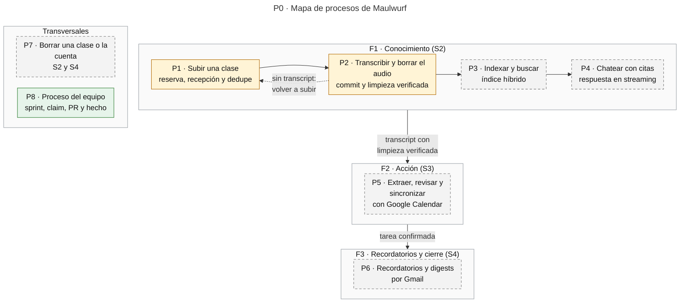
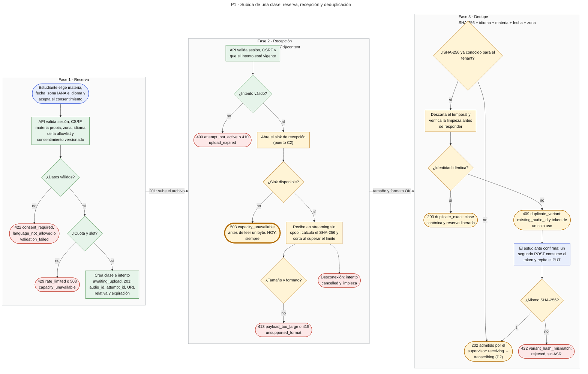
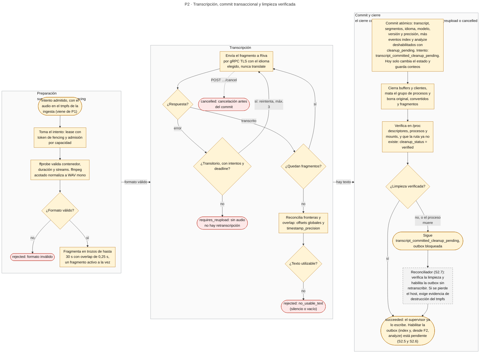
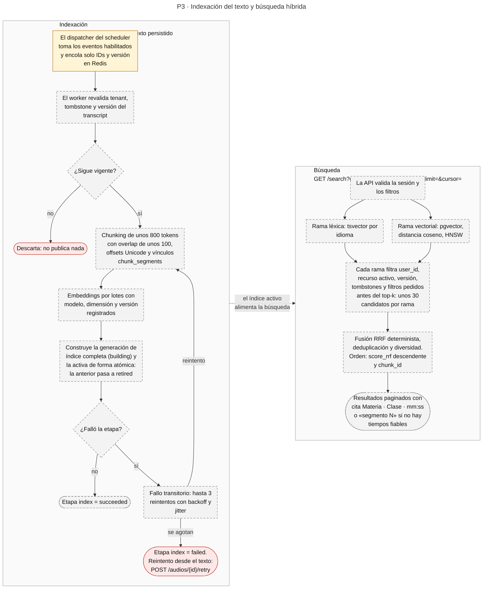
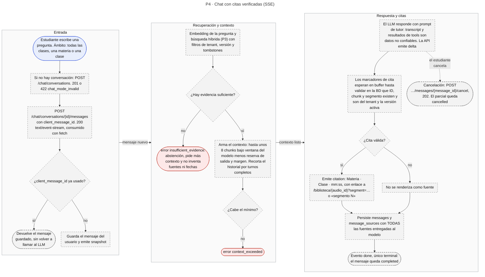
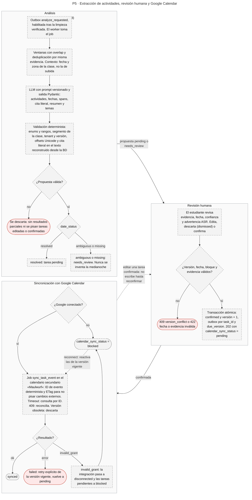
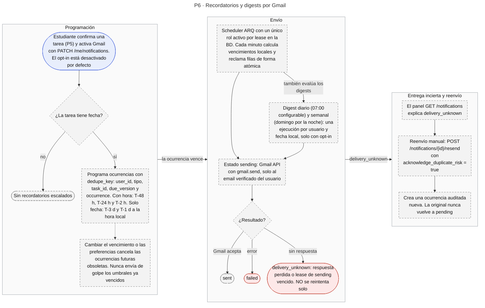
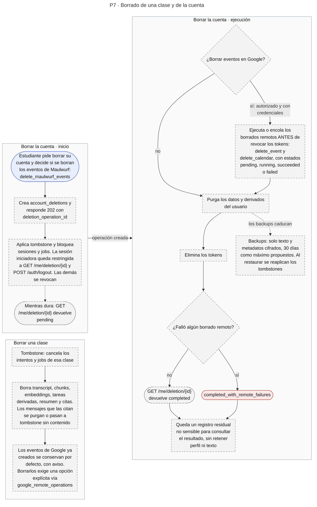
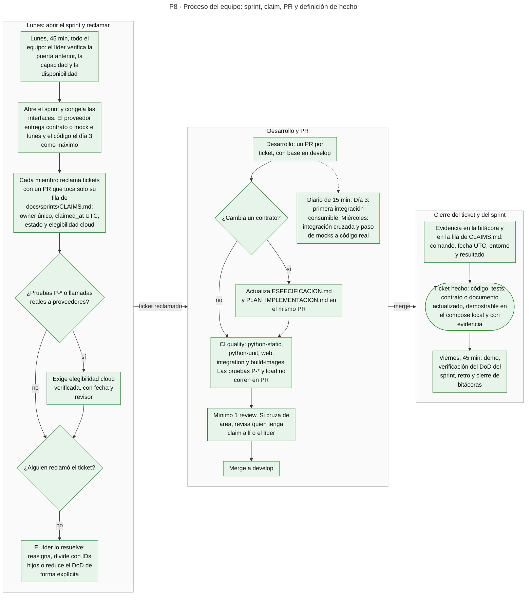

# Diagramas de procesos — Maulwurf

> **Estado:** procesos derivados de [ESPECIFICACION.md](ESPECIFICACION.md) (módulos M1–M9 y §5),
> de [DISENO_BD_API_SPRINTS.md](DISENO_BD_API_SPRINTS.md) (§2.10 y §3) y de los planes
> [S1](plan/S1.md)–[S4](plan/S4.md), y contrastados con el código de `develop` en `2298e1b`
> (2026-10-11). No crean contratos: ante cualquier diferencia mandan la especificación y el
> [plan de implementación](PLAN_IMPLEMENTACION.md). La arquitectura está en [ARCH.md](ARCH.md).

## 1. Qué es un diagrama de procesos

Un **diagrama de procesos** describe un flujo de trabajo de principio a fin: quién actúa, en qué
orden, qué decisiones abren ramas y cómo termina cada una (éxito, error o cancelación). Es el
«cómo ocurre» de un caso de uso. No sustituye a los otros diagramas del proyecto:

| Diagrama | Responde | Dónde está |
|---|---|---|
| Arquitectura | Qué piezas existen y cómo se conectan | [ARCH.md](ARCH.md) |
| **Proceso** | Qué pasos, decisiones y ramas de error tiene un flujo | Este documento |
| Secuencia | Qué mensajes se intercambian los participantes y en qué orden | [ESPECIFICACION §5](ESPECIFICACION.md#5-pipeline-end-to-end) |
| Estados | Qué estados tiene una entidad y qué transiciones son válidas | [DISENO §2.10](DISENO_BD_API_SPRINTS.md#210-máquinas-de-estado-contratos-congelados) |
| Datos | Qué tablas y relaciones existen | [ESPECIFICACION §6.1](ESPECIFICACION.md#61-diagrama-er) |

## 2. Cómo leerlos

| Estilo | Significado |
|---|---|
| Relleno verde | Implementado y en uso |
| Relleno ámbar | Existe en el código, pero el proceso no funciona de extremo a extremo |
| Relleno gris, borde discontinuo | Solo especificado o planificado |
| Relleno rojo | Terminal de error o rechazo |
| Relleno azul | Actor o sistema externo |
| Rombo | Decisión; las ramas llevan su condición |
| Terminal redondeado | Resultado, con su código HTTP o estado |

| Proceso | Fase y sprint | Estado a `2298e1b` | SVG |
|---|---|---|---|
| P0 · Mapa de procesos | Todas | — | [proc-00-mapa.svg](diagrams/proc-00-mapa.svg) |
| P1 · Subida: reserva, recepción y dedupe | F1 · S2 | Parcial | [proc-01-subida.svg](diagrams/proc-01-subida.svg) |
| P2 · Transcripción, commit y limpieza | F1 · S2 | Parcial (biblioteca) | [proc-02-transcripcion.svg](diagrams/proc-02-transcripcion.svg) |
| P3 · Indexación y búsqueda híbrida | F1 · S2 | Planificado | [proc-03-indexacion-busqueda.svg](diagrams/proc-03-indexacion-busqueda.svg) |
| P4 · Chat con citas | F1 · S2 | Planificado | [proc-04-chat.svg](diagrams/proc-04-chat.svg) |
| P5 · Extracción, revisión y Calendar | F2 · S3 | Planificado | [proc-05-extraccion-calendar.svg](diagrams/proc-05-extraccion-calendar.svg) |
| P6 · Recordatorios y digests | F3 · S4 | Planificado | [proc-06-recordatorios.svg](diagrams/proc-06-recordatorios.svg) |
| P7 · Borrado de clase y de cuenta | S2 y S4 | Planificado | [proc-07-borrado.svg](diagrams/proc-07-borrado.svg) |
| P8 · Proceso del equipo | Todas | En vigor | [proc-08-equipo.svg](diagrams/proc-08-equipo.svg) |

## 3. P0 · Mapa de procesos

<!-- svg: proc-00-mapa -->

El índice (P3) y el análisis (P5) cuelgan del mismo transcript y avanzan con estados
independientes: F1 no depende de la extracción de F2.

## 4. P1 · Subida de una clase: reserva, recepción y dedupe

<!-- svg: proc-01-subida -->

**Estado: parcial.** `POST /audios` (A2.3) y las validaciones del `PUT` (A2.4) están
implementadas. Como el sink de recepción no tiene implementación real, el `PUT` responde `503`
antes de leer el cuerpo. El resto de la fase 2 y toda la fase 3 existen y están probados con un
sink inyectado (`test_put_content_dedupe.py`), pero no son alcanzables hoy.

| Regla | Detalle |
|---|---|
| Identidad | SHA-256, idioma, materia, fecha y zona horaria; el título y el profesor no participan |
| Orden en duplicados | Primero se descarta el temporal y se verifica, después se responde `200` o `409` |
| Cuota y slot | `429` y `503` son mecanismos condicionales (A2.3, D4): sin configuración no limitan |
| Token de variante | Opaco, de un solo uso y con TTL; en la BD solo vive su hash, ligado a tenant, hash y metadatos |
| Variante confirmada | No muta la evidencia ni las tareas de la clase existente |
| Cierre de la pestaña | Antes del `202` cancela; después **no** cancela el ASR (ver P2) |

## 5. P2 · Transcripción, commit transaccional y limpieza verificada

<!-- svg: proc-02-transcripcion -->

**Estado: parcial.** El supervisor, el lease con fencing, ffprobe y ffmpeg, la fragmentación, la
reconciliación, el cliente de Riva y la verificación de limpieza existen como biblioteca con
tests, pero `main` no los importa y `asr_job` es un stub que no llama a Riva. El supervisor ya
escribe `transcript_committed_cleanup_pending` y `succeeded`, pero sin persistir el
transcript ni habilitar la outbox (S2.5, A2.10 y S2.6); el reconciliador no existe (S2.7).

**Reintentar o volver a subir** (A2.8). Ambos endpoints están especificados y ninguno existe aún:

| Situación | Acción | Respuesta |
|---|---|---|
| Hay transcript utilizable | `POST /audios/{id}/retry` con `{stages, transcript_version}` (`index` o `analyze`): runs idempotentes sobre el texto. El botón dice «reintentar análisis/índice» | `202`; `409 transcript_unavailable` o `409 invalid_transition` |
| No hay transcript utilizable | `POST /audios/{id}/reupload`: nueva sesión efímera con la misma identidad; el estudiante vuelve a subir. El botón dice «volver a subir» | `201` con URL nueva; `409` si ya hay transcript |

**Cancelación** (S2.8, A2.7):

| Momento | Resultado |
|---|---|
| Desconexión durante la recepción | Cancela y limpia |
| Tras el `202` | Continúa bajo lease; cerrar la pestaña o el SSE **no** cancela |
| `POST /audios/{id}/attempts/{attempt_id}/cancel` antes del commit | Invalida el fencing; el supervisor cancela el subproceso y el gRPC, y limpia. `202` |
| Cancelar tras el commit | `409` con el estado actual; el transcript no se destruye |

**Otras reglas.** Si la evidencia de limpieza falla, la instancia cierra la admisión de uploads
nuevos y dispara una alerta (S1.B6); un lease vencido que deja `pending` solo bloquea la outbox. Si
el contenedor muere (`SIGKILL`), el tmpfs desaparece con él y el intento queda con lease vencido y
`cleanup_status = pending`. Un TTL no equivale a borrado. El estado final de un error **no
transitorio** del proveedor no está especificado.

## 6. P3 · Indexación del texto y búsqueda híbrida

<!-- svg: proc-03-indexacion-busqueda -->

**Estado: planificado** (L2.1–L2.4, J2.1–J2.2, A2.11). Hoy existen los modelos de chunks y
embeddings, el dispatcher y el gate de limpieza; `index` y `analyze` son no-op y no hay ruta
`GET /search`. Reglas del diseño:

- Un evento `index_requested` solo se despacha si el último intento tiene `cleanup_status` en
  `verified`.
- Los embeddings tienen modelo y dimensión fijos por generación de índice; cambiarlos exige una
  generación nueva y reindexar, nunca mezclar vectores.
- Sin D3-Texto cerrada para el proveedor, solo se indexa texto sintético o redactado.
- El valor de `k` de RRF y el código HTTP de `GET /search` no están especificados.

## 7. P4 · Chat con citas verificadas

<!-- svg: proc-04-chat -->

**Estado: planificado** (L2.5–L2.6, A2.12, D2.5–D2.7). Hay modelos de conversaciones y mensajes,
pero ninguna ruta de chat.

| Aspecto | Contrato |
|---|---|
| Eventos SSE | `snapshot` inicial, luego `delta` y `citation`, y exactamente un terminal `done` o `error`; todos con ID monótono |
| Reconexión | Latidos `: ping` entre deltas; `Last-Event-ID` permite omitir lo ya enviado |
| Estados del mensaje | `streaming`, `completed`, `failed` y `cancelled` |
| Idempotencia | Repetir `client_message_id` devuelve el mensaje guardado |
| Sin tiempos fiables | La cita muestra «segmento N», nunca un minuto inventado (D6) |
| Fuentes | Se registran todas las que recibió el modelo, también las heredadas del historial |

## 8. P5 · Extracción de actividades, revisión humana y Google Calendar

<!-- svg: proc-05-extraccion-calendar -->

**Estado: planificado** (S3). No hay rutas, jobs ni servicios de análisis, tareas o Calendar; el
sync de Calendar figura en `services/outbox` sin consumidor y existe un esquema Pydantic de
análisis en borrador.

| Aspecto | Contrato |
|---|---|
| Estados de tarea | `pending`, `needs_review`, `confirmed`, `dismissed` y `completed`; `scheduled` no es un estado |
| `calendar_sync_status` | `not_requested`, `pending`, `synced`, `failed` y `blocked` |
| Escritura en Calendar | Solo tras la confirmación humana; los tools del chat nunca escriben en Calendar |
| Edición posterior | Editar una tarea confirmada crea una revisión y no escribe en Google hasta reconfirmar |
| Reintento | `failed` solo vuelve a `pending` con un retry explícito de la versión vigente |

## 9. P6 · Recordatorios y digests por Gmail

<!-- svg: proc-06-recordatorios -->

**Estado: planificado** (S4: J4.1–J4.6, A4.1). `me.py` declara que las preferencias de Gmail y de
los digests llegan en S4; no hay jobs de notificación, solo los tipos de evento `notify` y
`send_digest` catalogados en la outbox.

| Aspecto | Contrato |
|---|---|
| Estados | `pending`, `sending`, `sent`, `failed`, `delivery_unknown` y `cancelled` |
| Entrega | Gmail no ofrece exactly-once con `gmail.send`; un `Message-ID` estable no garantiza dedupe remota |
| Objetivo | Envío dentro de 15 minutos, no exactitud al segundo; varios workers protegidos por unicidad y leases |
| Fechas sin hora | T-3 d y T-1 d a la hora local; una hora inexistente por DST pasa al siguiente instante válido y una repetida se ejecuta una sola vez |
| Correo | Plantillas HTML y texto plano con contenido escapado; «Posponer» abre una UI autenticada y ningún GET de correo muta estado |
| Sin especificar | Cómo se recupera una entrega `failed` |

## 10. P7 · Borrado de una clase y de la cuenta

<!-- svg: proc-07-borrado -->

**Estado: planificado.** El borrado de una clase es A2.7 (S2) y el de la cuenta es A4.4 (S4);
`routers/audios.py` solo implementa `POST` y `PUT`, y `routers/me.py` solo `GET` y `PATCH`.

| Aspecto | Contrato |
|---|---|
| Eventos de Google | No se borran eventos ajenos ni sin autorización; sin permisos no se garantiza el borrado en Google |
| Registro residual | `account_deletions` conserva solo lo necesario para informar el resultado, sin perfil ni texto |
| Estados de la operación | `pending`, `completed` y `completed_with_remote_failures` |
| Backups | Solo texto y metadatos cifrados; los borrados se reaplican al restaurar (se valida en F3) |

## 11. P8 · Proceso del equipo: sprint, claim, PR y definición de hecho

<!-- svg: proc-08-equipo -->

Fuentes: [sprints/README.md](sprints/README.md), [PLAN_SPRINTS §0 y §7](PLAN_SPRINTS.md),
[ADR-0004](adr/ADR-0004-commits-pr.md), la plantilla de PR y `.github/workflows/quality.yml`.
Transferir o abandonar un ticket exige un PR atómico con el motivo y la entrega de evidencia.

## 12. Discrepancias entre documentos

Al dibujar los procesos aparecieron inconsistencias que conviene resolver. Cada diagrama sigue la
columna indicada.

| Tema | Un documento dice | Otro dice | Este documento sigue |
|---|---|---|---|
| Destino del `PUT` | ESPECIFICACION §5: la web sube a ingesta | `infra/Caddyfile` y `routers/audios.py`: lo recibe `api` y el sink C2 está pendiente | El código |
| Lease al reservar | `plan/S2.md` (A2.3): reserva «con lease» | `services/audios.py`: `lease_expires_at` queda `NULL` hasta que ingesta toma el intento | El código |
| Evento de outbox de Calendar | DISENO §2.6: `sync_task_event` | `plan/S3.md` (A3.4): `calendar.event.sync` | Solo nombra el job `sync_task_event` |
| Orden de los eventos SSE | ESPECIFICACION M7: `delta*` y luego `citation*` | DISENO §3.10: `delta` y `citation` en cualquier orden | No fija el orden |
| Contenido del digest semanal | ESPECIFICACION M8: incluye las tareas nuevas | `plan/S4.md` (J4.6): solo próximas y conflictos | No detalla el contenido |
| Operaciones remotas tras la purga | DISENO §2.8: `google_remote_operations` sobrevive a la purga | La misma tabla declara `user_id ... ON DELETE CASCADE` | La prosa; por resolver en A4.4 |

## 13. Mantenimiento

Los diagramas son bloques Mermaid precedidos de `<!-- svg: nombre -->`. Tras editarlos, ejecuta
`python3 scripts/docs/export_diagrams.py` para regenerar `docs/diagrams/*.svg` (ver
[ARCH.md §8](ARCH.md#8-mantenimiento)). Al fusionar un ticket que cambie lo implementado,
actualiza los colores, las tablas de estado y el commit de la cabecera.
