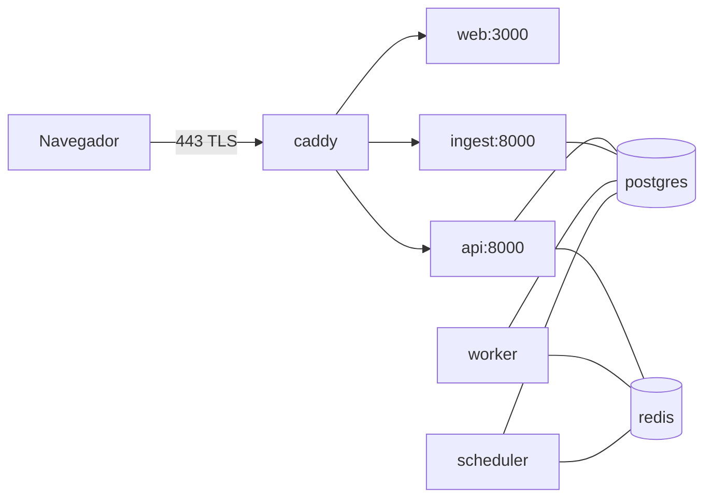

# J1.1 — `docker-compose.yml` con los 8 servicios

> Plan de ejecución previo. **No sustituye** el claim en
> [../../sprints/CLAIMS.md](../../sprints/CLAIMS.md) ni la evidencia en la bitácora.
> Fuentes: [../S1.md](../S1.md) §5 (J1.1), [../../PLAN_SPRINTS.md](../../PLAN_SPRINTS.md) §2,
> [../../PLAN_TESTS.md](../../PLAN_TESTS.md) §1.4, [../../ESPECIFICACION.md](../../ESPECIFICACION.md)
> §3 y §9.1.

> **Estado verificado (2026-09-25):** S1 abierto; L1.1/L1.2/L1.3 y S1.A1–A5 `hecho`
> (owner `satnovaOG`); J1.x sin claims. Dependencia L1.1 **satisfecha**:
> Python 3.12.14, Node 22.20.0, uv 0.12.18, `pgvector/pgvector:pg16`
> ([../../VERSIONES.md](../../VERSIONES.md)). Formato de PR: ADR-0004 y
> [../../../.github/pull_request_template.md](../../../.github/pull_request_template.md).
> Base de integración: `develop`.

## 1. Ficha del ticket

- **Objetivo:** entregar `infra/docker-compose.yml` que levante los servicios `web`, `api`,
  `ingest`, `worker`, `scheduler`, `postgres` (pgvector fijado), `redis` y `caddy`, sin ningún
  volumen ni mount persistente de audio.
- **Alcance:** compose, redes, healthchecks internos, Dockerfiles base de `api` y `web`,
  `env_file` opcional, pin de imágenes por digest.
- **No alcance:** endurecer `ingest` (J1.2), Caddyfile definitivo (J1.3), CI (J1.4), dispatcher
  y `/readyz` reales (J1.5), política Redis (J1.6), migraciones (A1.7), app de ingesta real
  (S1.B1/S1.B2).
- **Dependencia tipada:** `código` J1.1 ← L1.1 (versiones y lockfiles fijados).
  **L1.1 está `hecho`** (pins en [../../VERSIONES.md](../../VERSIONES.md), ADR-0002): usar
  Python 3.12, Node 22 y `pgvector/pgvector:pg16` tal cual; no introducir cifras nuevas.
- **Dependencia operativa:** Docker Engine + Compose v2 en la máquina del owner.
- **Entregables:** `infra/docker-compose.yml`, `apps/api/Dockerfile`,
  `apps/web/Dockerfile`, `infra/Caddyfile` mínimo provisional (J1.3 lo reemplaza), y un punto
  de entrada mínimo de `ingest` para que el servicio arranque (ver §5).
- **Criterios de aceptación:**
  - [ ] `docker compose up -d --build --wait` deja los 8 servicios `healthy`.
  - [ ] `pgvector/pgvector:pg16` está fijado por digest además de tag.
  - [ ] No existe volumen, bind ni tmpfs persistente con audio; `docker compose config`
    auditado.
  - [ ] `worker`/`scheduler` usan la misma imagen que `api` con comando distinto.
- **Pruebas/evidencia:** I-S1-JF-01 (smoke compose 8 servicios) — la parte de `/readyz` la
  cierra J1.5; en J1.1 se evidencia `/healthz` por proceso y `compose ps`.
- **Archivos previstos:** `infra/docker-compose.yml`, `infra/Caddyfile`,
  `apps/api/Dockerfile`, `apps/web/Dockerfile`, `apps/ingest/Dockerfile` (si no lo entregó
  J1.8), y el punto de entrada de salud de `ingest`.

## 2. Diseño de la entrega

### 2.1 Topología



- Red `edge`: `caddy`, `web`, `api`, `ingest`.
- Red `data`: `postgres`, `redis`, `api`, `ingest`, `worker`, `scheduler`.
- Solo `caddy` publica puertos (`80`, `443`). Los healthchecks se ejecutan **dentro** de cada
  contenedor; Caddy no publica `/healthz`.

### 2.2 Volúmenes (regla de privacidad)

| Volumen | Uso | ¿Audio? |
|---|---|---|
| `pgdata` | datos de PostgreSQL | no |
| `caddy_data` | CA local y certificados | no |
| `caddy_config` | autosave de Caddy | no |
| — | Redis | sin volumen por defecto; J1.6/ADR-0005 decide persistencia |

Prohibido: bind mounts a `apps/ingest`, `/tmp` del host, carpetas de uploads o cualquier ruta
que pueda contener audio. Los temporales de ingesta son `tmpfs` privados por contenedor (J1.2).

### 2.3 Variables de entorno

- `env_file: ../.env` con `required: false` (el repo no commitea `.env`).
- `MAULWURF_DATABASE_URL` y `MAULWURF_REDIS_URL` se **sobrescriben** en compose con los nombres
  de servicio (`postgres`, `redis`), como advierte `.env.example`.
- Secretos de proveedores (`NVIDIA_API_KEY`, `GOOGLE_*`) no se declaran como `environment`
  explícito; entran solo por `env_file` local. Nunca en el compose versionado ni en logs.

### 2.4 Healthchecks

| Servicio | Check | Comando |
|---|---|---|
| `postgres` | `pg_isready -U maulwurf -d maulwurf` | shell |
| `redis` | `redis-cli ping` | shell |
| `api` | `GET /healthz` con stdlib Python | `python -c "import urllib.request;..."` |
| `ingest` | `GET /healthz` idem | idem |
| `web` | `fetch('http://127.0.0.1:3000/')` con Node | `node -e "..."` |
| `worker`/`scheduler` | ping Redis + clave de salud ARQ | `python -m app.workers.health` (J1.5) |
| `caddy` | no requiere (proceso rápido, depende de los tres healthy) | — |

`/readyz` de API y de ingest se conectan en J1.5/A; J1.1 solo garantiza `/healthz`.

### 2.5 Imágenes y Dockerfiles

- `postgres`: `pgvector/pgvector:pg16@sha256:<digest capturado al implementar>`.
- `redis`: `redis:7.4-alpine@sha256:<digest>` con comando de política de J1.6 (sin
  persistencia por defecto).
- `caddy`: `caddy:2.8-alpine@sha256:<digest>`.
- `api`/`worker`/`scheduler`: una sola imagen `maulwurf-api:local` (build `apps/api/Dockerfile`,
  target `runtime`); `worker` y `scheduler` cambian solo el `command`.
- `ingest`: `apps/ingest/Dockerfile` target `base` de J1.8; J1.2 agrega el target `runtime`
  endurecido y actualiza el compose.
- `web`: `apps/web/Dockerfile` (Node LTS fijado por L1.1), `npm ci` + `npm run build` +
  `npm run start`, usuario no root.

## 3. Paso a paso

1. **Claim primero:** PR atómico a `docs/sprints/CLAIMS.md` (acción `claim`, owner único,
   `claimed_at` UTC, elegibilidad `no aplica`, revisores del área J o líder).
2. Crear rama `s1/j1.1-docker-compose` desde `develop` actualizado (base según ADR-0004).
3. Capturar digests reales:
   ```bash
   docker pull pgvector/pgvector:pg16 && docker inspect --format '{{index .RepoDigests 0}}' pgvector/pgvector:pg16
   docker pull redis:7.4-alpine && docker inspect --format '{{index .RepoDigests 0}}' redis:7.4-alpine
   docker pull caddy:2.8-alpine && docker inspect --format '{{index .RepoDigests 0}}' caddy:2.8-alpine
   ```
4. Escribir `apps/api/Dockerfile` (multi-stage, `uv sync --frozen --no-dev`,
   `uvicorn app.main:app`, no root). No copiar `alembic.ini` hasta que A1.7 lo entregue.
5. Escribir `apps/web/Dockerfile`.
6. Confirmar con el owner de ingesta el punto de entrada mínimo (`/healthz`) y construir la
   imagen desde el target de J1.8; si J1.8 no existe aún, acordar quién lo adelanta.
7. Escribir `infra/docker-compose.yml` con el diseño de §2 y `infra/Caddyfile` mínimo
   (`tls internal`, rutas a `web`, `api` e `ingest`); J1.3 lo endurece.
8. Levantar y esperar salud:
   ```bash
   cd infra && docker compose up -d --build --wait
   docker compose ps --format json
   docker compose exec api python -c "import urllib.request;print(urllib.request.urlopen('http://localhost:8000/healthz').status)"
   ```
9. Auditar ausencia de audio y de mounts persistentes:
   ```bash
   docker compose config --volumes
   docker inspect $(docker compose ps -q ingest) --format '{{json .Mounts}}'
   ```
10. `docker compose down` y registrar evidencia (fecha UTC, entorno, versiones, digests,
    salida de `compose ps`) en la bitácora; abrir PR.

## 4. Verificación y evidencia

- Test asociado: **I-S1-JF-01** (parte J1.1). Registrar comando, fecha, entorno y resultado.
- Evidencia redactada: salida de `docker compose ps`, digests de imágenes, `docker compose
  config` sin volúmenes de audio, `/healthz` 200 de los procesos que ya lo expongan.
- Marcar explícitamente qué queda pendiente para J1.5 (`/readyz` reales) y J1.2/J1.3
  (endurecimiento y Caddy definitivo).

## 5. Coordinaciones y riesgos

- **Caddyfile provisional:** J1.3 es owner del archivo final; J1.1 crea un mínimo para que el
  servicio arranque. Registrar la cesión en el PR.
- **Punto de entrada de `ingest`:** el paquete está vacío; sin un ASGI mínimo el servicio no
  arranca. Acordar con el owner S si lo crea J1.1 (placeholder) o S1.B1 el día 1.
- **`alembic.ini` no existe** (lo entrega A1.7): no copiarlo en la imagen hasta entonces.
- **Versiones:** ya fijadas por L1.1/ADR-0002 (Python 3.12, Node 22, PG16); no reabrirlas
  en este ticket.

## 6. Formato del PR

> **Canónico:** [ADR-0004](../../adr/ADR-0004-commits-pr.md) (aceptado 2026-09-23) y
> [../../../.github/pull_request_template.md](../../../.github/pull_request_template.md).
> Base `develop`; resumen de 1–3 puntos; test plan/checklist; mínimo 1 review; un PR de claim
> toca solo su fila de `CLAIMS.md`; nada de secretos, `.env`, audio ni payloads de proveedor.

- **Un ticket por PR.** Rama `s1/j1.1-docker-compose`.
- **Título:** `J1.1 — docker-compose.yml con los 8 servicios`.
- **Cuerpo:**
  ```markdown
  ## Ticket y claim
  - Ticket: J1.1 · Claim: fila de CLAIMS.md (PR #…)
  - Área: J- · Dependencias verificadas: L1.1

  ## Objetivo y alcance
  - Entrega: ...
  - No entrega (explícito): hardening de ingest, Caddy definitivo, CI, readyz reales

  ## Cambios principales
  | Archivo | Propósito |
  |---|---|

  ## Cómo verificar (reproducible)
  - Comandos exactos y resultado esperado

  ## Evidencia
  - Fecha UTC · entorno · versiones y digests · salida redactada · enlace a bitácora

  ## Pruebas
  - I-S1-JF-01 (parcial); P-* no corre en MR

  ## Checklist
  - [ ] 1 review mínimo (área afectada o líder)
  - [ ] CI/QA sin secretos; sin audio/PII en diff, logs ni fixtures
  - [ ] `docs/`/ADR/README actualizados si aplica
  - [ ] Fila de CLAIMS.md actualizada con evidencia
  ```
- **Commits:** prefijo con el ticket, p. ej. `J1.1: describe el cambio en imperativo`.
- **Review:** al tocar `apps/ingest` y `apps/web`, requiere review de quien tenga claim activo
  en esas carpetas o del líder si no hay claim.
- El workflow `.github/workflows/trigger-hoplite-qa.yml` dispara QA externo en cada PR; **no**
  sustituye el pipeline de calidad de J1.4.
